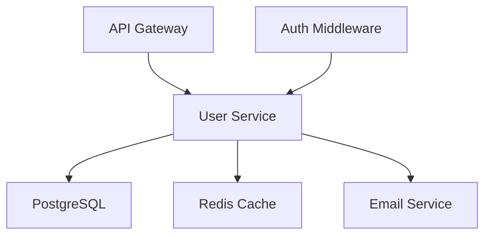
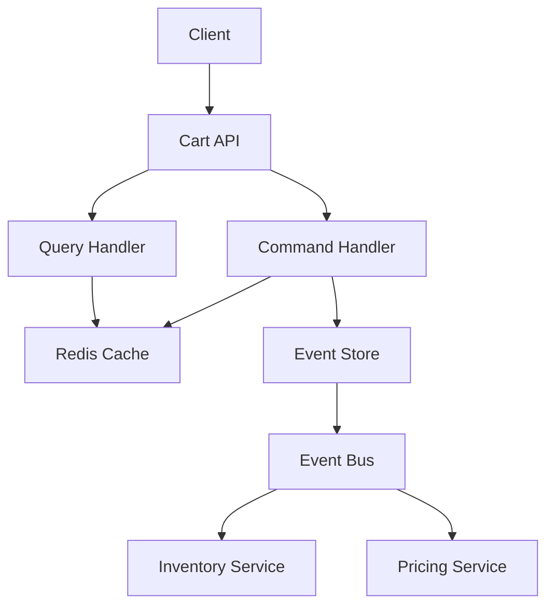
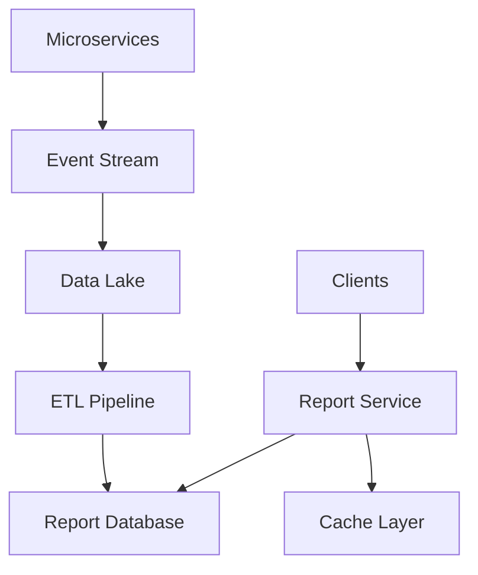

# Casos de Estudio - Análisis de Microservicios

## 📚 Propósito

Proporcionar ejemplos reales de análisis de microservicios para guiar el proceso de evaluación y toma de decisiones arquitectónicas.

---

## 🎯 Caso de Estudio 1: Microservicio de Gestión de Usuarios

### Contexto del Proyecto
**Dominio**: E-commerce  
**Problema**: Sistema monolítico de usuarios necesita ser extraído como microservicio  
**Usuarios**: 100,000 usuarios activos, 10,000 transacciones/día  

### Análisis de Requerimientos

#### Historia de Usuario Principal
```
Como administrador del sistema
Quiero gestionar usuarios de manera independiente
Para mejorar la escalabilidad y mantenibilidad del sistema
```

#### Funcionalidades Identificadas
- ✅ **Registro de usuarios**: Email, validación, activación
- ✅ **Autenticación**: Login/logout, JWT tokens
- ✅ **Gestión de perfiles**: CRUD de información personal
- ✅ **Recuperación de contraseñas**: Reset via email
- ✅ **Roles y permisos**: RBAC básico

#### Requerimientos Técnicos
```yaml
Performance:
  - Tiempo de respuesta: < 100ms
  - Throughput: 500 req/s
  - Disponibilidad: 99.9%

Seguridad:
  - Autenticación JWT
  - Encriptación bcrypt para passwords
  - Rate limiting: 10 req/min para registro

Integraciones:
  - Servicio de Email (SendGrid)
  - Base de datos PostgreSQL
  - Cache Redis para sesiones
```

### Decisiones Arquitectónicas

#### Patrón Seleccionado: **API Gateway + Database per Service**
```yaml
Justificación:
  - Simplicidad de implementación
  - Aislamiento de datos de usuarios
  - Escalabilidad horizontal clara
  
Componentes:
  - User API (Express.js)
  - PostgreSQL (datos usuarios)
  - Redis (cache sesiones)
  - JWT para tokens
```

#### Diagrama de Arquitectura


### Evaluación Técnica

| Categoría | Puntuación | Comentarios |
|-----------|------------|-------------|
| **Arquitectura** | 4.5/5 | Patrón apropiado, bajo acoplamiento |
| **Performance** | 4.0/5 | Cumple objetivos, cache implementado |
| **Seguridad** | 4.5/5 | JWT + bcrypt + rate limiting |
| **Observabilidad** | 3.5/5 | Logs estructurados, métricas básicas |
| **Mantenibilidad** | 4.0/5 | Código limpio, tests 85% |
| **Viabilidad** | 4.5/5 | ROI alto, implementación 2 semanas |

**Puntuación Total: 4.2/5 - ✅ Bueno**

### Lecciones Aprendidas
- ✅ **Éxito**: Separación clara de responsabilidades
- ✅ **Éxito**: Performance excelente con cache
- ⚠️ **Mejora**: Implementar health checks más robustos
- ⚠️ **Mejora**: Añadir distributed tracing

---

## 🛒 Caso de Estudio 2: Microservicio de Carrito de Compras

### Contexto del Proyecto
**Dominio**: E-commerce  
**Problema**: Carrito de compras con alta concurrencia y estado temporal  
**Volumen**: 50,000 carritos activos simultáneos, picos de 2000 req/s  

### Análisis de Requerimientos

#### Historia de Usuario Principal
```
Como cliente del e-commerce
Quiero mantener productos en mi carrito durante mi sesión
Para poder completar mi compra en múltiples pasos
```

#### Funcionalidades Específicas
- ✅ **Añadir productos**: Con validación de inventario
- ✅ **Actualizar cantidades**: Validación de stock
- ✅ **Eliminar productos**: Soft delete
- ✅ **Calcular totales**: Precios, descuentos, impuestos
- ✅ **Persistencia temporal**: 30 días de inactividad
- ✅ **Migración de carritos**: De anónimo a registrado

#### Desafíos Técnicos Identificados
```yaml
Concurrencia:
  - Múltiples usuarios modificando inventario
  - Race conditions en actualizaciones
  - Consistencia eventual aceptable

Estado:
  - Datos temporales (no críticos)
  - Pérdida aceptable en algunos casos
  - Sincronización con inventory service

Performance:
  - Lecturas muy frecuentes
  - Escrituras en ráfagas
  - Cache agresivo necesario
```

### Decisiones Arquitectónicas

#### Patrón Seleccionado: **Event Sourcing + CQRS + Redis**
```yaml
Justificación:
  - Alto volumen de lecturas/escrituras
  - Estado temporal, no crítico
  - Necesidad de auditoria de cambios
  - Performance crítica

Componentes:
  - Command Side: Escrituras en Redis
  - Query Side: Vistas materializadas
  - Event Store: Historial de cambios
  - Cache: Redis para estado actual
```

#### Diagrama de Arquitectura


### Implementación Técnica

#### Stack Tecnológico
```yaml
Backend: Node.js + Express + TypeScript
Cache: Redis Cluster
Event Store: MongoDB
Message Bus: RabbitMQ
Monitoring: Prometheus + Grafana
```

#### Patrones Aplicados
- ✅ **CQRS**: Separación comando/consulta
- ✅ **Event Sourcing**: Auditoría completa
- ✅ **Cache-Aside**: Redis para estado actual
- ✅ **Circuit Breaker**: Para inventory service
- ✅ **Bulkhead**: Aislamiento de operaciones

### Evaluación Técnica

| Categoría | Puntuación | Comentarios |
|-----------|------------|-------------|
| **Arquitectura** | 4.5/5 | Patrones avanzados bien aplicados |
| **Performance** | 5.0/5 | Sub-10ms response, 3000+ req/s |
| **Seguridad** | 3.5/5 | Autenticación JWT, validación básica |
| **Observabilidad** | 4.5/5 | Métricas completas, tracing |
| **Mantenibilidad** | 3.5/5 | Complejidad alta, docs buenas |
| **Viabilidad** | 3.0/5 | Desarrollo 6 semanas, alta complejidad |

**Puntuación Total: 4.0/5 - ✅ Bueno**

### Lecciones Aprendidas
- ✅ **Éxito**: Performance excepcional
- ✅ **Éxito**: Escalabilidad horizontal perfecta
- ⚠️ **Desafío**: Complejidad de debugging
- ⚠️ **Desafío**: Curva de aprendizaje del equipo
- ❌ **Error**: Subestimación del tiempo de desarrollo

---

## 📊 Caso de Estudio 3: Microservicio de Reportes (Anti-patrón)

### Contexto del Proyecto
**Dominio**: Analytics  
**Problema**: Generación de reportes complejos que requieren datos de múltiples servicios  
**Volumen**: 1000 reportes/día, algunos con 1M+ registros  

### Análisis Inicial (Erróneo)

#### Enfoque Inicial: **Monolithic Reports Service**
```yaml
Problemas Identificados:
  - Acoplamiento fuerte con todos los servicios
  - Queries complejas cross-service
  - Performance pobre
  - Dificultad de mantenimiento
```

#### Intentos Fallidos
1. **Database Federation**: Queries JOIN cross-database
2. **Service Orchestration**: Llamadas síncronas múltiples
3. **Shared Database**: Violación de principios microservicios

### Rediseño con Patrones Correctos

#### Patrón Seleccionado: **Data Lake + Event Sourcing**
```yaml
Enfoque Correcto:
  - Replicación asíncrona de datos
  - Data warehouse específico para reportes
  - Batch processing para reportes complejos
  - Real-time para reportes simples

Componentes:
  - Event Collectors: Capturan cambios
  - Data Lake: Almacén consolidado
  - Report Engine: Generación de reportes
  - Cache Layer: Reportes frecuentes
```

#### Arquitectura Corregida


### Comparación de Resultados

| Métrica | Enfoque Inicial | Enfoque Corregido | Mejora |
|---------|----------------|-------------------|---------|
| **Tiempo de Respuesta** | 30-60s | 2-5s | 85% mejora |
| **Acoplamiento** | Alto (7 servicios) | Bajo (eventos) | Desacoplado |
| **Mantenibilidad** | Muy difícil | Moderada | Significativa |
| **Escalabilidad** | Limitada | Alta | Horizontal |
| **Costo Desarrollo** | 8 semanas | 4 semanas | 50% reducción |

### Lecciones Críticas
- ❌ **Error**: Intentar usar microservicios para casos mal apropiados
- ❌ **Error**: Subestimar la complejidad de datos distribuidos
- ✅ **Corrección**: Usar patrones apropiados para el caso de uso
- ✅ **Corrección**: Eventual consistency es aceptable para reportes
- ✅ **Aprendizaje**: No todos los problemas necesitan microservicios

---

## 📈 Análisis Comparativo de Casos

### Matriz de Decisión de Patrones

| Caso de Uso | Complejidad | Volumen | Patrón Óptimo | Tiempo Desarrollo |
|-------------|-------------|---------|---------------|-------------------|
| **Gestión Usuarios** | Baja | Medio | API Gateway + DB per Service | 2 semanas |
| **Carrito Compras** | Alta | Alto | Event Sourcing + CQRS | 6 semanas |
| **Reportes** | Media | Variable | Data Lake + Batch Processing | 4 semanas |

### Factores Clave de Éxito

#### ✅ Factores de Éxito
1. **Análisis profundo** antes de seleccionar patrones
2. **Evaluación honesta** de complejidad vs. beneficio
3. **Consideración del equipo** y su experiencia
4. **Prototipado rápido** para validar decisiones
5. **Métricas claras** de éxito

#### ❌ Errores Comunes
1. **Over-engineering** para casos simples
2. **Subestimación** de complejidad operacional
3. **Ignorar** restricciones del equipo
4. **Falta de métricas** para validar decisiones
5. **Acoplamiento oculto** en integraciones

---

## 🔄 Plantilla de Análisis de Caso

### Información Básica
- **Nombre del Caso**: _______________
- **Dominio**: _______________
- **Analista**: _______________
- **Fecha**: _______________

### Contexto y Problema
- **Descripción del problema**: _______________
- **Volumen esperado**: _______________
- **Restricciones conocidas**: _______________

### Opciones Evaluadas
1. **Opción A**: _______________
   - Pros: _______________
   - Contras: _______________
   - Puntuación: ___/5

2. **Opción B**: _______________
   - Pros: _______________
   - Contras: _______________
   - Puntuación: ___/5

### Decisión Final
- **Patrón seleccionado**: _______________
- **Justificación**: _______________
- **Riesgos identificados**: _______________
- **Plan de mitigación**: _______________

### Seguimiento
- **Métricas de éxito**: _______________
- **Fecha de revisión**: _______________
- **Responsable**: _______________

---

**Última actualización**: 9 de Julio, 2025  
**Mantenedor**: Equipo MCP DevAccelerator
