# Especificación de Herramientas MCP para Análisis

## 🎯 Objetivo

Definir las herramientas MCP (Model Context Protocol) necesarias para automatizar el proceso de análisis de requerimientos y diseño de microservicios.

---

## 🔧 Herramienta 1: MCP Document Processor

### Propósito
Procesar documentos de requerimientos (Word, Excel, PDF) y extraer información estructurada para el análisis de microservicios.

### Funcionalidades

#### 1.1 Procesamiento de Documentos
```typescript
interface DocumentProcessor {
  // Procesar documento y extraer información
  processDocument(filePath: string): Promise<ProcessedDocument>;
  
  // Identificar tipo de documento
  identifyDocumentType(content: string): DocumentType;
  
  // Extraer secciones específicas
  extractSections(document: ProcessedDocument): DocumentSections;
}

interface ProcessedDocument {
  title: string;
  type: 'requirements' | 'technical-spec' | 'user-story' | 'api-doc';
  sections: DocumentSection[];
  metadata: DocumentMetadata;
}
```

#### 1.2 Extracción de Componentes
```typescript
interface ComponentExtractor {
  // Extraer historias de usuario
  extractUserStories(content: string): UserStory[];
  
  // Identificar requerimientos funcionales
  extractFunctionalRequirements(content: string): Requirement[];
  
  // Detectar requerimientos no funcionales
  extractNonFunctionalRequirements(content: string): NFRequirement[];
  
  // Identificar integraciones
  extractIntegrations(content: string): Integration[];
}
```

#### 1.3 Normalización de Datos
```typescript
interface DataNormalizer {
  // Normalizar formato de salida
  normalizeOutput(data: any): NormalizedAnalysis;
  
  // Validar completitud de información
  validateCompleteness(analysis: NormalizedAnalysis): ValidationResult;
  
  // Generar recomendaciones
  generateRecommendations(analysis: NormalizedAnalysis): Recommendation[];
}
```

### Ejemplo de Uso
```bash
# MCP Command
mcp-document-processor process-requirements \
  --file "requirements.docx" \
  --output "analysis.json" \
  --format "structured"

# Output
{
  "userStories": [...],
  "functionalRequirements": [...],
  "integrations": [...],
  "recommendedPatterns": [...]
}
```

---

## 🧠 Herramienta 2: MCP Pattern Analyzer

### Propósito
Analizar los requerimientos procesados y recomendar patrones arquitectónicos apropiados basándose en criterios técnicos y de negocio.

### Funcionalidades

#### 2.1 Análisis de Patrones
```typescript
interface PatternAnalyzer {
  // Analizar requerimientos y sugerir patrones
  analyzePatterns(requirements: NormalizedAnalysis): PatternRecommendation[];
  
  // Evaluar complejidad del proyecto
  assessComplexity(requirements: NormalizedAnalysis): ComplexityAssessment;
  
  // Comparar opciones de patrones
  comparePatterns(patterns: Pattern[]): PatternComparison;
}

interface PatternRecommendation {
  pattern: ArchitecturalPattern;
  confidence: number; // 0-1
  reasoning: string[];
  tradeoffs: Tradeoff[];
  estimatedComplexity: 'low' | 'medium' | 'high';
}
```

#### 2.2 Evaluación de Viabilidad
```typescript
interface ViabilityAssessor {
  // Evaluar viabilidad técnica
  assessTechnicalViability(pattern: Pattern, context: ProjectContext): ViabilityScore;
  
  // Evaluar impacto en el equipo
  assessTeamImpact(pattern: Pattern, team: TeamProfile): TeamImpactScore;
  
  // Calcular ROI estimado
  calculateROI(pattern: Pattern, requirements: NormalizedAnalysis): ROIEstimate;
}
```

#### 2.3 Generación de Arquitectura
```typescript
interface ArchitectureGenerator {
  // Generar propuesta de arquitectura
  generateArchitecture(patterns: Pattern[], requirements: NormalizedAnalysis): Architecture;
  
  // Crear diagrama de componentes
  generateComponentDiagram(architecture: Architecture): Diagram;
  
  // Generar especificación técnica
  generateTechnicalSpec(architecture: Architecture): TechnicalSpecification;
}
```

### Ejemplo de Uso
```bash
# MCP Command
mcp-pattern-analyzer analyze \
  --input "analysis.json" \
  --team-profile "team.json" \
  --output "architecture-recommendation.json"

# Output
{
  "recommendedPatterns": [
    {
      "pattern": "API Gateway + Microservices",
      "confidence": 0.87,
      "reasoning": ["High scalability needs", "Multiple data sources"],
      "complexity": "medium"
    }
  ],
  "architecture": {...},
  "implementation_plan": {...}
}
```

---

## 📊 Herramienta 3: MCP Dependency Mapper

### Propósito
Crear mapas de dependencias entre microservicios y sistemas externos, identificando puntos de integración y posibles cuellos de botella.

### Funcionalidades

#### 3.1 Mapeo de Dependencias
```typescript
interface DependencyMapper {
  // Identificar dependencias de los requerimientos
  identifyDependencies(requirements: NormalizedAnalysis): Dependency[];
  
  // Crear grafo de dependencias
  createDependencyGraph(dependencies: Dependency[]): DependencyGraph;
  
  // Detectar dependencias circulares
  detectCircularDependencies(graph: DependencyGraph): CircularDependency[];
}

interface Dependency {
  from: Service;
  to: Service;
  type: 'sync' | 'async' | 'data';
  protocol: 'REST' | 'GraphQL' | 'gRPC' | 'Message Queue';
  criticality: 'high' | 'medium' | 'low';
}
```

#### 3.2 Análisis de Impacto
```typescript
interface ImpactAnalyzer {
  // Analizar impacto de cambios
  analyzeChangeImpact(service: Service, change: Change): ImpactAnalysis;
  
  // Identificar cuellos de botella
  identifyBottlenecks(graph: DependencyGraph): Bottleneck[];
  
  // Sugerir optimizaciones
  suggestOptimizations(graph: DependencyGraph): Optimization[];
}
```

#### 3.3 Visualización
```typescript
interface DependencyVisualizer {
  // Generar diagrama de dependencias
  generateDependencyDiagram(graph: DependencyGraph): Diagram;
  
  // Crear vista por capas
  generateLayeredView(graph: DependencyGraph): LayeredDiagram;
  
  // Exportar a diferentes formatos
  exportDiagram(diagram: Diagram, format: 'mermaid' | 'plantuml' | 'svg'): string;
}
```

### Ejemplo de Uso
```bash
# MCP Command
mcp-dependency-mapper map \
  --input "architecture-recommendation.json" \
  --output "dependency-map.json" \
  --diagram "dependency-diagram.mermaid"

# Output: dependency-diagram.mermaid
graph TD
    A[User Service] --> B[Auth Service]
    A --> C[Profile Database]
    D[Order Service] --> A
    D --> E[Payment Gateway]
```

---

## 🎨 Herramienta 4: MCP Project Generator

### Propósito
Generar la estructura inicial del proyecto de microservicio basándose en las decisiones arquitectónicas y los patrones seleccionados.

### Funcionalidades

#### 4.1 Generación de Estructura
```typescript
interface ProjectGenerator {
  // Generar estructura de proyecto
  generateProjectStructure(architecture: Architecture): ProjectStructure;
  
  // Crear archivos de configuración
  generateConfigFiles(architecture: Architecture): ConfigFile[];
  
  // Generar documentación inicial
  generateDocumentation(architecture: Architecture): Documentation[];
}
```

#### 4.2 Selección de Plantillas
```typescript
interface TemplateSelector {
  // Seleccionar plantilla base
  selectBaseTemplate(patterns: Pattern[]): Template;
  
  // Customizar plantilla
  customizeTemplate(template: Template, requirements: NormalizedAnalysis): CustomTemplate;
  
  // Aplicar mejores prácticas
  applyBestPractices(template: CustomTemplate): EnhancedTemplate;
}
```

#### 4.3 Generación de Código Base
```typescript
interface CodeGenerator {
  // Generar controladores
  generateControllers(endpoints: Endpoint[]): ControllerFile[];
  
  // Generar servicios
  generateServices(businessLogic: BusinessRule[]): ServiceFile[];
  
  // Generar modelos
  generateModels(entities: Entity[]): ModelFile[];
  
  // Generar tests
  generateTests(components: Component[]): TestFile[];
}
```

### Ejemplo de Uso
```bash
# MCP Command
mcp-project-generator generate \
  --architecture "architecture-recommendation.json" \
  --template "nodejs-microservice" \
  --output-dir "./generated-microservice"

# Output: Estructura de proyecto generada
generated-microservice/
├── src/
│   ├── controllers/
│   ├── services/
│   ├── models/
│   └── middleware/
├── tests/
├── docs/
├── package.json
└── Dockerfile
```

---

## 📋 Herramienta 5: MCP Quality Assessor

### Propósito
Evaluar la calidad del análisis y las decisiones arquitectónicas basándose en los criterios de evaluación definidos.

### Funcionalidades

#### 5.1 Evaluación Automatizada
```typescript
interface QualityAssessor {
  // Evaluar calidad del análisis
  assessAnalysisQuality(analysis: NormalizedAnalysis): QualityScore;
  
  // Evaluar decisiones arquitectónicas
  assessArchitecturalDecisions(architecture: Architecture): DecisionScore;
  
  // Generar reporte de calidad
  generateQualityReport(assessment: QualityAssessment): QualityReport;
}
```

#### 5.2 Validación de Criterios
```typescript
interface CriteriaValidator {
  // Validar completitud
  validateCompleteness(analysis: NormalizedAnalysis): ValidationResult;
  
  // Verificar consistencia
  validateConsistency(architecture: Architecture): ConsistencyResult;
  
  // Evaluar viabilidad
  validateViability(project: ProjectPlan): ViabilityResult;
}
```

#### 5.3 Generación de Recomendaciones
```typescript
interface RecommendationEngine {
  // Generar recomendaciones de mejora
  generateImprovementRecommendations(assessment: QualityAssessment): Recommendation[];
  
  // Priorizar acciones
  prioritizeActions(recommendations: Recommendation[]): PrioritizedAction[];
  
  // Crear plan de mejora
  createImprovementPlan(actions: PrioritizedAction[]): ImprovementPlan;
}
```

---

## 🔄 Flujo de Trabajo Integrado

### Secuencia de Ejecución

```mermaid
sequenceDiagram
    participant U as Usuario
    participant DP as Document Processor
    participant PA as Pattern Analyzer
    participant DM as Dependency Mapper
    participant PG as Project Generator
    participant QA as Quality Assessor

    U->>DP: Procesar documentos de requerimientos
    DP->>PA: Análisis normalizado
    PA->>DM: Arquitectura recomendada
    DM->>PG: Mapa de dependencias
    PG->>QA: Proyecto generado
    QA->>U: Reporte de calidad y recomendaciones
```


### Comandos de Alto Nivel
```bash
# Flujo completo automatizado
mcp-devaccelerator analyze-and-generate \
  --requirements "requirements.docx" \
  --team-profile "team.json" \
  --output-dir "./new-microservice" \
  --quality-threshold 4.0

# Flujo paso a paso
mcp-devaccelerator process-step \
  --step "document-processing" \
  --input "requirements.docx" \
  --output "step1-analysis.json"

mcp-devaccelerator process-step \
  --step "pattern-analysis" \
  --input "step1-analysis.json" \
  --output "step2-architecture.json"

# Y así sucesivamente...
```

---

## 📊 Plan de Implementación

### Fase 1: Herramientas Básicas (2-3 semanas)
- [ ] MCP Document Processor (básico)
- [ ] MCP Pattern Analyzer (patrones esenciales)
- [ ] Integración básica entre herramientas

### Fase 2: Funcionalidades Avanzadas (3-4 semanas)
- [ ] MCP Dependency Mapper
- [ ] MCP Project Generator
- [ ] Visualizaciones y diagramas

### Fase 3: Calidad y Optimización (2-3 semanas)
- [ ] MCP Quality Assessor
- [ ] Optimización de performance
- [ ] Documentación completa

### Criterios de Aceptación
- ✅ Procesan documentos Word/Excel/PDF correctamente
- ✅ Identifican patrones con >80% precisión
- ✅ Generan arquitecturas válidas y consistentes
- ✅ Crean proyectos que compilan y ejecutan
- ✅ Evaluación de calidad automatizada funcional

---

**Última actualización**: 9 de Julio, 2025  
**Estado**: 📋 Especificación completada  
**Próximo paso**: Implementación Fase 1
