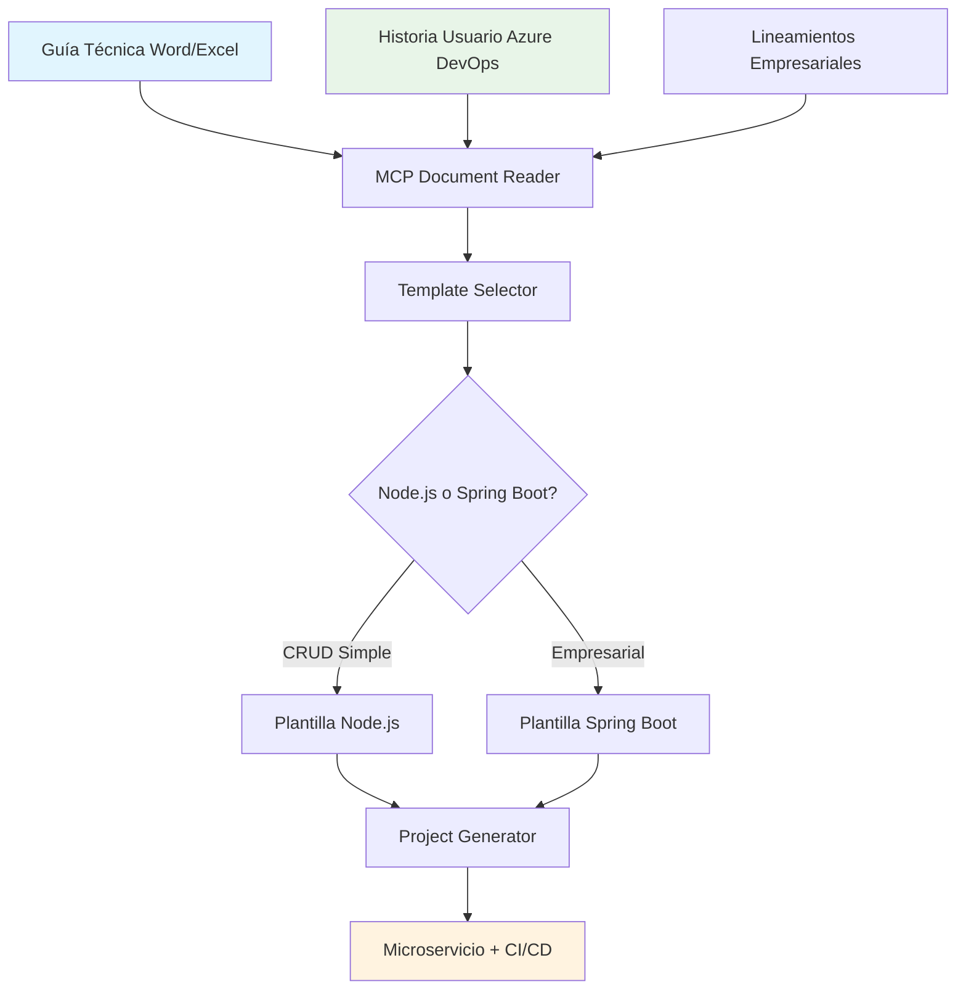

# 📊 Índice General - Fase de Análisis (Fábrica de Desarrollo)

## 🎯 Resumen Ejecutivo

La **Fase de Análisis** del proyecto MCP DevAccelerator establece las bases para crear una **Fábrica de Desarrollo Automatizada** que transforme guías técnicas y historias de usuario en microservicios funcionales, aprovechando las plantillas existentes (Node.js, Spring Boot) y los 400+ microservicios en Azure DevOps.

## 📋 Documentos de la Fase

### 1. Documentación Principal
| Documento | Descripción | Estado | Última Actualización |
|-----------|-------------|--------|---------------------|
| [README.md](./README.md) | Introducción y objetivos de la fase | ✅ Completo | 9 Jul 2025 |
| [Índice General](./indice-analisis.md) | Este documento | ✅ Completo | 9 Jul 2025 |

### 2. Plantillas y Metodología
| Documento | Descripción | Estado | Última Actualización |
|-----------|-------------|--------|---------------------|
| [Proceso Fábrica](./proceso-fabrica-desarrollo.md) | Flujo end-to-end de la fábrica | ✅ Completo | 9 Jul 2025 |
| [Plantillas y Lineamientos](./plantillas-lineamientos-empresariales.md) | Templates Node.js/Spring Boot y estándares | ✅ Completo | 9 Jul 2025 |
| [Criterios de Evaluación](./criterios-evaluacion-tecnica.md) | Métricas y criterios objetivos | ✅ Completo | 9 Jul 2025 |

### 3. Referencias Técnicas
| Documento | Descripción | Estado | Última Actualización |
|-----------|-------------|--------|---------------------|
| [Catálogo de Patrones](./catalogo-patrones-arquitectonicos.md) | Patrones arquitectónicos disponibles | ✅ Completo | 9 Jul 2025 |
| [Casos de Estudio](./casos-estudio-analisis.md) | Ejemplos reales de análisis | ✅ Completo | 9 Jul 2025 |

### 4. Especificaciones Técnicas
| Documento | Descripción | Estado | Última Actualización |
|-----------|-------------|--------|---------------------|
| [Herramientas MCP](./especificacion-herramientas-mcp.md) | Especificación de herramientas a desarrollar | ⚠️ Pendiente actualizar | 9 Jul 2025 |

### 5. Referencias Adicionales
| Documento | Descripción | Estado | Última Actualización |
|-----------|-------------|--------|---------------------|
| [Plantilla de Análisis](./plantilla-analisis-requerimientos.md) | Formato original de análisis | ✅ Completo | 9 Jul 2025 |

## 🔄 Flujo de Trabajo de la Fábrica

### Proceso de la Fábrica de Desarrollo


### Herramientas MCP (MVP)
1. **MCP Document Reader** → Procesa Word, Excel, Azure DevOps
2. **MCP Template Selector** → Decide Node.js vs Spring Boot 
3. **MCP Project Generator** → Genera Clean Architecture + CI/CD

## 📊 Métricas de la Fase

### Completitud de Documentación
- [x] **Proceso de fábrica definido** (100%)
- [x] **Plantillas empresariales documentadas** (100%)
- [x] **Lineamientos de código establecidos** (100%)
- [x] **Criterios de selección de templates** (100%)
- [x] **Flujo MVP especificado** (100%)

### Cobertura de Casos de Uso
- [x] **Microservicios CRUD** → Node.js Template
- [x] **Servicios empresariales** → Spring Boot Template
- [x] **Integraciones Azure DevOps** → Proceso automatizado
- [x] **Clean Architecture** → Ambas plantillas
- [x] **CI/CD Pipeline** → Configuración automática

### Plantillas y Lineamientos Cubiertos
- [x] **Node.js + Express + Clean Architecture** ✅
- [x] **Spring Boot + JPA + Clean Architecture** ✅
- [x] **Estándares de código** ✅
- [x] **Configuración de seguridad** ✅
- [x] **Testing obligatorio** ✅
- [x] **Documentación estándar** ✅
- [x] **Pipelines CI/CD** ✅

## 🎯 Criterios de Éxito de la Fase

### ✅ Completados
- [x] Proceso de fábrica de desarrollo documentado
- [x] Plantillas empresariales (Node.js, Spring Boot) especificadas
- [x] Lineamientos de código y estándares establecidos
- [x] Criterios de selección de templates automatizados
- [x] Flujo MVP (3 herramientas MCP) definido
- [x] Integración con Azure DevOps planificada

### 📋 Próximos Pasos (Fase de Diseño)
- [ ] Implementar MCP Document Reader (Word, Excel, Azure DevOps)
- [ ] Crear MCP Template Selector (lógica de decisión)
- [ ] Desarrollar MCP Project Generator (Clean Architecture)
- [ ] Integrar con plantillas existentes
- [ ] Probar con casos reales de la empresa

## 🔍 Resumen de Entregables

### Plantillas y Procesos
| Tipo | Archivo | Propósito |
|------|---------|-----------|
| **Proceso** | `proceso-fabrica-desarrollo.md` | Flujo end-to-end de la fábrica |
| **Templates** | `plantillas-lineamientos-empresariales.md` | Node.js y Spring Boot + estándares |
| **Evaluación** | `criterios-evaluacion-tecnica.md` | Criterios objetivos de calidad |

### Referencias y Casos
| Tipo | Archivo | Propósito |
|------|---------|-----------|
| **Patrones** | `catalogo-patrones-arquitectonicos.md` | Referencia de patrones arquitectónicos |
| **Casos** | `casos-estudio-analisis.md` | Ejemplos de análisis exitosos |
| **Análisis** | `plantilla-analisis-requerimientos.md` | Formato original de análisis |

### Documentación de Proceso
| Tipo | Archivo | Propósito |
|------|---------|-----------|
| **General** | `README.md` | Introducción a la fase |
| **Índice** | `indice-analisis.md` | Navegación de documentos |

## 🚀 Transición a la Fase de Diseño

### Prerrequisitos Completados ✅
- Metodología de análisis establecida
- Criterios de calidad definidos
- Herramientas MCP especificadas
- Casos de estudio documentados

### Próximos Entregables (Fase de Diseño)
1. **MCP Document Reader** (Word, Excel, Azure DevOps)
2. **MCP Template Selector** (Node.js vs Spring Boot)
3. **MCP Project Generator** (Clean Architecture + CI/CD)
4. **Integración con plantillas existentes**
5. **Validación con casos reales de la empresa**

### Cronograma Estimado
```
Fase de Diseño (MVP): 6 semanas
├── Semana 1-2: MCP Document Reader
├── Semana 3-4: MCP Template Selector  
├── Semana 5-6: MCP Project Generator
└── Integración y testing continuo
```

## 📞 Contacto y Mantenimiento

**Responsable de la Fase**: Equipo MCP DevAccelerator  
**Fecha de Inicio**: 9 de Julio, 2025  
**Fecha de Completado**: 9 de Julio, 2025  
**Estado**: ✅ **FASE COMPLETADA**  

### Próximas Revisiones
- **Revisión mensual**: Actualización de casos de estudio
- **Revisión trimestral**: Actualización de patrones
- **Revisión anual**: Revisión completa de metodología

---

## 📈 Dashboard de Estado

```
┌─────────────────────────────────────────────────┐
│           FÁBRICA DE DESARROLLO                 │
├─────────────────────────────────────────────────┤
│ Estado: ✅ ANÁLISIS COMPLETADO                  │
│ Progreso: ████████████████████████████ 100%    │
│ Documentos: 7/7 ✅                             │
│ Enfoque: 🏭 Fábrica Automatizada               │
│ Próxima fase: 🛠️ IMPLEMENTACIÓN MVP            │
└─────────────────────────────────────────────────┘
```

---

**¡Fase de Análisis redefinida exitosamente!** 🎉  
**Enfoque**: Fábrica de Desarrollo con MCPs + Plantillas Existentes  
**Listos para**: Implementar MVP de 3 herramientas MCP

---

*Última actualización: 9 de Julio, 2025*
