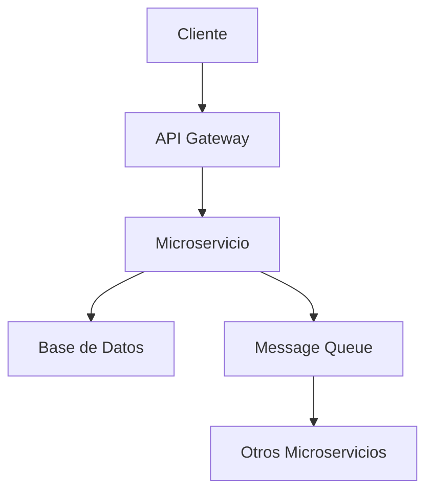

# Plantilla de Análisis de Requerimientos

## 📝 Información del Proyecto

| Campo | Descripción | Ejemplo |
|-------|-------------|---------|
| **Nombre del Proyecto** | Identificador único | `microservicio-usuarios` |
| **Descripción** | Propósito y funcionalidad | Gestión de usuarios y autenticación |
| **Tipo de Microservicio** | Categoría arquitectónica | API REST, Event-Driven, CRUD |
| **Prioridad** | Nivel de importancia | Alta, Media, Baja |
| **Complejidad Estimada** | Evaluación técnica | Simple, Moderada, Compleja |

## 🔧 Requerimientos Funcionales

### Historia de Usuario Principal
```
Como [tipo de usuario]
Quiero [funcionalidad deseada]
Para [beneficio o valor de negocio]
```

### Funcionalidades Específicas
- [ ] **Función 1**: Descripción detallada
- [ ] **Función 2**: Descripción detallada
- [ ] **Función 3**: Descripción detallada

### Criterios de Aceptación
1. **Criterio 1**: Condición específica que debe cumplirse
2. **Criterio 2**: Condición específica que debe cumplirse
3. **Criterio 3**: Condición específica que debe cumplirse

## ⚙️ Requerimientos Técnicos

### Stack Tecnológico
- **Backend**: Node.js, Express, TypeScript
- **Base de Datos**: PostgreSQL, MongoDB, Redis
- **Autenticación**: JWT, OAuth2, LDAP
- **Messagería**: RabbitMQ, Apache Kafka
- **Monitoreo**: Prometheus, Grafana, ELK Stack

### Integraciones Requeridas
| Sistema | Tipo | Protocolo | Descripción |
|---------|------|-----------|-------------|
| Sistema A | REST API | HTTPS | Consulta de datos |
| Sistema B | Message Queue | AMQP | Eventos asíncronos |
| Sistema C | Database | SQL | Persistencia |

### Restricciones Técnicas
- **Performance**: Tiempo de respuesta < 200ms
- **Disponibilidad**: 99.9% uptime
- **Escalabilidad**: Soporte para 1000 req/s
- **Seguridad**: Cifrado TLS 1.3, autenticación obligatoria

## 🏗️ Arquitectura Propuesta

### Patrón Arquitectónico
- [ ] **API Gateway**
- [ ] **Event Sourcing**
- [ ] **CQRS**
- [ ] **Saga Pattern**
- [ ] **Circuit Breaker**

### Componentes Identificados
1. **Controladores**: Endpoints REST
2. **Servicios**: Lógica de negocio
3. **Repositorios**: Acceso a datos
4. **Middlewares**: Autenticación, logging, validación
5. **Eventos**: Publishers y subscribers

## 🔗 Mapeo de Dependencias

### Dependencias Internas
- **Microservicio A**: Para autenticación
- **Microservicio B**: Para validación de datos
- **Shared Library**: Utilidades comunes

### Dependencias Externas
- **API Externa 1**: Servicios de geolocalización
- **API Externa 2**: Servicios de notificación
- **Base de Datos**: Cluster PostgreSQL

### Flujo de Datos


## 📊 Estimaciones

### Esfuerzo de Desarrollo
- **Análisis y Diseño**: X días
- **Desarrollo Backend**: X días
- **Pruebas**: X días
- **Documentación**: X días
- **Deploy y Configuración**: X días

### Recursos Necesarios
- **Desarrolladores**: X personas
- **DevOps**: X personas
- **QA**: X personas
- **Infraestructura**: Descripción de recursos

## ✅ Checklist de Validación

### Completitud del Análisis
- [ ] Todos los requerimientos funcionales están definidos
- [ ] Stack tecnológico está seleccionado
- [ ] Integraciones están identificadas
- [ ] Dependencias están mapeadas
- [ ] Criterios de aceptación están claros

### Viabilidad Técnica
- [ ] Arquitectura es escalable
- [ ] Performance cumple requerimientos
- [ ] Seguridad está contemplada
- [ ] Monitoreo está incluido
- [ ] Estrategia de testing está definida

---

**Fecha de Análisis**: _______________
**Analista**: _______________
**Revisor**: _______________
**Estado**: ⏳ Pendiente / 🔄 En Revisión / ✅ Aprobado
