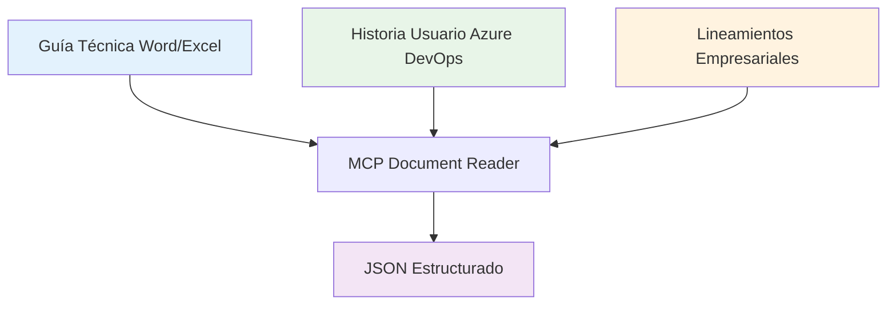
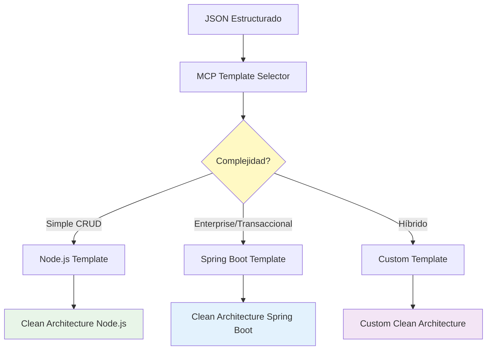
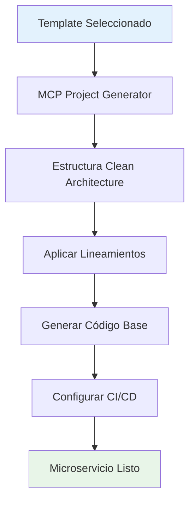
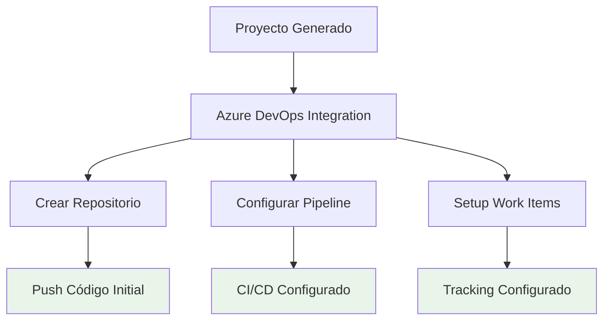

# 🏭 Proceso End-to-End: Fábrica de Desarrollo

## 🎯 Visión General

**Input**: Guía técnica (Word/Excel) + Historia de Usuario (Azure DevOps)  
**Output**: Microservicio funcional con Clean Architecture + CI/CD Pipeline

## 🔄 Flujo del Proceso

### Fase 1: Ingesta de Información


#### 1.1 Fuentes de Entrada
| Fuente | Formato | Información Extraída | Herramienta |
|--------|---------|---------------------|-------------|
| **Guías Técnicas** | Word (.docx) | Endpoints, modelos, reglas de negocio | MCP Document Reader |
| **Historias de Usuario** | Azure DevOps | Criterios de aceptación, prioridad | Azure DevOps API |
| **Especificaciones** | Excel (.xlsx) | Matrices de datos, APIs externas | MCP Document Reader |
| **Lineamientos** | JSON/Markdown | Estándares de código, arquitectura | Config Loader |

#### 1.2 Salida Normalizada
```json
{
  "project": {
    "name": "microservicio-usuarios",
    "type": "api-rest",
    "complexity": "medium",
    "domain": "authentication"
  },
  "requirements": {
    "functional": ["login", "register", "profile-management"],
    "nonFunctional": {
      "performance": "< 200ms",
      "availability": "99.9%",
      "security": "JWT + OAuth2"
    }
  },
  "endpoints": [
    {
      "method": "POST",
      "path": "/auth/login",
      "description": "Autenticación de usuarios"
    }
  ],
  "integrations": [
    {
      "system": "email-service",
      "type": "rest-api",
      "purpose": "notifications"
    }
  ]
}
```

### Fase 2: Toma de Decisiones


#### 2.1 Matriz de Decisión de Plantillas

| Criterio | Node.js | Spring Boot | Recomendación |
|----------|---------|-------------|---------------|
| **CRUD Simple** | ✅ Ideal | ⚠️ Over-engineering | Node.js |
| **Transacciones Complejas** | ⚠️ Limitado | ✅ Ideal | Spring Boot |
| **Alta Concurrencia** | ✅ Event Loop | ✅ Threading | Evaluar caso |
| **Integraciones REST** | ✅ Ligero | ✅ Robusto | Node.js (simplicidad) |
| **Procesamiento Batch** | ⚠️ Limitado | ✅ Ideal | Spring Boot |
| **Time to Market** | ✅ Rápido | ⚠️ Más tiempo | Node.js |

#### 2.2 Análisis de Microservicios Existentes
```typescript
// Proceso de análisis de los 400+ microservicios
interface ExistingServiceAnalyzer {
  // Buscar patrones similares en repo existente
  findSimilarServices(requirements: Requirements): SimilarService[];
  
  // Extraer patrones exitosos
  extractSuccessPatterns(services: SimilarService[]): Pattern[];
  
  // Identificar anti-patrones a evitar
  identifyAntiPatterns(services: SimilarService[]): AntiPattern[];
}
```

### Fase 3: Generación de Proyecto


#### 3.1 Estructura Generada (Node.js)
```
microservicio-usuarios/
├── src/
│   ├── domain/
│   │   ├── entities/
│   │   ├── repositories/
│   │   └── use-cases/
│   ├── infrastructure/
│   │   ├── database/
│   │   ├── external-services/
│   │   └── web/
│   └── application/
│       ├── controllers/
│       ├── middlewares/
│       └── services/
├── tests/
│   ├── unit/
│   ├── integration/
│   └── e2e/
├── docs/
├── pipeline/
│   └── azure-pipelines.yml
├── package.json
├── Dockerfile
└── README.md
```

#### 3.2 Estructura Generada (Spring Boot)
```
microservicio-usuarios/
├── src/
│   ├── main/
│   │   ├── java/com/empresa/usuarios/
│   │   │   ├── domain/
│   │   │   ├── application/
│   │   │   └── infrastructure/
│   │   └── resources/
│   └── test/
├── pipeline/
│   └── azure-pipelines.yml
├── pom.xml
├── Dockerfile
└── README.md
```

### Fase 4: Integración Empresarial


## 🛠️ Especificación de Herramientas MCP

### MCP 1: Document Reader (MVP)
```typescript
interface DocumentReader {
  // Procesar documentos Word
  processWordDocument(filePath: string): Promise<DocumentContent>;
  
  // Procesar documentos Excel
  processExcelDocument(filePath: string): Promise<SpreadsheetContent>;
  
  // Integrar con Azure DevOps
  fetchWorkItems(projectId: string, workItemIds: number[]): Promise<WorkItem[]>;
  
  // Normalizar toda la información
  normalizeContent(sources: ContentSource[]): Promise<NormalizedRequirements>;
}
```

### MCP 2: Template Selector (MVP)
```typescript
interface TemplateSelector {
  // Analizar requerimientos y sugerir template
  selectTemplate(requirements: NormalizedRequirements): TemplateRecommendation;
  
  // Buscar servicios similares existentes
  findSimilarServices(requirements: NormalizedRequirements): ExistingService[];
  
  // Aplicar reglas de negocio empresariales
  applyBusinessRules(template: Template, requirements: NormalizedRequirements): ConfiguredTemplate;
}
```

### MCP 3: Project Generator (MVP)
```typescript
interface ProjectGenerator {
  // Generar estructura del proyecto
  generateProjectStructure(template: ConfiguredTemplate): ProjectStructure;
  
  // Aplicar lineamientos empresariales
  applyCompanyGuidelines(project: ProjectStructure): EnhancedProject;
  
  // Generar archivos de configuración
  generateConfigFiles(project: EnhancedProject): ConfigFiles;
  
  // Crear documentación inicial
  generateDocumentation(project: EnhancedProject): Documentation;
}
```

## 📊 Plan de Implementación MVP

### Semana 1-2: MCP Document Reader
- [x] **Día 1-3**: Procesador de Word básico
- [ ] **Día 4-6**: Procesador de Excel básico
- [ ] **Día 7-10**: Integración Azure DevOps básica
- [ ] **Día 11-14**: Normalizador de datos

### Semana 3-4: MCP Template Selector
- [ ] **Día 1-4**: Lógica de decisión Node.js vs Spring Boot
- [ ] **Día 5-8**: Aplicador de lineamientos empresariales
- [ ] **Día 9-12**: Buscador de servicios similares (básico)
- [ ] **Día 13-14**: Integración con Document Reader

### Semana 5-6: MCP Project Generator
- [ ] **Día 1-5**: Generador de estructura Clean Architecture
- [ ] **Día 6-8**: Generador de código base (controllers, services)
- [ ] **Día 9-10**: Generador de tests básicos
- [ ] **Día 11-14**: Configuración CI/CD Azure DevOps

## 🧪 Casos de Prueba MVP

### Caso 1: Microservicio Simple (Node.js)
**Input**: 
- Word: "API REST para gestión de usuarios"
- Azure DevOps: Historia de usuario básica

**Output Esperado**:
- Proyecto Node.js con Express + Clean Architecture
- Endpoints básicos CRUD
- Tests unitarios generados
- Pipeline CI/CD configurado

### Caso 2: Microservicio Empresarial (Spring Boot)
**Input**:
- Excel: Matriz de endpoints complejos
- Azure DevOps: Múltiples historias con transacciones

**Output Esperado**:
- Proyecto Spring Boot con JPA + Clean Architecture
- Servicios transaccionales
- Tests de integración
- Pipeline con stages empresariales

## 🎯 Criterios de Aceptación MVP

### Funcionalidad Básica
- [ ] Procesa documentos Word y Excel correctamente
- [ ] Selecciona template apropiado (Node.js vs Spring Boot)
- [ ] Genera proyecto con Clean Architecture
- [ ] Aplica lineamientos empresariales automáticamente
- [ ] Crea repositorio en Azure DevOps
- [ ] Configura pipeline CI/CD básico

### Calidad
- [ ] 90% de acierto en selección de template
- [ ] Código generado compila sin errores
- [ ] Tests generados pasan correctamente
- [ ] Documentación básica incluida

### Performance
- [ ] Proceso completo < 5 minutos
- [ ] Manejo de documentos hasta 50 páginas
- [ ] Soporte para hasta 20 endpoints por servicio

---

## 🚀 Siguientes Pasos

1. **Implementar MCP Document Reader básico**
2. **Crear lógica de selección de templates**
3. **Desarrollar generador de Clean Architecture**
4. **Integrar con Azure DevOps**
5. **Probar con casos reales de la empresa**

---

**Estado**: 📋 **Proceso documentado - Listo para implementación**
**Próximo milestone**: MCP Document Reader funcional
