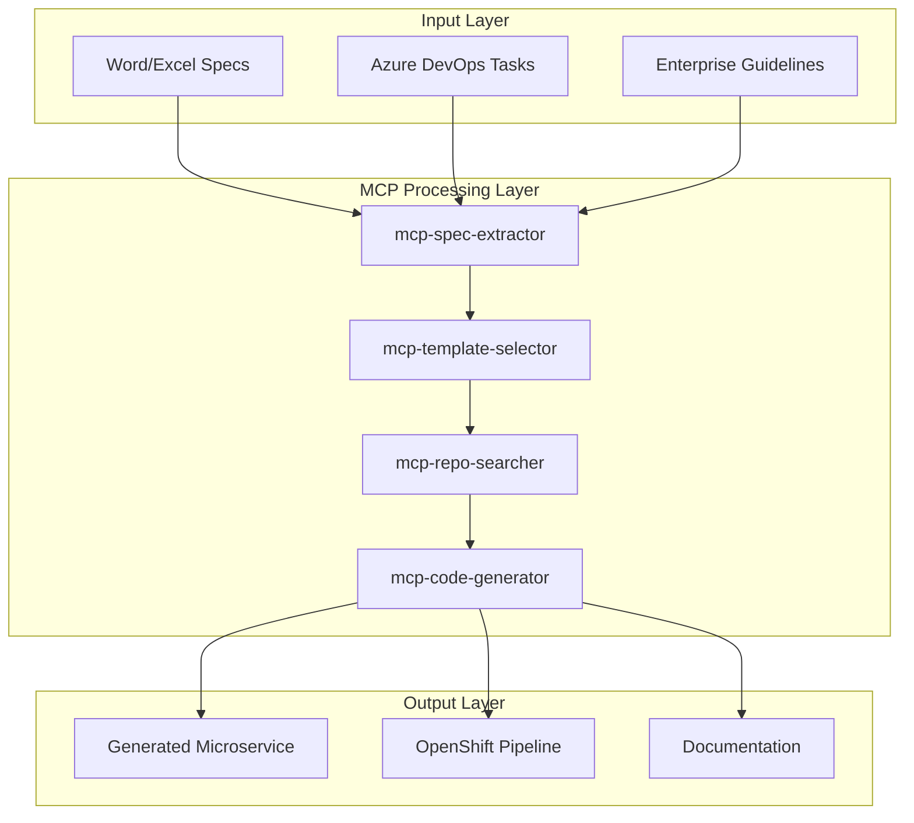
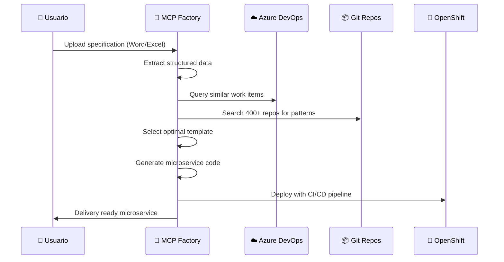

# 🎨 Resumen Ejecutivo - Diseño de la Fábrica MCP

## 🎯 Visión del Diseño

**Arquitectura técnica y organizacional** para implementar la Fábrica de Desarrollo MCP DevAccelerator, definiendo la estructura de equipos, tecnologías, integraciones y flujos de trabajo necesarios para transformar el proceso de desarrollo de microservicios.

## 🏗️ Arquitectura de la Solución

### Componentes Core del Sistema


### Stack Tecnológico
| Capa | Tecnología | Justificación |
|------|------------|---------------|
| **MCPs** | Node.js 18+ + TypeScript | Ecosistema maduro, integración Claude |
| **AI/ML** | Claude API + Custom Models | Extracción inteligente de especificaciones |
| **Integraciones** | Azure DevOps API + REST | Acceso nativo a repositorios y work items |
| **Storage** | PostgreSQL + Redis | Persistencia + caching para performance |
| **Container** | Docker + OpenShift | Deployment estándar empresarial |
| **Monitoring** | Prometheus + Grafana | Observabilidad y métricas |

## 👥 Estructura Organizacional

### Equipo de Implementación (6-8 semanas)
| Rol | FTE | Responsabilidades Clave |
|-----|-----|------------------------|
| **🏗️ Arquitecto de Software** | 0.5 | Diseño técnico, decisiones arquitectónicas, integración |
| **👨‍💻 Desarrollador Full-Stack** | 1.0 | Implementación MCPs, APIs, interfaces |
| **🔧 DevOps Engineer** | 0.3 | Azure DevOps, OpenShift, CI/CD, seguridad |
| **🎯 Líder Técnico (Piloto)** | 0.2 | Testing, validación, casos de uso reales |

### Equipo de Operación (Post Go-Live)
| Rol | FTE | Responsabilidades Clave |
|-----|-----|------------------------|
| **👨‍🔧 Administrador de Fábrica** | 0.1 | Mantenimiento MCPs, actualización templates |
| **📚 Curador de Repositorios** | 0.05 | Análisis patrones nuevos, mejores prácticas |
| **🆘 Soporte Técnico** | 0.15 | Help desk, troubleshooting, capacitación |

### Matriz RACI
| Actividad | Arquitecto | Desarrollador | DevOps | Líder Técnico |
|-----------|------------|---------------|--------|---------------|
| Diseño arquitectura MCP | **R** | C | C | I |
| Implementación MCPs | A | **R** | C | C |
| Configuración Azure DevOps | C | C | **R** | A |
| Testing casos reales | C | C | I | **R** |
| Capacitación usuarios | C | I | C | **A** |

*R=Responsable, A=Aprueba, C=Consulta, I=Informado*

## 🔐 Arquitectura de Seguridad

### Modelo de Permisos
```
┌─────────────────────────────────────────┐
│             SECURITY LAYERS             │
├─────────────────────────────────────────┤
│ 🔐 Azure AD Authentication              │
│ 🛡️  RBAC Authorization                  │
│ 🔒 API Key Management                   │
│ 📝 Audit Logging                       │
│ 🚫 Network Isolation                   │
└─────────────────────────────────────────┘
```

### Acceso a Recursos
| Recurso | Permisos Requeridos | Principio |
|---------|-------------------|-----------|
| **400+ Repositorios** | Read-only clone/browse | Least privilege |
| **Azure DevOps** | Work items read, Repos read | Service account |
| **OpenShift** | Project creation, deployment | Dedicated namespace |
| **Templates** | Read templates, write output | Segregated access |

### Controles de Seguridad
- **🔑 Gestión de secretos**: Azure Key Vault
- **🔍 Monitoreo de acceso**: Azure Monitor + SIEM
- **🛡️ Escaneo de vulnerabilidades**: Automated security scanning
- **📋 Compliance**: SOX, GDPR, ISO 27001 alignment
- **🔒 Encriptación**: TLS 1.3, AES-256 at rest

## 🔄 Flujos de Trabajo Detallados

### Flujo Principal: Especificación → Microservicio


### Workflow por Roles

#### 👨‍💻 Desarrollador
1. **Input**: Especificación técnica (Word/Excel/Azure Task)
2. **Proceso**: Submit a MCP Factory via web interface
3. **Review**: Generated code structure y configuración
4. **Customize**: Business logic específica del dominio
5. **Deploy**: Merge to trigger automated pipeline

#### 🏗️ Líder Técnico  
1. **Strategy**: Define templates y estándares empresariales
2. **Review**: Validate generated architecture
3. **Approve**: Sign-off para deployment a producción
4. **Monitor**: Métricas de calidad y performance

#### 🔧 DevOps Engineer
1. **Setup**: Configurar integraciones Azure DevOps/OpenShift
2. **Maintain**: Templates actualizados y pipelines
3. **Monitor**: Health sistema y performance MCPs
4. **Support**: Troubleshooting y resolución de incidentes

## 📊 Estimaciones de Implementación

### Cronograma por Fases
| Fase | Duración | Esfuerzo | Entregables Principales |
|------|----------|----------|-------------------------|
| **Diseño Detallado** | 2 semanas | 120h | Arquitectura, especificaciones técnicas |
| **MVP Development** | 4 semanas | 320h | MCP core + integración básica |
| **Advanced Features** | 4 semanas | 280h | Motor búsqueda + generación inteligente |
| **Production Ready** | 2 semanas | 160h | Hardening, documentación, capacitación |

### Estimación de Costos de Implementación
| Categoría | Costo | Distribución |
|-----------|-------|-------------|
| **Desarrollo** | $90,000 | 61% |
| **Infraestructura** | $8,000 | 5% |
| **Testing y QA** | $12,000 | 8% |
| **Capacitación** | $10,000 | 7% |
| **Contingencia** | $27,000 | 19% |
| **Total** | **$147,000** | 100% |

### Estimación de Costos Operacionales (Anual)
| Categoría | Costo Anual | Descripción |
|-----------|-------------|-------------|
| **Personal** | $45,000 | Admin + soporte + curación |
| **Infraestructura** | $12,000 | Hosting, storage, compute |
| **Licencias** | $8,000 | Azure, herramientas, APIs |
| **Mantenimiento** | $10,000 | Updates, security patches |
| **Total Operacional** | **$75,000** | |

## 🎯 Arquitectura de Implementación

### Ambiente de Desarrollo
```
┌─────────────────────────────────────────┐
│            DEV ENVIRONMENT              │
├─────────────────────────────────────────┤
│ 🖥️  Local Development                   │
│ 🧪 Unit Testing                        │
│ 🔗 API Integration Testing             │
│ 📝 Documentation Generation            │
└─────────────────────────────────────────┘
```

### Ambiente de Testing
```
┌─────────────────────────────────────────┐
│           TEST ENVIRONMENT              │
├─────────────────────────────────────────┤
│ 🎭 User Acceptance Testing             │
│ 🔄 End-to-End Workflows               │
│ 📊 Performance Testing                │
│ 🛡️  Security Testing                   │
└─────────────────────────────────────────┘
```

### Ambiente de Producción
```
┌─────────────────────────────────────────┐
│          PROD ENVIRONMENT               │
├─────────────────────────────────────────┤
│ 🚀 High Availability Setup             │
│ 📈 Auto-scaling                       │
│ 🔍 Comprehensive Monitoring           │
│ 💾 Automated Backups                  │
└─────────────────────────────────────────┘
```

## 📈 Métricas de Éxito del Diseño

### KPIs Técnicos
| Métrica | Target | Medición |
|---------|--------|----------|
| **Tiempo generación microservicio** | < 30 min | End-to-end desde spec |
| **Precisión extracción** | > 95% | Validación manual samples |
| **Uptime sistema** | > 99.5% | Monitoreo 24/7 |
| **Performance búsqueda repos** | < 10 seg | 400+ repos search |

### KPIs de Negocio
| Métrica | Target | Medición |
|---------|--------|----------|
| **Adopción por equipos** | > 80% | Active users por semana |
| **Reducción tiempo setup** | > 85% | Before vs after comparison |
| **Satisfacción usuario** | > 4.5/5 | NPS surveys mensuales |
| **ROI** | > 200% | Cost savings vs investment |

### KPIs de Calidad
| Métrica | Target | Medición |
|---------|--------|----------|
| **Adherencia estándares** | 100% | Automated compliance checks |
| **Cobertura testing** | > 80% | Generated code quality |
| **Seguridad** | 0 vulnerabilidades críticas | Security scanning |
| **Documentación** | 100% coverage | All components documented |

## 🔮 Roadmap de Evolución

### Versión 1.0 (MVP) - Semanas 1-8
- ✅ Extractor Word/Excel básico
- ✅ Template selector Node.js/Spring Boot
- ✅ Generador código con pipeline básico
- ✅ Integración Azure DevOps elemental

### Versión 2.0 (Advanced) - Semanas 9-16
- 🔄 Motor búsqueda inteligente en 400+ repos
- 🤖 AI-powered pattern recognition  
- 📊 Dashboard métricas y analytics
- 🔐 Enterprise security hardening

### Versión 3.0 (Enterprise) - Semanas 17-24
- 🌐 Multi-tenant architecture
- 🔄 Auto-healing y self-optimization
- 📱 Mobile interface
- 🤝 Third-party tool integrations

## 🚀 Preparación para Implementación

### Pre-requisitos Técnicos
- [ ] Azure DevOps tenant configurado
- [ ] OpenShift cluster disponible
- [ ] Acceso read-only a 400+ repositorios
- [ ] Claude API keys y quotas
- [ ] PostgreSQL database instance

### Pre-requisitos Organizacionales
- [ ] Sponsor ejecutivo identificado (CTO level)
- [ ] Budget aprobado ($147K)
- [ ] Recursos asignados y disponibles
- [ ] Change management plan activado
- [ ] Communication plan con stakeholders

### Criterios de Go/No-Go
| Criterio | Required | Status |
|----------|----------|--------|
| **Budget approval** | ✅ | ⏳ Pending |
| **Resource allocation** | ✅ | ⏳ Pending |
| **Technical feasibility** | ✅ | ✅ Validated |
| **Executive sponsorship** | ✅ | ⏳ Pending |
| **Change readiness** | ✅ | ⏳ Assessment needed |

---

**🎯 El diseño de la Fábrica MCP está listo para implementación** con arquitectura sólida, equipos definidos, y plan de ejecución claro.

**Próximo paso**: Obtener aprobaciones finales y arrancar Fase 1 de implementación.

---

**Preparado por**: Equipo de Arquitectura MCP  
**Revisado por**: CTO, VP Engineering, Security Officer  
**Fecha**: 25 de Julio, 2025  
**Estado**: ✅ **DISEÑO COMPLETADO - LISTO PARA IMPLEMENTACIÓN**