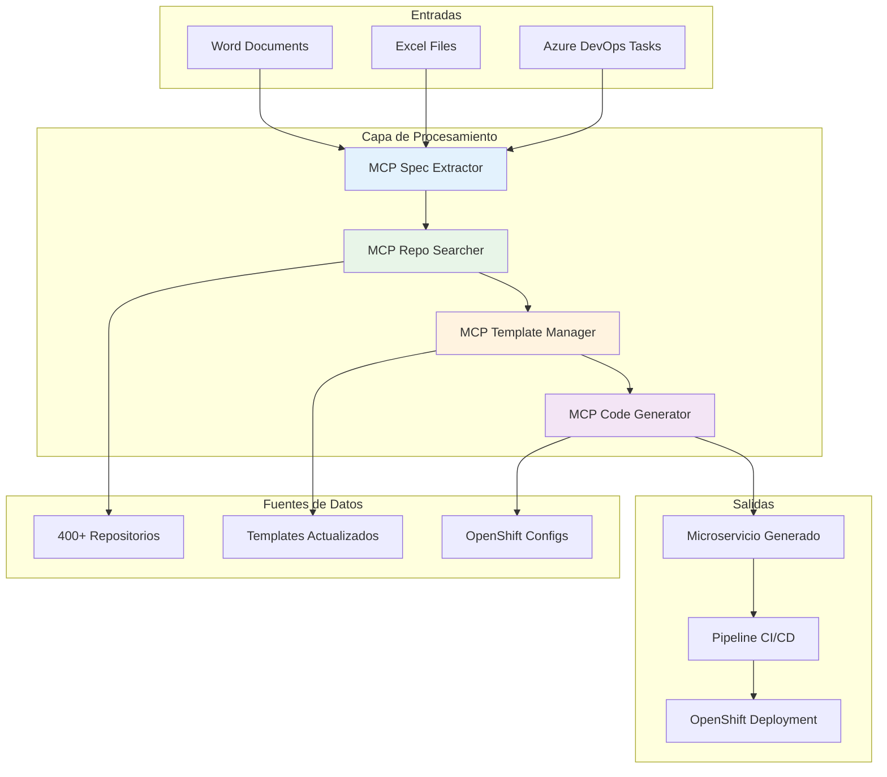
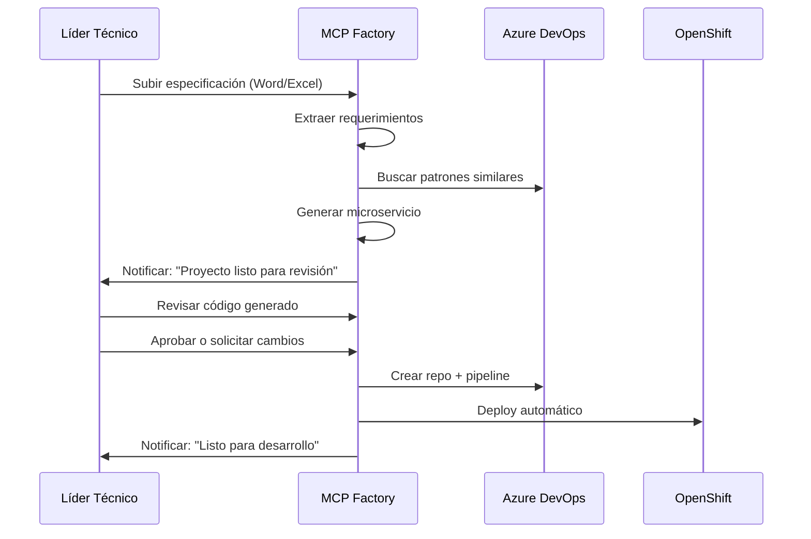
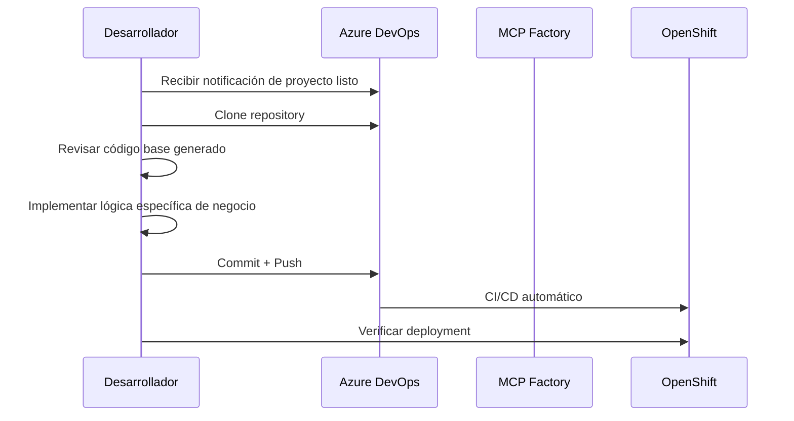
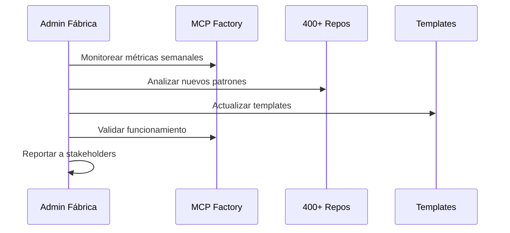

# 🎨 Diseño - Fábrica de Desarrollo MCP

## 🎯 Visión General

La **Fase de Diseño** del proyecto MCP DevAccelerator define la arquitectura técnica, estructura organizacional y plan de implementación detallado para materializar la visión de la Fábrica de Desarrollo Automatizada.

### Objetivos del Diseño
- **Arquitectura técnica** robusta y escalable para herramientas MCP
- **Estructura organizacional** con roles y responsabilidades claras
- **Integraciones empresariales** con Azure DevOps, OpenShift y repositorios
- **Modelo de seguridad** y gestión de permisos
- **Flujos de trabajo** optimizados para cada perfil de usuario
- **Plan de implementación** detallado con cronograma y costos

## 📚 Documentación de Diseño

### 📋 Documentos Principales
| Documento | Descripción | Estado |
|-----------|-------------|--------|
| [📋 Resumen Ejecutivo](./00-executive-summary-design.md) | Arquitectura, equipos, cronograma y costos | ✅ |
| [🏗️ Arquitectura MCP Code Generator](./arquitectura-mcp-code-generator.md) | Diseño técnico del generador principal | ✅ |
| [🔍 Arquitectura MCP Repo Searcher](./arquitectura-mcp-repo-searcher.md) | Motor de búsqueda en repositorios | ✅ |
| [📄 Arquitectura MCP Spec Extractor](./arquitectura-mcp-spec-extractor.md) | Extractor de especificaciones | ✅ |
| [📐 Arquitectura MCP Template Manager](./arquitectura-mcp-template-manager.md) | Gestor de templates empresariales | ✅ |

### 🎯 Experiencia de Usuario y Workflows
| Documento | Descripción | Estado |
|-----------|-------------|--------|
| [👤 Casos de Uso y UX](./casos-uso-experiencia-usuario.md) | Flujos por rol y experiencia usuario | ✅ |
| [🔄 Workflows Diarios por Roles](./workflows-diarios-roles.md) | Procesos específicos por perfil | ✅ |
| [📚 Guía de Acceso Práctico](./guía-acceso-uso-practico.md) | Manual de uso step-by-step | ✅ |

### 🚀 Implementación y Operación
| Documento | Descripción | Estado |
|-----------|-------------|--------|
| [📈 Plan de Implementación](./plan-implementacion-roadmap.md) | Roadmap detallado por fases | ✅ |
| [🏭 Estrategia de Automatización](./estrategia-automatizacion-fabrica.md) | Automatización de la fábrica | ✅ |
| [🔧 Guía de Deployment](./guia-deployment-operacion.md) | Operación y mantenimiento | ✅ |
| [📍 Resumen de Ubicación](./resumen-ubicacion-uso.md) | Integración en proceso actual | ✅ |

## 👥 Diseño Organizacional

### Roles y Perfiles Necesarios

#### 🏗️ **Equipo de Implementación (Fase de Construcción)**

| Rol | Responsabilidad | Perfil Requerido | Tiempo Estimado |
|-----|----------------|------------------|-----------------|
| **Arquitecto de Software** | Diseño técnico, decisiones arquitectónicas | Senior, experiencia MCP/LLM, Azure DevOps | 50% por 6 semanas |
| **Desarrollador Full-Stack** | Implementación MCPs, integraciones | Senior Node.js/Python, APIs, Git | 100% por 6 semanas |
| **DevOps Engineer** | Configuración Azure DevOps, OpenShift, permisos | Experto Azure DevOps, OpenShift, seguridad | 30% por 6 semanas |
| **Líder Técnico (Usuario Piloto)** | Testing, feedback, casos de uso reales | Actual líder técnico con conocimiento del proceso | 20% por 6 semanas |

#### ⚙️ **Equipo de Operación (Post-Implementación)**

| Rol | Responsabilidad | Perfil Requerido | Tiempo Estimado |
|-----|----------------|------------------|-----------------|
| **Administrador de Fábrica** | Mantenimiento MCPs, templates actualizados | Mid-level, scripting, Git | 10% continuo |
| **Curador de Repositorios** | Análisis de nuevos patrones en 400+ repos | Junior/Mid, análisis de código | 5% continuo |
| **Soporte Técnico** | Resolución de incidencias, capacitación | Mid-level, conocimiento del proceso | 15% continuo |

### Matriz de Responsabilidades (RACI)

| Actividad | Arquitecto | Desarrollador | DevOps | Líder Técnico | Admin Fábrica |
|-----------|------------|---------------|--------|---------------|---------------|
| **Diseño MCP Architecture** | R | C | C | I | I |
| **Implementación MCPs** | A | R | C | C | I |
| **Configuración Azure DevOps** | C | C | R | A | I |
| **Testing con casos reales** | C | C | I | R | A |
| **Mantenimiento templates** | I | C | I | C | R |
| **Capacitación usuarios** | C | I | C | A | R |
| **Monitoreo y soporte** | I | I | C | I | R |

*R=Responsable, A=Aprueba, C=Consulta, I=Informado*

## 🔐 Diseño de Seguridad y Permisos

### Acceso a Repositorios (400+ Repos)

#### Permisos Requeridos por la Fábrica
```yaml
Azure DevOps Access:
  - Organization: READ (para buscar repos)
  - Projects: READ (para análisis de patrones)
  - Repositories: READ (para extraer código)
  - Work Items: READ/WRITE (para crear tasks)
  - Pipelines: CREATE (para generar CI/CD)
  
GitHub/GitLab Access (si aplica):
  - Organization: READ
  - Repositories: READ
  - Issues: READ
```

#### Service Principal / Bot Account
```json
{
  "name": "mcp-factory-bot",
  "permissions": [
    "devops.project.read",
    "devops.repository.read", 
    "devops.workitem.read_write",
    "devops.pipeline.create",
    "openshift.deployment.create"
  ],
  "scope": "organization-wide",
  "security": {
    "authentication": "service_principal",
    "secrets": "azure_key_vault",
    "rotation": "90_days"
  }
}
```

### Seguridad de Datos Sensibles

#### Información Clasificada en Repos
- ❌ **No acceso**: Secretos, configuraciones production
- ✅ **Acceso permitido**: Estructura de código, patrones públicos
- ✅ **Acceso controlado**: Configuraciones de desarrollo/testing

#### Manejo de Especificaciones
```yaml
Documentos Word/Excel:
  - Almacenamiento: SharePoint/Azure Blob (temporal)
  - Procesamiento: En memoria, sin persistencia
  - Logs: Sin datos sensibles, solo metadatos
  
Azure DevOps Tasks:
  - Acceso: Solo work items asignados al equipo
  - Scope: Proyectos específicos (no todos)
```

## 🏗️ Arquitectura Técnica

### Arquitectura de Alto Nivel



### Diseño de Componentes MCP

#### 1. MCP Spec Extractor
```typescript
interface SpecExtractorDesign {
  // Arquitectura
  runtime: 'Node.js 18+';
  framework: 'Express + TypeScript';
  
  // Capacidades
  processors: {
    word: 'mammoth.js + natural language processing';
    excel: 'xlsx + data parsing';
    azureDevOps: 'azure-devops-node-api';
  };
  
  // Output
  format: 'JSON Schema validado';
  storage: 'temporal en memoria';
  
  // Performance
  maxFileSize: '50MB';
  timeout: '30 segundos';
  concurrent: '5 documentos';
}
```

#### 2. MCP Repo Searcher  
```typescript
interface RepoSearcherDesign {
  // Indexación
  indexing: {
    frequency: 'weekly';
    scope: '400+ repositorios';
    content: 'código + configuraciones + READMEs';
  };
  
  // Búsqueda
  search: {
    engine: 'elasticsearch/opensearch';
    similarity: 'semantic similarity (embeddings)';
    filters: 'tecnología, dominio, complejidad';
  };
  
  // Extracción
  extraction: {
    patterns: 'AST parsing + regex';
    validation: 'compilación + tests';
    ranking: 'usage frequency + stars + age';
  };
}
```

#### 3. MCP Template Manager
```typescript
interface TemplateManagerDesign {
  // Templates
  storage: 'Git repository versionado';
  update: 'CI/CD automático con dependencias';
  validation: 'tests + security scan';
  
  // Versionado
  strategy: 'semantic versioning';
  rollback: 'automático si falla validación';
  
  // Personalización
  customization: 'merge de empresa + template base';
  variables: 'inyección de configuración específica';
}
```

#### 4. MCP Code Generator
```typescript
interface CodeGeneratorDesign {
  // Generación
  engine: 'template engine (Handlebars/Mustache)';
  validation: 'ESLint + Prettier + tests automáticos';
  
  // Integración
  git: 'creación de repo + initial commit';
  pipeline: 'azure-pipelines.yml generado';
  openshift: 'deployment.yaml + service.yaml';
  
  // Post-generación
  verification: 'build + test + deploy simulation';
  notification: 'Teams/Email al líder técnico';
}
```

## 🔄 Flujos de Trabajo por Perfil

### Flujo del Líder Técnico (Usuario Principal)



**Tiempo del Líder Técnico**: 30-60 minutos (vs. 2-3 días actuales)

### Flujo del Desarrollador (Usuario Secundario)



**Foco del Desarrollador**: Solo lógica de negocio (no boilerplate)

### Flujo del Administrador de Fábrica



## 🎯 Métricas y KPIs del Diseño

### Métricas Técnicas
| Métrica | Objetivo | Herramienta |
|---------|----------|-------------|
| **Tiempo extracción** | < 30 segundos | Application Insights |
| **Precisión extracción** | > 95% | Manual validation + feedback |
| **Tiempo generación** | < 5 minutos | CI/CD logs |
| **Éxito de builds** | > 98% | Azure DevOps analytics |
| **Uptime de fábrica** | > 99.5% | Azure Monitor |

### Métricas de Negocio
| Métrica | Objetivo | Cálculo |
|---------|----------|---------|
| **Reducción tiempo líder** | > 80% | (Tiempo_antes - Tiempo_después) / Tiempo_antes |
| **Microservicios/mes** | +200% | Count mensual |
| **Reutilización código** | > 70% | LOC_reutilizada / LOC_total |
| **Satisfacción usuario** | > 4.5/5 | Survey mensual |

## 🚀 Plan de Implementación del Diseño

### Sprint 1-2: Infraestructura Base (2 semanas)
- [ ] **Configurar Azure DevOps service principal**
- [ ] **Setup permisos en 400+ repositorios**  
- [ ] **Crear infraestructura MCP hosting**
- [ ] **Implementar MCP Spec Extractor MVP**

### Sprint 3-4: Búsqueda y Templates (2 semanas)
- [ ] **Indexar repositorios existentes**
- [ ] **Implementar MCP Repo Searcher**
- [ ] **Actualizar template Node.js base**
- [ ] **Configurar template versionado**

### Sprint 5-6: Generación y Integración (2 semanas)
- [ ] **Implementar MCP Code Generator**
- [ ] **Integración con OpenShift**
- [ ] **Testing end-to-end con casos reales**
- [ ] **Capacitación a líderes técnicos piloto**

---

**Estado**: 📋 **Diseño organizacional y técnico completado**
**Próximo paso**: Definir arquitectura detallada de MCPs y comenzar implementación
**Equipo requerido**: 1 Arquitecto + 1 Desarrollador + 0.3 DevOps por 6 semanas
