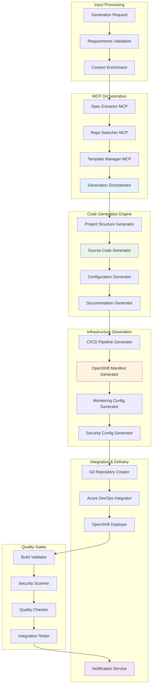

# ⚡ Arquitectura Detallada: MCP Code Generator

## 📋 Resumen del Componente

El **MCP Code Generator** es el componente final y más crítico de la cadena de automatización, responsable de orquestar todos los componentes anteriores para generar un microservicio completamente funcional, incluyendo código fuente, configuraciones, pipelines CI/CD y manifiestos de deployment para OpenShift.

## 🎯 Objetivos y Responsabilidades

### Objetivos Primarios
- **Orquestar la generación end-to-end** de microservicios completos
- **Integrar patrones reutilizables** con templates personalizados
- **Generar infraestructura como código** (CI/CD, OpenShift, monitoreo)
- **Garantizar calidad** mediante validación automática y testing

### Responsabilidades Específicas
```yaml
Code Generation:
  - Orchestración de componentes MCP (Extractor, Searcher, Template Manager)
  - Generación de código fuente basado en templates y patrones
  - Integración de patrones reutilizables identificados
  - Aplicación de estándares de código y mejores prácticas

Infrastructure Generation:
  - Generación de pipelines CI/CD para Azure DevOps
  - Creación de manifiestos OpenShift/Kubernetes
  - Configuración de monitoreo y observabilidad
  - Setup de entornos (dev, test, staging, prod)

Integration & Delivery:
  - Creación automática de repositorios Git
  - Configuración de webhooks y integraciones
  - Deploy inicial a entorno de desarrollo
  - Configuración de secrets y variables de entorno

Quality Assurance:
  - Validación end-to-end del proyecto generado
  - Testing automático de build y deployment
  - Verificación de estándares de seguridad
  - Notificación de estado y próximos pasos
```

## 🏗️ Arquitectura Técnica

### Stack Tecnológico
```typescript
interface TechStack {
  runtime: 'Node.js 18 LTS';
  framework: 'Express.js + TypeScript + BullMQ para queues';
  orchestration: {
    workflow: 'Azure Logic Apps + custom orchestrator';
    messaging: 'Azure Service Bus para eventos';
    state: 'Azure Cosmos DB para tracking de jobs';
  };
  generation: {
    templating: 'Handlebars + custom helpers';
    fileGeneration: 'vinyl-fs + gulp para file streams';
    codeGeneration: 'AST manipulation con babel/typescript';
  };
  integration: {
    git: '@octokit/rest + azure-devops-node-api';
    cicd: 'Azure DevOps REST API';
    openshift: 'kubernetes-client + OpenShift REST API';
    secrets: 'Azure Key Vault SDK';
  };
  validation: {
    build: 'Docker + testcontainers';
    quality: 'SonarQube API + ESLint';
    security: 'Snyk CLI + OWASP dependency check';
  };
}
```

### Diseño de Alto Nivel



### Componentes Detallados

#### 1. Generation Orchestrator
```typescript
class GenerationOrchestrator {
  private mcpClients: MCPClients;
  private jobQueue: Queue;
  private stateManager: StateManager;
  
  async generateMicroservice(request: GenerationRequest): Promise<GenerationJob> {
    // Create generation job
    const job = await this.createGenerationJob(request);
    
    // Add to processing queue
    await this.jobQueue.add('generate-microservice', {
      jobId: job.id,
      request,
      priority: request.priority || 'normal'
    }, {
      attempts: 3,
      backoff: 'exponential',
      delay: 1000
    });
    
    return job;
  }
  
  async processGenerationJob(jobData: GenerationJobData): Promise<GenerationResult> {
    const { jobId, request } = jobData;
    
    try {
      await this.updateJobStatus(jobId, 'processing', 'Starting generation process');
      
      // Step 1: Extract and validate requirements
      const requirements = await this.extractRequirements(request);
      await this.updateJobStatus(jobId, 'processing', 'Requirements extracted', { progress: 10 });
      
      // Step 2: Search for reusable patterns
      const patterns = await this.searchPatterns(requirements);
      await this.updateJobStatus(jobId, 'processing', 'Patterns identified', { progress: 20 });
      
      // Step 3: Get and customize template
      const template = await this.getCustomizedTemplate(requirements, patterns);
      await this.updateJobStatus(jobId, 'processing', 'Template customized', { progress: 30 });
      
      // Step 4: Generate project structure and code
      const generatedProject = await this.generateProject(template, requirements, patterns);
      await this.updateJobStatus(jobId, 'processing', 'Code generated', { progress: 50 });
      
      // Step 5: Generate infrastructure code
      const infrastructure = await this.generateInfrastructure(generatedProject, requirements);
      await this.updateJobStatus(jobId, 'processing', 'Infrastructure generated', { progress: 60 });
      
      // Step 6: Create repository and setup CI/CD
      const repository = await this.createRepository(generatedProject, infrastructure);
      await this.updateJobStatus(jobId, 'processing', 'Repository created', { progress: 70 });
      
      // Step 7: Deploy to development environment
      const deployment = await this.deployToDev(repository, infrastructure);
      await this.updateJobStatus(jobId, 'processing', 'Deployed to dev', { progress: 80 });
      
      // Step 8: Run quality gates
      const validation = await this.runQualityGates(repository, deployment);
      await this.updateJobStatus(jobId, 'processing', 'Quality gates completed', { progress: 90 });
      
      // Step 9: Final notifications and cleanup
      await this.finalizeGeneration(jobId, repository, deployment, validation);
      await this.updateJobStatus(jobId, 'completed', 'Generation completed successfully', { progress: 100 });
      
      return {
        success: true,
        jobId,
        repository,
        deployment,
        validation,
        artifacts: {
          sourceCode: repository.cloneUrl,
          pipeline: repository.pipelineUrl,
          deployment: deployment.url,
          documentation: repository.documentationUrl
        }
      };
    } catch (error) {
      await this.handleGenerationError(jobId, error);
      throw error;
    }
  }
  
  private async extractRequirements(request: GenerationRequest): Promise<ExtractedRequirements> {
    if (request.source.type === 'specification') {
      // Use Spec Extractor MCP
      const response = await this.mcpClients.specExtractor.extract({
        document: request.source.document,
        type: request.source.documentType
      });
      
      return response.requirements;
    } else if (request.source.type === 'azure-devops') {
      // Extract from Azure DevOps work item
      const response = await this.mcpClients.specExtractor.extractFromAzureDevOps({
        workItemId: request.source.workItemId,
        projectName: request.source.projectName
      });
      
      return response.requirements;
    } else {
      // Direct requirements provided
      return request.source.requirements;
    }
  }
  
  private async searchPatterns(requirements: ExtractedRequirements): Promise<RelevantPattern[]> {
    const searchResults = await this.mcpClients.repoSearcher.search({
      requirements,
      maxResults: 10,
      includeCode: true,
      filters: {
        technology: requirements.technology,
        domain: requirements.domain
      }
    });
    
    // Filter and rank patterns based on relevance and quality
    return searchResults.patterns
      .filter(p => p.score > 0.7)
      .slice(0, 5)
      .map(p => ({
        ...p,
        applicableComponents: this.identifyApplicableComponents(p, requirements)
      }));
  }
  
  private async getCustomizedTemplate(
    requirements: ExtractedRequirements, 
    patterns: RelevantPattern[]
  ): Promise<CustomizedTemplate> {
    const customizationRequest = {
      requirements,
      patterns: patterns.map(p => p.id),
      customization: {
        projectName: requirements.project.name,
        technology: requirements.technology,
        features: this.extractFeatures(requirements),
        integrations: this.extractIntegrations(requirements)
      }
    };
    
    return await this.mcpClients.templateManager.customize(customizationRequest);
  }
}
```

#### 2. Project Generator Engine
```typescript
class ProjectGenerator {
  private templateEngine: TemplateEngine;
  private fileGenerator: FileGenerator;
  private codeIntegrator: CodeIntegrator;
  
  async generateProject(
    template: CustomizedTemplate,
    requirements: ExtractedRequirements,
    patterns: RelevantPattern[]
  ): Promise<GeneratedProject> {
    // Initialize project structure
    const project = this.initializeProject(template, requirements);
    
    // Generate base files from template
    await this.generateBaseFiles(project, template);
    
    // Integrate reusable patterns
    await this.integratePatterns(project, patterns);
    
    // Generate business logic scaffolding
    await this.generateBusinessLogic(project, requirements);
    
    // Generate tests
    await this.generateTests(project, requirements);
    
    // Generate documentation
    await this.generateDocumentation(project, requirements);
    
    // Optimize and finalize
    await this.optimizeProject(project);
    
    return project;
  }
  
  private async generateBaseFiles(project: GeneratedProject, template: CustomizedTemplate): Promise<void> {
    for (const templateFile of template.files) {
      const rendered = await this.templateEngine.render(templateFile.content, {
        project: project.metadata,
        template: template.variables,
        helpers: this.getTemplateHelpers()
      });
      
      await this.fileGenerator.writeFile(project.path, templateFile.path, rendered);
    }
  }
  
  private async integratePatterns(project: GeneratedProject, patterns: RelevantPattern[]): Promise<void> {
    for (const pattern of patterns) {
      for (const component of pattern.applicableComponents) {
        await this.integratePatternComponent(project, pattern, component);
      }
    }
  }
  
  private async integratePatternComponent(
    project: GeneratedProject,
    pattern: RelevantPattern,
    component: ApplicableComponent
  ): Promise<void> {
    switch (component.type) {
      case 'function':
        await this.integrateFunctionPattern(project, pattern, component);
        break;
      case 'class':
        await this.integrateClassPattern(project, pattern, component);
        break;
      case 'configuration':
        await this.integrateConfigurationPattern(project, pattern, component);
        break;
      case 'module':
        await this.integrateModulePattern(project, pattern, component);
        break;
      default:
        this.logger.warn(`Unknown pattern component type: ${component.type}`);
    }
  }
  
  private async integrateFunctionPattern(
    project: GeneratedProject,
    pattern: RelevantPattern,
    component: ApplicableComponent
  ): Promise<void> {
    const targetFile = this.findTargetFile(project, component.targetLocation);
    
    if (targetFile) {
      // Parse existing file
      const ast = this.parseCode(targetFile.content, project.language);
      
      // Insert function at appropriate location
      const modifiedAst = this.insertFunction(ast, component.code, component.insertLocation);
      
      // Add necessary imports
      const withImports = this.addImports(modifiedAst, component.dependencies);
      
      // Generate updated code
      const updatedCode = this.generateCode(withImports, project.language);
      
      // Update file
      targetFile.content = updatedCode;
      
      // Add to integration log
      project.integrationLog.push({
        type: 'function-pattern',
        patternId: pattern.id,
        component: component.name,
        file: targetFile.path,
        description: `Integrated ${component.name} from ${pattern.sourceRepository.name}`
      });
    }
  }
  
  private async generateBusinessLogic(project: GeneratedProject, requirements: ExtractedRequirements): Promise<void> {
    // Generate API endpoints
    if (requirements.apis && requirements.apis.length > 0) {
      await this.generateAPIEndpoints(project, requirements.apis);
    }
    
    // Generate data models
    if (requirements.dataModels && requirements.dataModels.length > 0) {
      await this.generateDataModels(project, requirements.dataModels);
    }
    
    // Generate business services
    if (requirements.businessLogic && requirements.businessLogic.length > 0) {
      await this.generateBusinessServices(project, requirements.businessLogic);
    }
    
    // Generate database access layer
    if (requirements.databases && requirements.databases.length > 0) {
      await this.generateDataAccessLayer(project, requirements.databases);
    }
  }
  
  private async generateAPIEndpoints(project: GeneratedProject, apis: APIRequirement[]): Promise<void> {
    for (const api of apis) {
      const controller = this.generateController(api, project.conventions);
      const routes = this.generateRoutes(api, project.conventions);
      const validation = this.generateValidation(api, project.conventions);
      
      await this.fileGenerator.writeFile(
        project.path,
        `src/controllers/${api.name.toLowerCase()}.controller.${project.fileExtension}`,
        controller
      );
      
      await this.fileGenerator.writeFile(
        project.path,
        `src/routes/${api.name.toLowerCase()}.routes.${project.fileExtension}`,
        routes
      );
      
      await this.fileGenerator.writeFile(
        project.path,
        `src/validation/${api.name.toLowerCase()}.validation.${project.fileExtension}`,
        validation
      );
    }
  }
}
```

#### 3. Infrastructure Generator
```typescript
class InfrastructureGenerator {
  private pipelineGenerator: PipelineGenerator;
  private k8sGenerator: KubernetesGenerator;
  private monitoringGenerator: MonitoringGenerator;
  
  async generateInfrastructure(
    project: GeneratedProject,
    requirements: ExtractedRequirements
  ): Promise<Infrastructure> {
    const infrastructure: Infrastructure = {
      cicd: null,
      deployment: null,
      monitoring: null,
      security: null
    };
    
    // Generate CI/CD Pipeline
    infrastructure.cicd = await this.generateCICDPipeline(project, requirements);
    
    // Generate Kubernetes/OpenShift manifests
    infrastructure.deployment = await this.generateDeploymentManifests(project, requirements);
    
    // Generate monitoring configuration
    infrastructure.monitoring = await this.generateMonitoringConfig(project, requirements);
    
    // Generate security configuration
    infrastructure.security = await this.generateSecurityConfig(project, requirements);
    
    return infrastructure;
  }
  
  private async generateCICDPipeline(
    project: GeneratedProject,
    requirements: ExtractedRequirements
  ): Promise<CICDConfiguration> {
    const pipelineConfig = {
      projectName: project.metadata.name,
      technology: project.metadata.technology,
      buildSteps: this.determineBuildSteps(project),
      testSteps: this.determineTestSteps(project),
      deploymentTargets: this.determineDeploymentTargets(requirements),
      qualityGates: this.determineQualityGates(requirements),
      secrets: this.determineSecrets(requirements)
    };
    
    // Generate Azure DevOps Pipeline
    const azurePipeline = await this.pipelineGenerator.generateAzureDevOpsPipeline(pipelineConfig);
    
    // Generate GitHub Actions (if needed)
    const githubActions = await this.pipelineGenerator.generateGitHubActions(pipelineConfig);
    
    return {
      azure: azurePipeline,
      github: githubActions,
      config: pipelineConfig
    };
  }
  
  private async generateDeploymentManifests(
    project: GeneratedProject,
    requirements: ExtractedRequirements
  ): Promise<DeploymentConfiguration> {
    const deploymentConfig = {
      appName: project.metadata.name,
      image: `${project.metadata.registry}/${project.metadata.name}`,
      replicas: requirements.scalability?.minReplicas || 2,
      resources: this.calculateResources(requirements),
      environment: this.extractEnvironmentConfig(requirements),
      volumes: this.determineVolumes(requirements),
      secrets: this.determineKubernetesSecrets(requirements),
      networking: this.determineNetworking(requirements)
    };
    
    // Generate Kubernetes manifests
    const k8sManifests = await this.k8sGenerator.generate(deploymentConfig);
    
    // Generate OpenShift specific configurations
    const openshiftConfigs = await this.k8sGenerator.generateOpenShiftConfigs(deploymentConfig);
    
    // Generate Helm chart
    const helmChart = await this.k8sGenerator.generateHelmChart(deploymentConfig);
    
    return {
      kubernetes: k8sManifests,
      openshift: openshiftConfigs,
      helm: helmChart,
      config: deploymentConfig
    };
  }
  
  private async generateMonitoringConfig(
    project: GeneratedProject,
    requirements: ExtractedRequirements
  ): Promise<MonitoringConfiguration> {
    const monitoringConfig = {
      metrics: {
        enabled: true,
        endpoint: '/metrics',
        port: 9090
      },
      logging: {
        level: 'info',
        format: 'json',
        destinations: ['console', 'file']
      },
      tracing: {
        enabled: requirements.observability?.tracing !== false,
        jaeger: true,
        samplingRate: 0.1
      },
      healthChecks: {
        liveness: '/health/live',
        readiness: '/health/ready',
        startup: '/health/startup'
      },
      alerts: this.generateAlertRules(requirements)
    };
    
    // Generate Prometheus configuration
    const prometheusConfig = await this.monitoringGenerator.generatePrometheusConfig(monitoringConfig);
    
    // Generate Grafana dashboards
    const grafanaDashboards = await this.monitoringGenerator.generateGrafanaDashboards(monitoringConfig);
    
    // Generate AlertManager rules
    const alertRules = await this.monitoringGenerator.generateAlertRules(monitoringConfig);
    
    return {
      prometheus: prometheusConfig,
      grafana: grafanaDashboards,
      alerts: alertRules,
      config: monitoringConfig
    };
  }
}
```

#### 4. Integration & Delivery Manager
```typescript
class IntegrationDeliveryManager {
  private gitService: GitService;
  private azureDevOpsService: AzureDevOpsService;
  private openshiftService: OpenShiftService;
  private notificationService: NotificationService;
  
  async createAndSetupRepository(
    project: GeneratedProject,
    infrastructure: Infrastructure
  ): Promise<Repository> {
    // Create repository
    const repository = await this.createRepository(project);
    
    // Initialize with generated code
    await this.initializeRepository(repository, project, infrastructure);
    
    // Setup CI/CD pipeline
    await this.setupCICDPipeline(repository, infrastructure.cicd);
    
    // Configure webhooks and integrations
    await this.configureIntegrations(repository, project);
    
    // Setup branch policies
    await this.setupBranchPolicies(repository);
    
    return repository;
  }
  
  private async createRepository(project: GeneratedProject): Promise<Repository> {
    const repoRequest = {
      name: project.metadata.name,
      description: project.metadata.description,
      private: true,
      gitignoreTemplate: this.getGitignoreTemplate(project.metadata.technology),
      licenseTemplate: 'MIT'
    };
    
    // Create in Azure DevOps
    const azureRepo = await this.azureDevOpsService.createRepository(repoRequest);
    
    return {
      id: azureRepo.id,
      name: azureRepo.name,
      url: azureRepo.webUrl,
      cloneUrl: azureRepo.remoteUrl,
      provider: 'azure-devops',
      project: azureRepo.project.name
    };
  }
  
  private async initializeRepository(
    repository: Repository,
    project: GeneratedProject,
    infrastructure: Infrastructure
  ): Promise<void> {
    // Clone repository
    const localPath = await this.gitService.clone(repository.cloneUrl);
    
    try {
      // Copy generated files
      await this.copyProjectFiles(localPath, project);
      
      // Add infrastructure files
      await this.addInfrastructureFiles(localPath, infrastructure);
      
      // Create initial commit
      await this.gitService.addAll(localPath);
      await this.gitService.commit(localPath, 'Initial commit: Generated microservice');
      
      // Push to remote
      await this.gitService.push(localPath);
      
      // Create development branch
      await this.gitService.createBranch(localPath, 'develop');
      await this.gitService.push(localPath, 'develop');
      
    } finally {
      // Cleanup local clone
      await this.gitService.cleanup(localPath);
    }
  }
  
  private async setupCICDPipeline(
    repository: Repository,
    cicdConfig: CICDConfiguration
  ): Promise<Pipeline> {
    // Create build pipeline
    const buildPipeline = await this.azureDevOpsService.createPipeline({
      name: `${repository.name}-ci`,
      repository: repository,
      yamlPath: '.azure/pipelines/ci.yml',
      variables: cicdConfig.config.secrets
    });
    
    // Create release pipeline
    const releasePipeline = await this.azureDevOpsService.createReleasePipeline({
      name: `${repository.name}-cd`,
      buildPipeline: buildPipeline,
      environments: cicdConfig.config.deploymentTargets
    });
    
    // Setup triggers
    await this.azureDevOpsService.setupTriggers(buildPipeline, {
      ci: ['main', 'develop'],
      pr: ['main'],
      scheduled: '0 2 * * *' // Nightly builds
    });
    
    return {
      build: buildPipeline,
      release: releasePipeline,
      triggers: ['ci', 'pr', 'scheduled']
    };
  }
  
  async deployToEnvironment(
    repository: Repository,
    deployment: DeploymentConfiguration,
    environment: string = 'development'
  ): Promise<Deployment> {
    const deploymentManifests = deployment.kubernetes;
    
    // Apply namespace
    await this.openshiftService.ensureNamespace(`${repository.name}-${environment}`);
    
    // Apply secrets
    for (const secret of deployment.config.secrets) {
      await this.openshiftService.applySecret(secret, environment);
    }
    
    // Apply configmaps
    for (const configMap of deploymentManifests.configMaps) {
      await this.openshiftService.applyConfigMap(configMap, environment);
    }
    
    // Apply deployment
    const deploymentResult = await this.openshiftService.applyDeployment(
      deploymentManifests.deployment,
      environment
    );
    
    // Apply service
    await this.openshiftService.applyService(deploymentManifests.service, environment);
    
    // Apply ingress/route
    const routeResult = await this.openshiftService.applyRoute(
      deploymentManifests.ingress,
      environment
    );
    
    // Wait for rollout to complete
    await this.openshiftService.waitForRollout(deploymentResult, { timeout: 300000 }); // 5 minutes
    
    return {
      environment,
      namespace: `${repository.name}-${environment}`,
      url: routeResult.url,
      status: 'running',
      deployedAt: new Date(),
      version: '1.0.0',
      replicas: deployment.config.replicas
    };
  }
}
```

#### 5. Quality Gates & Validation
```typescript
class QualityGatesValidator {
  private buildValidator: BuildValidator;
  private securityValidator: SecurityValidator;
  private qualityValidator: QualityValidator;
  private integrationTester: IntegrationTester;
  
  async validateGeneration(
    repository: Repository,
    deployment: Deployment
  ): Promise<ValidationResult> {
    const results: ValidationResult = {
      overall: false,
      build: null,
      security: null,
      quality: null,
      integration: null,
      errors: [],
      warnings: [],
      recommendations: []
    };
    
    try {
      // Run all validations in parallel for speed
      const [buildResult, securityResult, qualityResult, integrationResult] = await Promise.all([
        this.validateBuild(repository),
        this.validateSecurity(repository),
        this.validateQuality(repository),
        this.validateIntegration(repository, deployment)
      ]);
      
      results.build = buildResult;
      results.security = securityResult;
      results.quality = qualityResult;
      results.integration = integrationResult;
      
      // Determine overall result
      results.overall = this.calculateOverallResult(results);
      
      // Collect issues and recommendations
      this.collectIssuesAndRecommendations(results);
      
    } catch (error) {
      results.errors.push(`Validation failed: ${error.message}`);
    }
    
    return results;
  }
  
  private async validateBuild(repository: Repository): Promise<BuildValidationResult> {
    try {
      // Clone repository
      const projectPath = await this.gitService.cloneForValidation(repository.cloneUrl);
      
      // Run build process
      const buildResult = await this.buildValidator.build(projectPath);
      
      // Run tests
      const testResult = await this.buildValidator.test(projectPath);
      
      // Cleanup
      await this.gitService.cleanup(projectPath);
      
      return {
        success: buildResult.success && testResult.success,
        buildTime: buildResult.duration,
        testResults: testResult,
        artifacts: buildResult.artifacts,
        logs: [...buildResult.logs, ...testResult.logs]
      };
    } catch (error) {
      return {
        success: false,
        error: error.message,
        buildTime: 0,
        testResults: null,
        artifacts: [],
        logs: []
      };
    }
  }
  
  private async validateSecurity(repository: Repository): Promise<SecurityValidationResult> {
    // Scan dependencies for vulnerabilities
    const dependencyResults = await this.securityValidator.scanDependencies(repository);
    
    // Scan code for security issues
    const codeResults = await this.securityValidator.scanCode(repository);
    
    // Check for secrets in code
    const secretsResults = await this.securityValidator.scanForSecrets(repository);
    
    // Check configuration security
    const configResults = await this.securityValidator.scanConfiguration(repository);
    
    const allVulnerabilities = [
      ...dependencyResults.vulnerabilities,
      ...codeResults.vulnerabilities,
      ...configResults.vulnerabilities
    ];
    
    const criticalIssues = allVulnerabilities.filter(v => v.severity === 'critical');
    const highIssues = allVulnerabilities.filter(v => v.severity === 'high');
    
    return {
      success: criticalIssues.length === 0,
      vulnerabilities: allVulnerabilities,
      criticalCount: criticalIssues.length,
      highCount: highIssues.length,
      hasSecrets: secretsResults.found,
      recommendations: this.generateSecurityRecommendations(allVulnerabilities)
    };
  }
  
  private async validateIntegration(
    repository: Repository,
    deployment: Deployment
  ): Promise<IntegrationValidationResult> {
    try {
      // Test deployment health
      const healthCheck = await this.integrationTester.checkHealth(deployment.url);
      
      // Test API endpoints
      const apiTests = await this.integrationTester.testAPIs(deployment.url);
      
      // Test external integrations
      const integrationTests = await this.integrationTester.testIntegrations(deployment.url);
      
      // Performance baseline test
      const performanceTest = await this.integrationTester.runPerformanceTest(deployment.url);
      
      return {
        success: healthCheck.success && apiTests.success && integrationTests.success,
        health: healthCheck,
        api: apiTests,
        integrations: integrationTests,
        performance: performanceTest,
        overallScore: this.calculateIntegrationScore({
          healthCheck,
          apiTests,
          integrationTests,
          performanceTest
        })
      };
    } catch (error) {
      return {
        success: false,
        error: error.message,
        health: null,
        api: null,
        integrations: null,
        performance: null,
        overallScore: 0
      };
    }
  }
}
```

## 📄 APIs y Interfaces

### Generation Request Schema
```typescript
interface GenerationRequest {
  source: {
    type: 'specification' | 'azure-devops' | 'direct';
    // For specification
    document?: Buffer;
    documentType?: 'word' | 'excel';
    // For Azure DevOps
    workItemId?: string;
    projectName?: string;
    // For direct
    requirements?: ExtractedRequirements;
  };
  options: {
    priority?: 'low' | 'normal' | 'high';
    async?: boolean;
    notifications?: NotificationPreferences;
    validation?: ValidationOptions;
  };
  metadata: {
    requestedBy: string;
    teamId?: string;
    projectContext?: string;
    deadline?: Date;
  };
}

interface GenerationResult {
  success: boolean;
  jobId: string;
  repository: Repository;
  deployment: Deployment;
  validation: ValidationResult;
  artifacts: GenerationArtifacts;
  metrics: GenerationMetrics;
  nextSteps?: string[];
}
```

### API Endpoints
```typescript
// POST /generate
async generateMicroservice(request: GenerationRequest): Promise<GenerationJob>

// GET /generate/:jobId
async getGenerationStatus(jobId: string): Promise<GenerationStatus>

// GET /generate/:jobId/logs
async getGenerationLogs(jobId: string): Promise<GenerationLogs>

// POST /generate/:jobId/cancel
async cancelGeneration(jobId: string): Promise<CancellationResult>

// GET /generate/:jobId/artifacts
async getGenerationArtifacts(jobId: string): Promise<GenerationArtifacts>

// POST /validate
async validateGeneration(repository: Repository): Promise<ValidationResult>
```

## 🔧 Deployment y Configuración

### Kubernetes Deployment
```yaml
# k8s-code-generator.yml
apiVersion: apps/v1
kind: Deployment
metadata:
  name: mcp-code-generator
  namespace: mcp-factory
spec:
  replicas: 3
  selector:
    matchLabels:
      app: mcp-code-generator
  template:
    metadata:
      labels:
        app: mcp-code-generator
    spec:
      containers:
      - name: code-generator
        image: mcpfactory.azurecr.io/mcp-code-generator:latest
        ports:
        - containerPort: 3000
        env:
        - name: NODE_ENV
          value: "production"
        - name: REDIS_URL
          valueFrom:
            secretKeyRef:
              name: mcp-secrets
              key: redis-url
        - name: AZURE_DEVOPS_TOKEN
          valueFrom:
            secretKeyRef:
              name: mcp-secrets
              key: azure-devops-token
        - name: OPENSHIFT_TOKEN
          valueFrom:
            secretKeyRef:
              name: mcp-secrets
              key: openshift-token
        resources:
          requests:
            memory: "1Gi"
            cpu: "500m"
          limits:
            memory: "4Gi"
            cpu: "2000m"
        volumeMounts:
        - name: workspace
          mountPath: /app/workspace
        - name: docker-socket
          mountPath: /var/run/docker.sock
        livenessProbe:
          httpGet:
            path: /health
            port: 3000
          initialDelaySeconds: 60
          periodSeconds: 30
        readinessProbe:
          httpGet:
            path: /ready
            port: 3000
          initialDelaySeconds: 10
          periodSeconds: 10
      volumes:
      - name: workspace
        emptyDir:
          sizeLimit: "10Gi"
      - name: docker-socket
        hostPath:
          path: /var/run/docker.sock
          type: Socket

---
apiVersion: v1
kind: Service
metadata:
  name: mcp-code-generator-service
  namespace: mcp-factory
spec:
  selector:
    app: mcp-code-generator
  ports:
  - port: 80
    targetPort: 3000
  type: ClusterIP
```

## 📊 Monitoreo y Métricas

### KPIs del Code Generator
```yaml
Generation Performance:
  - Generation Time: "< 10 minutes end-to-end"
  - Queue Processing: "< 2 minutes wait time"
  - Success Rate: "> 95% successful generations"
  - Concurrent Jobs: "> 5 simultaneous generations"

Quality Metrics:
  - Build Success: "> 99% generated projects build successfully"
  - Test Coverage: "> 80% in generated tests"
  - Security Score: "0 critical vulnerabilities"
  - Code Quality: "> 0.85 SonarQube score"

Integration Success:
  - Repository Creation: "> 99% success rate"
  - Pipeline Setup: "> 95% success rate"
  - Deployment Success: "> 95% to dev environment"
  - Integration Tests: "> 90% pass rate"

User Experience:
  - Time to First Deploy: "< 15 minutes from request"
  - User Satisfaction: "> 4.5/5 rating"
  - Support Tickets: "< 5% of generations require support"
  - Feature Adoption: "> 85% of generated features used"
```

---

**Estado**: 📋 **Arquitectura detallada del MCP Code Generator completada**  
**Próximo**: Documento de integración técnica y plan de implementación  
**Complejidad**: Muy Alta (orchestración, múltiples integraciones, quality gates)  
**Estimación**: 4 semanas de desarrollo para implementación completa  

## 🎯 Resumen de la Arquitectura Completa

Con el **MCP Code Generator** completamos la arquitectura de los 4 componentes principales:

1. **🔍 MCP Spec Extractor** - Extracción inteligente de requerimientos
2. **🔎 MCP Repo Searcher** - Búsqueda semántica y análisis de patrones
3. **📋 MCP Template Manager** - Gestión dinámica de templates
4. **⚡ MCP Code Generator** - Orquestación y generación end-to-end

La **Fábrica de Desarrollo Automatizada** está arquitectónicamente diseñada para transformar el proceso de desarrollo de microservicios, reduciendo el tiempo del líder técnico de **2-3 días a 30-60 minutos** mediante automatización inteligente y reutilización de conocimiento organizacional.
