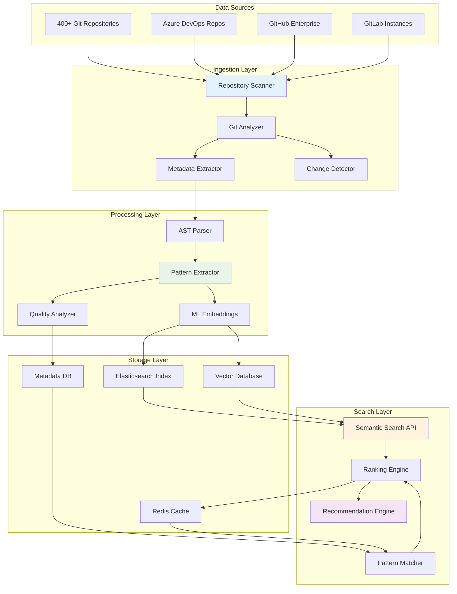

# 🔎 Arquitectura Detallada: MCP Repo Searcher

## 📋 Resumen del Componente

El **MCP Repo Searcher** es responsable de la inteligencia colectiva de la fábrica, analizando y extrayendo patrones reutilizables de 400+ repositorios existentes, proporcionando recomendaciones inteligentes basadas en similaridad semántica y mejores prácticas identificadas automáticamente.

## 🎯 Objetivos y Responsabilidades

### Objetivos Primarios
- **Indexar y analizar** 400+ repositorios de forma automática y continua
- **Identificar patrones reutilizables** de código, configuración y arquitectura
- **Proporcionar búsqueda semántica** basada en requerimientos extraídos
- **Rankear y recomendar** soluciones basadas en calidad, uso y relevancia

### Responsabilidades Específicas
```yaml
Repository Analysis:
  - Indexación automática semanal de repositorios
  - AST parsing para extracción de patrones de código
  - Análisis de configuraciones (Docker, K8s, CI/CD)
  - Extracción de metadatos y métricas de calidad

Pattern Recognition:
  - Identificación de patrones arquitectónicos comunes
  - Clasificación por dominio y tecnología
  - Detección de mejores prácticas emergentes
  - Análisis de evolución de patrones en el tiempo

Search Intelligence:
  - Búsqueda semántica basada en embeddings
  - Ranking multi-criterio (relevancia, calidad, popularidad)
  - Filtrado contextual por tecnología y dominio
  - Recomendaciones proactivas basadas en contexto

Knowledge Management:
  - Base de conocimiento versionada y actualizable
  - Métricas de uso y efectividad de patrones
  - Feedback loop para mejora continua
  - Integration con sistemas de documentación
```

## 🏗️ Arquitectura Técnica

### Stack Tecnológico
```typescript
interface TechStack {
  runtime: 'Node.js 18 LTS + Python 3.11 para ML';
  framework: 'Express.js + FastAPI (microservices híbridos)';
  database: {
    primary: 'Elasticsearch 8.x para búsqueda';
    cache: 'Redis 7.x para resultados frecuentes';
    metadata: 'PostgreSQL 15 para relaciones';
  };
  ml: {
    embeddings: 'sentence-transformers (multilingual)';
    similarity: 'faiss para búsqueda vectorial';
    clustering: 'scikit-learn para agrupación de patrones';
  };
  git: {
    client: 'simple-git + @octokit/rest';
    analysis: 'tree-sitter para AST parsing';
    diff: 'diff2html para análisis de cambios';
  };
  monitoring: 'Prometheus + Grafana + ELK Stack';
}
```

### Diseño de Alto Nivel



### Componentes Detallados

#### 1. Repository Scanner & Indexer
```typescript
class RepositoryScanner {
  private indexingQueue: Queue;
  private gitClients: Map<string, GitClient>;
  
  async scanRepositories(): Promise<ScanResult[]> {
    const repositories = await this.discoverRepositories();
    const results: ScanResult[] = [];
    
    for (const repo of repositories) {
      try {
        const scanResult = await this.scanSingleRepository(repo);
        results.push(scanResult);
        
        // Queue for detailed analysis
        await this.indexingQueue.add('analyze-repository', {
          repoId: repo.id,
          lastCommit: scanResult.lastCommit,
          priority: this.calculatePriority(repo)
        });
      } catch (error) {
        this.logger.error(`Failed to scan repository ${repo.name}`, error);
      }
    }
    
    return results;
  }
  
  private async scanSingleRepository(repo: Repository): Promise<ScanResult> {
    const client = this.getGitClient(repo.provider);
    
    // Basic repository information
    const metadata = await client.getRepositoryMetadata(repo.id);
    
    // Recent activity analysis
    const commits = await client.getRecentCommits(repo.id, { limit: 100 });
    const branches = await client.getBranches(repo.id);
    const tags = await client.getTags(repo.id);
    
    // File structure analysis
    const fileTree = await client.getFileTree(repo.id, 'main');
    const languages = this.detectLanguages(fileTree);
    const frameworks = this.detectFrameworks(fileTree);
    
    return {
      repositoryId: repo.id,
      name: metadata.name,
      description: metadata.description,
      languages,
      frameworks,
      lastCommit: commits[0]?.sha,
      activity: this.calculateActivity(commits),
      structure: this.analyzeStructure(fileTree),
      quality: await this.assessQuality(repo.id)
    };
  }
  
  private async assessQuality(repoId: string): Promise<QualityMetrics> {
    // Multiple quality indicators
    return {
      hasTests: await this.hasTestFiles(repoId),
      hasDocumentation: await this.hasDocumentation(repoId),
      hasCI: await this.hasCIConfiguration(repoId),
      codeComplexity: await this.analyzeCodeComplexity(repoId),
      securityScore: await this.assessSecurity(repoId),
      maintainability: await this.assessMaintainability(repoId)
    };
  }
}
```

#### 2. Pattern Extractor & Analyzer
```typescript
class PatternExtractor {
  private astParser: ASTParser;
  private configAnalyzer: ConfigurationAnalyzer;
  
  async extractPatterns(repoId: string): Promise<ExtractedPatterns> {
    const sourceFiles = await this.getSourceFiles(repoId);
    
    const patterns = {
      architectural: await this.extractArchitecturalPatterns(sourceFiles),
      code: await this.extractCodePatterns(sourceFiles),
      configuration: await this.extractConfigurationPatterns(repoId),
      api: await this.extractAPIPatterns(sourceFiles),
      database: await this.extractDatabasePatterns(sourceFiles)
    };
    
    return this.consolidatePatterns(patterns);
  }
  
  private async extractArchitecturalPatterns(files: SourceFile[]): Promise<ArchitecturalPattern[]> {
    const patterns: ArchitecturalPattern[] = [];
    
    // Detect common architectural patterns
    patterns.push(...this.detectMicroservicePatterns(files));
    patterns.push(...this.detectLayeredArchitecture(files));
    patterns.push(...this.detectEventDrivenPatterns(files));
    patterns.push(...this.detectAPIGatewayPatterns(files));
    
    return patterns;
  }
  
  private async extractCodePatterns(files: SourceFile[]): Promise<CodePattern[]> {
    const patterns: CodePattern[] = [];
    
    for (const file of files) {
      const ast = await this.astParser.parse(file.content, file.language);
      
      // Extract common code patterns
      patterns.push(...this.extractDesignPatterns(ast));
      patterns.push(...this.extractUtilityFunctions(ast));
      patterns.push(...this.extractErrorHandlingPatterns(ast));
      patterns.push(...this.extractValidationPatterns(ast));
    }
    
    return this.deduplicatePatterns(patterns);
  }
  
  private async extractConfigurationPatterns(repoId: string): Promise<ConfigPattern[]> {
    const configs = await this.configAnalyzer.analyze(repoId);
    
    return [
      ...this.extractDockerPatterns(configs.docker),
      ...this.extractK8sPatterns(configs.kubernetes),
      ...this.extractCIPatterns(configs.ci),
      ...this.extractEnvironmentPatterns(configs.environment)
    ];
  }
  
  private detectMicroservicePatterns(files: SourceFile[]): ArchitecturalPattern[] {
    const indicators = {
      hasAPIRoutes: files.some(f => this.hasAPIRoutes(f)),
      hasServiceLayer: files.some(f => this.hasServiceLayer(f)),
      hasDataAccess: files.some(f => this.hasDataAccessLayer(f)),
      hasHealthCheck: files.some(f => this.hasHealthCheckEndpoint(f)),
      hasConfig: files.some(f => this.hasConfigurationFiles(f))
    };
    
    const confidence = Object.values(indicators).filter(Boolean).length / Object.keys(indicators).length;
    
    if (confidence > 0.6) {
      return [{
        type: 'microservice',
        confidence,
        evidence: indicators,
        components: this.identifyMicroserviceComponents(files)
      }];
    }
    
    return [];
  }
}
```

#### 3. Semantic Search Engine
```typescript
class SemanticSearchEngine {
  private embeddingModel: SentenceTransformer;
  private vectorDB: FaissIndex;
  private elasticsearch: ElasticsearchClient;
  
  async searchPatterns(query: SearchQuery): Promise<SearchResults> {
    // Multi-stage search approach
    const results = await Promise.allSettled([
      this.semanticSearch(query),
      this.keywordSearch(query),
      this.structuredSearch(query)
    ]);
    
    // Combine and rank results
    const combinedResults = this.combineSearchResults(results);
    const rankedResults = await this.rankResults(combinedResults, query);
    
    return {
      patterns: rankedResults,
      totalHits: combinedResults.length,
      searchTime: Date.now() - query.startTime,
      searchStrategy: this.getSearchStrategy(query)
    };
  }
  
  private async semanticSearch(query: SearchQuery): Promise<PatternMatch[]> {
    // Generate embedding for query
    const queryEmbedding = await this.embeddingModel.encode(query.text);
    
    // Search in vector database
    const vectorResults = await this.vectorDB.search(queryEmbedding, {
      topK: query.maxResults * 2, // Get more to allow for filtering
      threshold: 0.7 // Minimum similarity threshold
    });
    
    // Enrich with metadata
    const enrichedResults = await Promise.all(
      vectorResults.map(async (result) => {
        const pattern = await this.getPatternById(result.id);
        return {
          pattern,
          similarity: result.score,
          source: 'semantic'
        };
      })
    );
    
    return enrichedResults.filter(r => r.pattern && this.matchesFilters(r.pattern, query.filters));
  }
  
  private async keywordSearch(query: SearchQuery): Promise<PatternMatch[]> {
    const searchBody = {
      query: {
        bool: {
          must: [
            {
              multi_match: {
                query: query.text,
                fields: ['name^3', 'description^2', 'tags', 'content'],
                type: 'best_fields',
                fuzziness: 'AUTO'
              }
            }
          ],
          filter: this.buildElasticsearchFilters(query.filters)
        }
      },
      size: query.maxResults,
      sort: [
        { '_score': { order: 'desc' } },
        { 'usage_count': { order: 'desc' } },
        { 'last_updated': { order: 'desc' } }
      ]
    };
    
    const response = await this.elasticsearch.search({
      index: 'patterns',
      body: searchBody
    });
    
    return response.body.hits.hits.map(hit => ({
      pattern: hit._source,
      similarity: hit._score / 100, // Normalize score
      source: 'keyword'
    }));
  }
  
  private async structuredSearch(query: SearchQuery): Promise<PatternMatch[]> {
    // Search based on structured requirements
    if (!query.requirements) return [];
    
    const structuredQuery = {
      query: {
        bool: {
          should: [
            ...this.buildTechnologyQueries(query.requirements.technology),
            ...this.buildDomainQueries(query.requirements.domain),
            ...this.buildPatternQueries(query.requirements.patterns)
          ],
          minimum_should_match: 1
        }
      }
    };
    
    const response = await this.elasticsearch.search({
      index: 'patterns',
      body: structuredQuery
    });
    
    return response.body.hits.hits.map(hit => ({
      pattern: hit._source,
      similarity: hit._score / 100,
      source: 'structured'
    }));
  }
}
```

#### 4. Ranking & Recommendation Engine
```typescript
class RankingEngine {
  private readonly RANKING_WEIGHTS = {
    similarity: 0.35,      // How well it matches the query
    quality: 0.25,         // Code quality metrics
    popularity: 0.15,      // Usage across organization
    recency: 0.10,         // How recently updated
    completeness: 0.10,    // How complete the pattern is
    context: 0.05          // Contextual relevance
  };
  
  async rankResults(results: PatternMatch[], query: SearchQuery): Promise<RankedPattern[]> {
    const scoredResults = await Promise.all(
      results.map(async (result) => {
        const scores = await this.calculateScores(result, query);
        const finalScore = this.calculateWeightedScore(scores);
        
        return {
          ...result,
          scores,
          finalScore,
          reasoning: this.generateReasoning(scores)
        };
      })
    );
    
    // Sort by final score and apply business rules
    return scoredResults
      .sort((a, b) => b.finalScore - a.finalScore)
      .slice(0, query.maxResults)
      .map((result, index) => ({
        ...result,
        rank: index + 1,
        category: this.categorizePattern(result.pattern)
      }));
  }
  
  private async calculateScores(match: PatternMatch, query: SearchQuery): Promise<PatternScores> {
    const pattern = match.pattern;
    
    return {
      similarity: match.similarity,
      quality: await this.calculateQualityScore(pattern),
      popularity: await this.calculatePopularityScore(pattern),
      recency: this.calculateRecencyScore(pattern.lastUpdated),
      completeness: this.calculateCompletenessScore(pattern),
      context: this.calculateContextScore(pattern, query)
    };
  }
  
  private async calculateQualityScore(pattern: Pattern): Promise<number> {
    const metrics = pattern.qualityMetrics;
    
    const factors = {
      hasTests: metrics.hasTests ? 0.3 : 0,
      hasDocumentation: metrics.hasDocumentation ? 0.2 : 0,
      hasCI: metrics.hasCI ? 0.15 : 0,
      codeComplexity: this.normalizeComplexity(metrics.codeComplexity) * 0.15,
      securityScore: metrics.securityScore * 0.1,
      maintainability: metrics.maintainability * 0.1
    };
    
    return Object.values(factors).reduce((sum, value) => sum + value, 0);
  }
  
  private async calculatePopularityScore(pattern: Pattern): Promise<number> {
    const usage = await this.getPatternUsage(pattern.id);
    
    const factors = {
      timesUsed: Math.min(usage.timesUsed / 100, 1) * 0.4,
      distinctUsers: Math.min(usage.distinctUsers / 50, 1) * 0.3,
      successRate: usage.successRate * 0.2,
      feedback: (usage.averageRating / 5) * 0.1
    };
    
    return Object.values(factors).reduce((sum, value) => sum + value, 0);
  }
  
  private calculateContextScore(pattern: Pattern, query: SearchQuery): number {
    let score = 0;
    
    // Technology alignment
    if (query.context?.technology && pattern.technologies.includes(query.context.technology)) {
      score += 0.4;
    }
    
    // Domain alignment
    if (query.context?.domain && pattern.domain === query.context.domain) {
      score += 0.3;
    }
    
    // Team alignment (same team has used this pattern)
    if (query.context?.teamId && pattern.usage.teams.includes(query.context.teamId)) {
      score += 0.2;
    }
    
    // Project size alignment
    if (this.isProjectSizeAligned(pattern, query.context?.projectSize)) {
      score += 0.1;
    }
    
    return score;
  }
}
```

## 📄 Esquemas y Interfaces

### Pattern Data Model
```typescript
interface Pattern {
  id: string;
  name: string;
  description: string;
  type: 'architectural' | 'code' | 'configuration' | 'api' | 'database';
  category: string;
  
  // Source information
  sourceRepository: {
    id: string;
    name: string;
    url: string;
    branch: string;
    path: string;
  };
  
  // Pattern details
  technologies: string[];
  frameworks: string[];
  domain: string;
  complexity: 'low' | 'medium' | 'high';
  
  // Pattern content
  content: {
    files: PatternFile[];
    dependencies: string[];
    configuration: any;
    documentation: string;
  };
  
  // Quality metrics
  qualityMetrics: {
    hasTests: boolean;
    hasDocumentation: boolean;
    hasCI: boolean;
    codeComplexity: number;
    securityScore: number;
    maintainability: number;
  };
  
  // Usage analytics
  usage: {
    timesUsed: number;
    distinctUsers: number;
    teams: string[];
    successRate: number;
    averageRating: number;
    lastUsed: Date;
  };
  
  // Metadata
  extractedAt: Date;
  lastUpdated: Date;
  version: string;
  tags: string[];
  embedding?: number[]; // Vector representation
}

interface SearchQuery {
  text: string;
  requirements?: ExtractedRequirements;
  filters?: {
    technology?: string[];
    domain?: string;
    complexity?: string;
    type?: string[];
  };
  context?: {
    teamId?: string;
    projectSize?: 'small' | 'medium' | 'large';
    technology?: string;
    domain?: string;
  };
  maxResults: number;
  startTime: number;
}

interface SearchResults {
  patterns: RankedPattern[];
  totalHits: number;
  searchTime: number;
  searchStrategy: string;
  suggestions?: string[];
  relatedQueries?: string[];
}
```

### API Endpoints
```typescript
// POST /search/patterns
interface SearchPatternsRequest {
  query: string;
  requirements?: ExtractedRequirements;
  filters?: SearchFilters;
  context?: SearchContext;
  options?: {
    maxResults?: number;
    includeMetadata?: boolean;
    includeUsage?: boolean;
  };
}

// GET /patterns/:id
interface GetPatternRequest {
  includeContent?: boolean;
  includeUsage?: boolean;
  format?: 'json' | 'zip' | 'files';
}

// POST /patterns/recommend
interface RecommendPatternsRequest {
  currentProject: ProjectContext;
  requirements: ExtractedRequirements;
  preferences?: UserPreferences;
}

// POST /patterns/feedback
interface PatternFeedbackRequest {
  patternId: string;
  userId: string;
  rating: number;
  feedback?: string;
  usage: {
    successful: boolean;
    timeToImplement: number;
    issues?: string[];
  };
}
```

## 🔧 Implementación y Deployment

### Configuración de Indexación
```yaml
# indexing-config.yml
indexing:
  schedule:
    full_scan: "0 2 * * 0"  # Weekly on Sunday 2 AM
    incremental: "0 */4 * * *"  # Every 4 hours
    priority_repos: "*/30 * * * *"  # Every 30 minutes
  
  repositories:
    sources:
      - type: "azure-devops"
        organization: "your-org"
        projects: ["project1", "project2"]
        exclude_patterns: ["temp-*", "*-archive"]
      
      - type: "github-enterprise"
        organization: "your-org"
        exclude_private: false
        include_forks: false
    
    filters:
      min_size: "1KB"
      max_size: "500MB"
      languages: ["javascript", "typescript", "java", "python"]
      exclude_extensions: [".png", ".jpg", ".gif", ".pdf"]
  
  analysis:
    ast_parsing:
      enabled: true
      timeout: "60s"
      max_file_size: "10MB"
    
    embedding:
      model: "sentence-transformers/all-MiniLM-L6-v2"
      batch_size: 32
      dimensions: 384
    
    quality:
      enable_security_scan: true
      enable_complexity_analysis: true
      enable_test_detection: true
```

### Docker Configuration
```dockerfile
# Dockerfile for MCP Repo Searcher
FROM node:18-alpine AS base

# Install Python for ML components
RUN apk add --no-cache python3 py3-pip

# Install Python dependencies
COPY requirements.txt .
RUN pip3 install -r requirements.txt

# Install Node.js dependencies
WORKDIR /app
COPY package*.json ./
RUN npm ci --only=production

# Copy application code
COPY src/ ./src/
COPY config/ ./config/

# Create non-root user
RUN addgroup -g 1001 -S nodejs && \
    adduser -S nodejs -u 1001
USER nodejs

EXPOSE 3000
CMD ["node", "src/index.js"]
```

### Kubernetes Deployment
```yaml
# k8s-deployment.yml
apiVersion: apps/v1
kind: Deployment
metadata:
  name: mcp-repo-searcher
  namespace: mcp-factory
spec:
  replicas: 3
  selector:
    matchLabels:
      app: mcp-repo-searcher
  template:
    metadata:
      labels:
        app: mcp-repo-searcher
    spec:
      containers:
      - name: repo-searcher
        image: mcpfactory.azurecr.io/mcp-repo-searcher:latest
        ports:
        - containerPort: 3000
        env:
        - name: NODE_ENV
          value: "production"
        - name: ELASTICSEARCH_URL
          valueFrom:
            secretKeyRef:
              name: mcp-secrets
              key: elasticsearch-url
        - name: AZURE_DEVOPS_TOKEN
          valueFrom:
            secretKeyRef:
              name: mcp-secrets
              key: azure-devops-token
        resources:
          requests:
            memory: "512Mi"
            cpu: "250m"
          limits:
            memory: "2Gi"
            cpu: "1000m"
        livenessProbe:
          httpGet:
            path: /health
            port: 3000
          initialDelaySeconds: 30
          periodSeconds: 10
        readinessProbe:
          httpGet:
            path: /ready
            port: 3000
          initialDelaySeconds: 5
          periodSeconds: 5

---
apiVersion: v1
kind: Service
metadata:
  name: mcp-repo-searcher-service
  namespace: mcp-factory
spec:
  selector:
    app: mcp-repo-searcher
  ports:
  - port: 80
    targetPort: 3000
  type: ClusterIP

---
apiVersion: batch/v1
kind: CronJob
metadata:
  name: repo-indexer
  namespace: mcp-factory
spec:
  schedule: "0 2 * * 0"  # Weekly
  jobTemplate:
    spec:
      template:
        spec:
          containers:
          - name: indexer
            image: mcpfactory.azurecr.io/mcp-repo-searcher:latest
            command: ["node", "src/indexer.js"]
            env:
            - name: JOB_TYPE
              value: "full_scan"
          restartPolicy: OnFailure
```

## 📊 Monitoreo y Métricas

### KPIs Específicos del Componente
```yaml
Indexing Performance:
  - Repositories Indexed: "400+ weekly"
  - Indexing Speed: "> 50 repos/hour"
  - Pattern Extraction Rate: "> 1000 patterns/hour"
  - Index Update Time: "< 6 hours for full scan"

Search Performance:
  - Query Response Time: "< 500ms for 95% of queries"
  - Search Accuracy: "> 85% relevant results in top 10"
  - Embedding Generation: "< 100ms per query"
  - Cache Hit Rate: "> 70% for common queries"

Pattern Quality:
  - Unique Patterns: "> 5000 in knowledge base"
  - Pattern Freshness: "< 7 days average age"
  - Quality Score: "> 0.8 average"
  - Usage Success Rate: "> 80% patterns successfully implemented"

System Health:
  - Service Uptime: "> 99.5%"
  - Elasticsearch Health: "Green cluster status"
  - Vector DB Performance: "< 50ms similarity search"
  - Memory Usage: "< 4GB per instance"
```

### Alerting Configuration
```yaml
# prometheus-alerts.yml
groups:
- name: mcp-repo-searcher
  rules:
  - alert: HighSearchLatency
    expr: histogram_quantile(0.95, rate(search_duration_seconds_bucket[5m])) > 1
    for: 5m
    labels:
      severity: warning
    annotations:
      summary: "High search latency detected"
      description: "95th percentile search latency is {{ $value }} seconds"

  - alert: IndexingJobFailed
    expr: increase(indexing_job_failures_total[1h]) > 0
    labels:
      severity: critical
    annotations:
      summary: "Repository indexing job failed"
      description: "{{ $value }} indexing jobs failed in the last hour"

  - alert: LowPatternQuality
    expr: avg(pattern_quality_score) < 0.7
    for: 15m
    labels:
      severity: warning
    annotations:
      summary: "Pattern quality score is low"
      description: "Average pattern quality score is {{ $value }}"
```

---

**Estado**: 📋 **Arquitectura detallada del MCP Repo Searcher completada**  
**Próximo**: Arquitectura detallada del MCP Template Manager  
**Complejidad**: Alta (ML + búsqueda semántica + análisis de código)  
**Estimación**: 3 semanas de desarrollo para implementación completa
