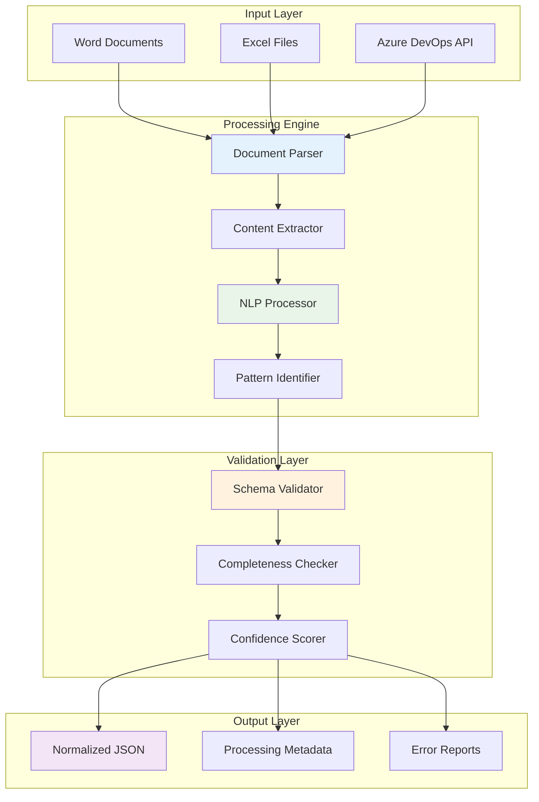

# 🔍 Arquitectura Detallada: MCP Spec Extractor

## 📋 Resumen del Componente

El **MCP Spec Extractor** es el primer componente de la cadena de automatización, responsable de extraer requerimientos estructurados desde documentos Word, Excel y Azure DevOps Tasks, convirtiéndolos en un formato JSON estándar que alimenta el resto del pipeline.

## 🎯 Objetivos y Responsabilidades

### Objetivos Primarios
- **Extraer automáticamente** requerimientos funcionales y no funcionales
- **Normalizar información** de fuentes heterogéneas a formato estándar
- **Identificar patrones arquitectónicos** requeridos
- **Validar completitud** de especificaciones antes de procesamiento

### Responsabilidades Específicas
```yaml
Input Processing:
  - Documentos Word (.docx, .doc): "Análisis de texto con estructura"
  - Archivos Excel (.xlsx, .xls): "Extracción de datos tabulares"
  - Azure DevOps Tasks: "API integration para work items"
  - Validation: "Schema validation y completitud"

Output Generation:
  - Formato estándar JSON con schema definido
  - Metadatos de procesamiento y confianza
  - Logging detallado para debugging
  - Error handling con fallbacks manuales
```

## 🏗️ Arquitectura Técnica

### Stack Tecnológico
```typescript
interface TechStack {
  runtime: 'Node.js 18 LTS';
  framework: 'Express.js + TypeScript';
  documentation: {
    word: 'mammoth.js + cheerio para parsing HTML';
    excel: 'xlsx + papaparse para datos complejos';
    azureDevOps: 'azure-devops-node-api oficial';
  };
  nlp: {
    primary: 'spaCy (Python bridge) para NER';
    secondary: 'natural.js para análisis básico';
    ai: 'OpenAI API para análisis complejo opcional';
  };
  validation: 'joi + ajv para JSON schema';
  testing: 'jest + supertest para APIs';
}
```

### Diseño de Alto Nivel



### Componentes Detallados

#### 1. Document Parser
```typescript
class DocumentParser {
  async parseWord(buffer: Buffer): Promise<ParsedContent> {
    // Usar mammoth.js para extraer contenido estructurado
    const result = await mammoth.extractRawText(buffer);
    
    return {
      type: 'word',
      rawText: result.value,
      structure: await this.extractWordStructure(buffer),
      metadata: this.extractWordMetadata(result.messages)
    };
  }
  
  async parseExcel(buffer: Buffer): Promise<ParsedContent> {
    const workbook = XLSX.read(buffer, { type: 'buffer' });
    
    return {
      type: 'excel',
      sheets: workbook.SheetNames.map(name => ({
        name,
        data: XLSX.utils.sheet_to_json(workbook.Sheets[name]),
        structure: this.analyzeSheetStructure(workbook.Sheets[name])
      })),
      metadata: workbook.Props
    };
  }
  
  async parseAzureDevOps(workItemId: string): Promise<ParsedContent> {
    const workItem = await this.azureClient.getWorkItem(workItemId);
    
    return {
      type: 'azure-devops',
      workItem: {
        id: workItem.id,
        title: workItem.fields['System.Title'],
        description: workItem.fields['System.Description'],
        acceptanceCriteria: workItem.fields['Microsoft.VSTS.Common.AcceptanceCriteria'],
        state: workItem.fields['System.State']
      },
      relatedItems: await this.getRelatedWorkItems(workItemId),
      metadata: this.extractWorkItemMetadata(workItem)
    };
  }
}
```

#### 2. Content Extractor
```typescript
class ContentExtractor {
  async extractRequirements(content: ParsedContent): Promise<ExtractedRequirements> {
    const extractor = this.getExtractorForType(content.type);
    
    return {
      functional: await extractor.extractFunctionalRequirements(content),
      nonFunctional: await extractor.extractNonFunctionalRequirements(content),
      technical: await extractor.extractTechnicalRequirements(content),
      business: await extractor.extractBusinessRequirements(content)
    };
  }
  
  private async extractFromWord(content: ParsedContent): Promise<any> {
    // Análisis específico para documentos Word
    const sections = this.identifyWordSections(content.rawText);
    
    return {
      requirements: this.extractFromSections(sections, [
        'requirements', 'requerimientos', 'funcional', 'functional'
      ]),
      architecture: this.extractFromSections(sections, [
        'architecture', 'arquitectura', 'design', 'diseño'
      ]),
      apis: this.extractAPIs(content.rawText),
      databases: this.extractDatabases(content.rawText)
    };
  }
  
  private async extractFromExcel(content: ParsedContent): Promise<any> {
    // Análisis específico para archivos Excel
    const requirementsSheet = content.sheets.find(s => 
      s.name.toLowerCase().includes('requirement') || 
      s.name.toLowerCase().includes('requerimiento')
    );
    
    if (requirementsSheet) {
      return this.parseRequirementsTable(requirementsSheet.data);
    }
    
    // Fallback: buscar en todas las hojas
    return this.extractFromAllSheets(content.sheets);
  }
}
```

#### 3. NLP Processor
```typescript
class NLPProcessor {
  private nlp: any; // spaCy bridge
  
  async processText(text: string): Promise<NLPResults> {
    // Named Entity Recognition
    const entities = await this.nlp.process(text, {
      entities: ['TECH', 'API', 'DATABASE', 'FRAMEWORK'],
      customPatterns: this.getCustomPatterns()
    });
    
    // Intent classification
    const intents = await this.classifyIntents(text);
    
    // Relationship extraction
    const relationships = await this.extractRelationships(entities);
    
    return {
      entities,
      intents,
      relationships,
      confidence: this.calculateConfidence(entities, intents)
    };
  }
  
  private getCustomPatterns(): Pattern[] {
    return [
      {
        label: 'API_ENDPOINT',
        pattern: [
          { text: { regex: true }, pattern: '/(GET|POST|PUT|DELETE)\\s+\\/[\\w\\/\\-]+/' }
        ]
      },
      {
        label: 'DATABASE_TABLE',
        pattern: [
          { lower: { in: ['table', 'tabla', 'collection', 'colección'] } },
          { pos: 'NOUN' }
        ]
      },
      {
        label: 'TECHNOLOGY',
        pattern: [
          { lower: { in: ['node.js', 'spring boot', 'react', 'mongodb', 'postgresql'] } }
        ]
      }
    ];
  }
}
```

#### 4. Pattern Identifier
```typescript
class PatternIdentifier {
  async identifyArchitecturalPatterns(requirements: ExtractedRequirements): Promise<ArchitecturalPatterns> {
    const patterns = {
      microservice: this.detectMicroservicePattern(requirements),
      apiGateway: this.detectAPIGatewayPattern(requirements),
      eventDriven: this.detectEventDrivenPattern(requirements),
      database: this.detectDatabasePattern(requirements),
      authentication: this.detectAuthPattern(requirements)
    };
    
    return {
      primary: this.selectPrimaryPattern(patterns),
      secondary: this.selectSecondaryPatterns(patterns),
      confidence: this.calculatePatternConfidence(patterns)
    };
  }
  
  private detectMicroservicePattern(req: ExtractedRequirements): PatternMatch {
    const indicators = [
      this.hasMultipleServices(req),
      this.hasServiceBoundaries(req),
      this.hasIndependentData(req),
      this.hasAPIExposure(req)
    ];
    
    return {
      pattern: 'microservice',
      confidence: indicators.filter(Boolean).length / indicators.length,
      evidence: indicators
    };
  }
}
```

## 📄 Esquema de Output

### JSON Schema Principal
```json
{
  "$schema": "http://json-schema.org/draft-07/schema#",
  "type": "object",
  "required": ["project", "requirements", "architecture", "metadata"],
  "properties": {
    "project": {
      "type": "object",
      "required": ["name", "description", "technology"],
      "properties": {
        "name": { "type": "string", "minLength": 3 },
        "description": { "type": "string", "minLength": 10 },
        "technology": { 
          "type": "string", 
          "enum": ["nodejs", "springboot", "python", "other"] 
        },
        "domain": { "type": "string" },
        "priority": { 
          "type": "string", 
          "enum": ["low", "medium", "high", "critical"] 
        }
      }
    },
    "requirements": {
      "type": "object",
      "properties": {
        "functional": {
          "type": "array",
          "items": {
            "type": "object",
            "properties": {
              "id": { "type": "string" },
              "description": { "type": "string" },
              "priority": { "type": "string" },
              "category": { "type": "string" }
            }
          }
        },
        "nonFunctional": {
          "type": "array",
          "items": {
            "type": "object",
            "properties": {
              "type": { 
                "type": "string",
                "enum": ["performance", "security", "scalability", "reliability"]
              },
              "description": { "type": "string" },
              "threshold": { "type": "string" }
            }
          }
        },
        "apis": {
          "type": "array",
          "items": {
            "type": "object",
            "properties": {
              "name": { "type": "string" },
              "type": { 
                "type": "string", 
                "enum": ["REST", "GraphQL", "gRPC", "WebSocket"] 
              },
              "endpoints": {
                "type": "array",
                "items": {
                  "type": "object",
                  "properties": {
                    "method": { "type": "string" },
                    "path": { "type": "string" },
                    "description": { "type": "string" }
                  }
                }
              }
            }
          }
        },
        "databases": {
          "type": "array",
          "items": {
            "type": "object",
            "properties": {
              "type": { 
                "type": "string",
                "enum": ["MongoDB", "PostgreSQL", "MySQL", "Redis", "Elasticsearch"]
              },
              "purpose": { "type": "string" },
              "entities": {
                "type": "array",
                "items": { "type": "string" }
              }
            }
          }
        }
      }
    },
    "architecture": {
      "type": "object",
      "properties": {
        "pattern": { 
          "type": "string",
          "enum": ["microservice", "api-gateway", "event-driven", "monolith"]
        },
        "dependencies": {
          "type": "array",
          "items": { "type": "string" }
        },
        "integrations": {
          "type": "array",
          "items": {
            "type": "object",
            "properties": {
              "name": { "type": "string" },
              "type": { "type": "string" },
              "protocol": { "type": "string" }
            }
          }
        }
      }
    },
    "metadata": {
      "type": "object",
      "properties": {
        "extractionTimestamp": { "type": "string", "format": "date-time" },
        "sourceDocument": { "type": "string" },
        "processingTime": { "type": "number" },
        "confidence": { 
          "type": "object",
          "properties": {
            "overall": { "type": "number", "minimum": 0, "maximum": 1 },
            "requirements": { "type": "number", "minimum": 0, "maximum": 1 },
            "architecture": { "type": "number", "minimum": 0, "maximum": 1 }
          }
        },
        "warnings": {
          "type": "array",
          "items": { "type": "string" }
        }
      }
    }
  }
}
```

## 🔧 Implementación y APIs

### API Endpoints
```typescript
// POST /extract/document
interface ExtractDocumentRequest {
  file: File; // multipart/form-data
  type?: 'word' | 'excel' | 'auto';
  options?: {
    language?: 'es' | 'en';
    strictValidation?: boolean;
    includeMetadata?: boolean;
  };
}

// POST /extract/azure-devops  
interface ExtractAzureDevOpsRequest {
  workItemId: string;
  includeRelated?: boolean;
  projectName?: string;
}

// GET /extract/status/:jobId
interface ExtractionStatus {
  jobId: string;
  status: 'pending' | 'processing' | 'completed' | 'failed';
  progress: number;
  result?: ExtractedSpecification;
  error?: string;
}
```

### Configuración de Deployment
```yaml
# azure-pipelines.yml para MCP Spec Extractor
trigger:
  branches:
    include: [main, develop]
  paths:
    include: [src/spec-extractor/**]

pool:
  vmImage: 'ubuntu-latest'

variables:
  - group: mcp-factory-secrets
  - name: containerRegistry
    value: 'mcpfactory.azurecr.io'

stages:
- stage: Build
  jobs:
  - job: BuildAndTest
    steps:
    - task: NodeTool@0
      inputs:
        versionSpec: '18.x'
    
    - script: npm ci
      displayName: 'Install dependencies'
    
    - script: npm run test:unit
      displayName: 'Run unit tests'
    
    - script: npm run test:integration
      displayName: 'Run integration tests'
    
    - script: npm run build
      displayName: 'Build application'
    
    - task: Docker@2
      inputs:
        command: 'buildAndPush'
        repository: 'mcp-spec-extractor'
        dockerfile: 'Dockerfile'
        tags: |
          $(Build.BuildId)
          latest

- stage: Deploy
  dependsOn: Build
  condition: and(succeeded(), eq(variables['Build.SourceBranch'], 'refs/heads/main'))
  jobs:
  - deployment: DeployToAzure
    environment: 'mcp-factory-prod'
    strategy:
      runOnce:
        deploy:
          steps:
          - task: AzureWebAppContainer@1
            inputs:
              azureSubscription: 'mcp-factory-service-connection'
              appName: 'mcp-spec-extractor'
              imageName: '$(containerRegistry)/mcp-spec-extractor:$(Build.BuildId)'
```

## 🧪 Testing Strategy

### Casos de Prueba
```typescript
describe('MCP Spec Extractor', () => {
  describe('Word Document Processing', () => {
    test('should extract requirements from structured document', async () => {
      const wordBuffer = await fs.readFile('./test-docs/structured-requirements.docx');
      const result = await specExtractor.processDocument(wordBuffer, 'word');
      
      expect(result.requirements.functional).toHaveLength(5);
      expect(result.architecture.pattern).toBe('microservice');
      expect(result.metadata.confidence.overall).toBeGreaterThan(0.8);
    });
    
    test('should handle unstructured documents with warnings', async () => {
      const wordBuffer = await fs.readFile('./test-docs/unstructured-text.docx');
      const result = await specExtractor.processDocument(wordBuffer, 'word');
      
      expect(result.metadata.warnings).toContain('Low structure confidence');
      expect(result.metadata.confidence.overall).toBeLessThan(0.6);
    });
  });
  
  describe('Excel Processing', () => {
    test('should extract from requirements table format', async () => {
      const excelBuffer = await fs.readFile('./test-docs/requirements-table.xlsx');
      const result = await specExtractor.processDocument(excelBuffer, 'excel');
      
      expect(result.requirements.functional).toHaveLength(10);
      expect(result.requirements.apis).toHaveLength(3);
    });
  });
  
  describe('Azure DevOps Integration', () => {
    test('should extract from work item with acceptance criteria', async () => {
      const mockWorkItem = createMockWorkItem();
      jest.spyOn(azureClient, 'getWorkItem').mockResolvedValue(mockWorkItem);
      
      const result = await specExtractor.processAzureDevOps('12345');
      
      expect(result.project.name).toBe(mockWorkItem.fields['System.Title']);
      expect(result.requirements.functional).toBeDefined();
    });
  });
});
```

## 📊 Monitoreo y Métricas

### KPIs del Componente
```yaml
Performance:
  - Processing Time: "< 30 segundos per document"
  - Throughput: "> 10 documents per minute"
  - Memory Usage: "< 512MB per process"
  - Error Rate: "< 2% failed extractions"

Quality:
  - Extraction Accuracy: "> 95% for structured docs"
  - Schema Compliance: "100% valid JSON output"
  - Confidence Score: "> 0.8 average"
  - False Positives: "< 5% in pattern detection"

Reliability:
  - Uptime: "> 99.5%"
  - Recovery Time: "< 5 minutes"
  - Data Loss: "0% (stateless processing)"
  - API Response Time: "< 3 seconds"
```

### Logging y Alerting
```typescript
// Structured logging example
const logger = winston.createLogger({
  format: winston.format.combine(
    winston.format.timestamp(),
    winston.format.errors({ stack: true }),
    winston.format.json()
  ),
  transports: [
    new winston.transports.Console(),
    new winston.transports.File({ filename: 'spec-extractor.log' }),
    new winston.transports.Http({
      host: 'logs.azure.com',
      path: '/api/logs'
    })
  ]
});

// Metrics collection
const prometheus = require('prom-client');
const extractionDuration = new prometheus.Histogram({
  name: 'spec_extraction_duration_seconds',
  help: 'Duration of specification extraction',
  labelNames: ['document_type', 'status']
});

const extractionAccuracy = new prometheus.Gauge({
  name: 'spec_extraction_accuracy',
  help: 'Accuracy of extraction by confidence score',
  labelNames: ['document_type']
});
```

---

**Estado**: 📋 **Arquitectura detallada del MCP Spec Extractor completada**  
**Próximo**: Arquitectura detallada del MCP Repo Searcher  
**Estimación**: 2 semanas de desarrollo para implementación completa
