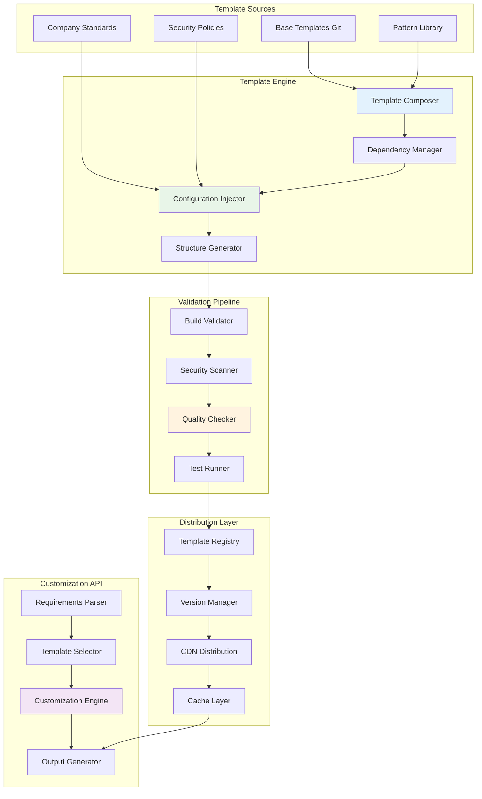

# 📋 Arquitectura Detallada: MCP Template Manager

## 📋 Resumen del Componente

El **MCP Template Manager** es responsable de mantener y evolucionar dinámicamente los templates de microservicios, asegurando que siempre estén actualizados con las últimas mejores prácticas, dependencias seguras y patrones organizacionales, mientras proporciona capacidades de personalización inteligente basada en requerimientos específicos.

## 🎯 Objetivos y Responsabilidades

### Objetivos Primarios
- **Gestionar templates versionados** de Node.js, Spring Boot y otras tecnologías
- **Actualizar automáticamente** dependencias y mejores prácticas
- **Personalizar templates** basado en requerimientos específicos del proyecto
- **Garantizar calidad y seguridad** mediante validación automática continua

### Responsabilidades Específicas
```yaml
Template Lifecycle:
  - Versionado semántico de templates base
  - Actualización automática de dependencias
  - Integración de nuevos patrones identificados
  - Rollback automático en caso de fallos

Customization Engine:
  - Composición dinámica de módulos según requerimientos
  - Inyección de configuraciones específicas de empresa
  - Adaptación a patrones arquitectónicos específicos
  - Personalización de estructura de carpetas y naming

Quality Assurance:
  - Validación automática de templates
  - Testing de build y deployment
  - Security scanning de dependencias
  - Performance baseline testing

Template Distribution:
  - Distribución versionada a través de registry interno
  - Caching y CDN para acceso rápido
  - Rollback y blue-green deployment de templates
  - Métricas de uso y feedback loop
```

## 🏗️ Arquitectura Técnica

### Stack Tecnológico
```typescript
interface TechStack {
  runtime: 'Node.js 18 LTS';
  framework: 'Express.js + TypeScript';
  templateEngine: 'Handlebars.js + Mustache para plantillas complejas';
  versionControl: {
    storage: 'Git (Azure Repos) para templates';
    registry: 'npm private registry + Docker registry';
    delivery: 'Azure CDN para distribución global';
  };
  validation: {
    build: 'Docker multi-stage builds';
    security: 'Snyk + OWASP dependency check';
    quality: 'SonarQube + ESLint + Prettier';
    testing: 'Jest + TestContainers para integration';
  };
  automation: {
    cicd: 'Azure DevOps Pipelines';
    monitoring: 'Azure Monitor + Application Insights';
    dependency: 'Renovate Bot + Dependabot';
  };
  database: 'Azure CosmosDB para metadata + Redis para cache';
}
```

### Diseño de Alto Nivel



### Componentes Detallados

#### 1. Template Composer & Manager
```typescript
class TemplateManager {
  private gitClient: GitClient;
  private registry: TemplateRegistry;
  private validator: TemplateValidator;
  
  async updateTemplates(): Promise<UpdateResult[]> {
    const results: UpdateResult[] = [];
    
    // Get all template repositories
    const templates = await this.getTemplateRepositories();
    
    for (const template of templates) {
      try {
        const updateResult = await this.updateSingleTemplate(template);
        results.push(updateResult);
        
        // If update successful, trigger validation pipeline
        if (updateResult.success) {
          await this.triggerValidationPipeline(template.id, updateResult.newVersion);
        }
      } catch (error) {
        this.logger.error(`Failed to update template ${template.name}`, error);
        results.push({
          templateId: template.id,
          success: false,
          error: error.message
        });
      }
    }
    
    return results;
  }
  
  private async updateSingleTemplate(template: Template): Promise<UpdateResult> {
    const currentVersion = await this.registry.getCurrentVersion(template.id);
    
    // Check for dependency updates
    const dependencyUpdates = await this.checkDependencyUpdates(template);
    
    // Check for new patterns from repo searcher
    const newPatterns = await this.getNewPatterns(template.technology);
    
    // Check for security updates
    const securityUpdates = await this.checkSecurityUpdates(template);
    
    if (dependencyUpdates.length === 0 && newPatterns.length === 0 && securityUpdates.length === 0) {
      return { templateId: template.id, success: true, changes: 'none' };
    }
    
    // Create new template version
    const newTemplate = await this.composeUpdatedTemplate({
      base: template,
      dependencyUpdates,
      newPatterns,
      securityUpdates
    });
    
    // Validate new template
    const validation = await this.validator.validate(newTemplate);
    if (!validation.success) {
      throw new Error(`Template validation failed: ${validation.errors.join(', ')}`);
    }
    
    // Commit and tag new version
    const newVersion = this.generateVersion(currentVersion, {
      hasDependencyUpdates: dependencyUpdates.length > 0,
      hasPatternUpdates: newPatterns.length > 0,
      hasSecurityUpdates: securityUpdates.length > 0
    });
    
    await this.commitTemplate(newTemplate, newVersion);
    await this.registry.publishVersion(template.id, newVersion);
    
    return {
      templateId: template.id,
      success: true,
      oldVersion: currentVersion,
      newVersion,
      changes: {
        dependencies: dependencyUpdates,
        patterns: newPatterns,
        security: securityUpdates
      }
    };
  }
  
  private async composeUpdatedTemplate(params: TemplateUpdateParams): Promise<Template> {
    const { base, dependencyUpdates, newPatterns, securityUpdates } = params;
    
    // Clone base template
    const updated = JSON.parse(JSON.stringify(base));
    
    // Apply dependency updates
    for (const update of dependencyUpdates) {
      await this.applyDependencyUpdate(updated, update);
    }
    
    // Integrate new patterns
    for (const pattern of newPatterns) {
      await this.integratePattern(updated, pattern);
    }
    
    // Apply security updates
    for (const security of securityUpdates) {
      await this.applySecurityUpdate(updated, security);
    }
    
    // Update metadata
    updated.lastUpdated = new Date();
    updated.changeLog = this.generateChangeLog(params);
    
    return updated;
  }
}
```

#### 2. Dynamic Customization Engine
```typescript
class CustomizationEngine {
  private templateRegistry: TemplateRegistry;
  private patternMatcher: PatternMatcher;
  
  async customizeTemplate(request: CustomizationRequest): Promise<CustomizedTemplate> {
    const { requirements, preferences, context } = request;
    
    // Select base template
    const baseTemplate = await this.selectBaseTemplate(requirements);
    
    // Determine required modules and patterns
    const modules = await this.selectModules(requirements, baseTemplate);
    
    // Apply customizations
    const customized = await this.applyCustomizations({
      baseTemplate,
      modules,
      requirements,
      preferences,
      context
    });
    
    // Validate customized template
    const validation = await this.validateCustomization(customized);
    if (!validation.valid) {
      throw new Error(`Customization validation failed: ${validation.errors.join(', ')}`);
    }
    
    return customized;
  }
  
  private async selectBaseTemplate(requirements: ProjectRequirements): Promise<Template> {
    const technology = requirements.technology;
    const templates = await this.templateRegistry.getByTechnology(technology);
    
    // Score templates based on requirements
    const scored = await Promise.all(
      templates.map(async (template) => ({
        template,
        score: await this.scoreTemplateMatch(template, requirements)
      }))
    );
    
    // Return best match
    const best = scored.reduce((prev, current) => 
      current.score > prev.score ? current : prev
    );
    
    if (best.score < 0.6) {
      throw new Error(`No suitable template found for requirements. Best match: ${best.score}`);
    }
    
    return best.template;
  }
  
  private async selectModules(requirements: ProjectRequirements, baseTemplate: Template): Promise<TemplateModule[]> {
    const modules: TemplateModule[] = [...baseTemplate.coreModules];
    
    // Add modules based on requirements
    if (requirements.hasAuthentication) {
      modules.push(await this.getAuthenticationModule(requirements.authType));
    }
    
    if (requirements.hasDatabase) {
      modules.push(await this.getDatabaseModule(requirements.databaseType));
    }
    
    if (requirements.hasMessaging) {
      modules.push(await this.getMessagingModule(requirements.messagingType));
    }
    
    if (requirements.hasExternalAPIs) {
      modules.push(await this.getExternalAPIModule());
    }
    
    if (requirements.hasFileStorage) {
      modules.push(await this.getFileStorageModule(requirements.storageType));
    }
    
    // Add monitoring and observability
    modules.push(await this.getMonitoringModule());
    
    // Add testing modules
    modules.push(await this.getTestingModule(baseTemplate.technology));
    
    return this.resolveModuleDependencies(modules);
  }
  
  private async applyCustomizations(params: CustomizationParams): Promise<CustomizedTemplate> {
    const { baseTemplate, modules, requirements, preferences, context } = params;
    
    // Start with base template structure
    const customized = this.cloneTemplate(baseTemplate);
    
    // Apply module compositions
    for (const module of modules) {
      await this.integrateModule(customized, module);
    }
    
    // Apply naming conventions
    await this.applyNamingConventions(customized, preferences.naming);
    
    // Apply company-specific configurations
    await this.applyCompanyStandards(customized, context.companyId);
    
    // Customize package.json and dependencies
    await this.customizePackageConfig(customized, requirements);
    
    // Generate environment configurations
    await this.generateEnvironmentConfigs(customized, requirements);
    
    // Customize CI/CD pipeline
    await this.customizeCICDPipeline(customized, context.deploymentTarget);
    
    // Generate OpenShift/Kubernetes manifests
    await this.generateDeploymentManifests(customized, requirements);
    
    return customized;
  }
  
  private async integrateModule(template: CustomizedTemplate, module: TemplateModule): Promise<void> {
    // Add source files
    for (const file of module.files) {
      const rendered = await this.renderTemplate(file.content, {
        projectName: template.projectName,
        ...template.variables
      });
      
      template.files.push({
        path: file.path,
        content: rendered,
        type: file.type
      });
    }
    
    // Merge dependencies
    template.dependencies = {
      ...template.dependencies,
      ...module.dependencies
    };
    
    // Add configuration
    template.configuration = {
      ...template.configuration,
      ...module.configuration
    };
    
    // Update documentation
    if (module.documentation) {
      template.documentation.sections.push(module.documentation);
    }
  }
}
```

#### 3. Template Validation Pipeline
```typescript
class TemplateValidator {
  private buildService: BuildService;
  private securityScanner: SecurityScanner;
  private qualityChecker: QualityChecker;
  
  async validate(template: Template): Promise<ValidationResult> {
    const results = {
      build: null,
      security: null,
      quality: null,
      integration: null
    };
    
    try {
      // Parallel validation for speed
      [results.build, results.security, results.quality, results.integration] = await Promise.all([
        this.validateBuild(template),
        this.validateSecurity(template),
        this.validateQuality(template),
        this.validateIntegration(template)
      ]);
      
      const overall = this.calculateOverallResult(results);
      
      return {
        success: overall.success,
        score: overall.score,
        results,
        errors: overall.errors,
        warnings: overall.warnings,
        recommendations: overall.recommendations
      };
    } catch (error) {
      return {
        success: false,
        score: 0,
        results,
        errors: [error.message],
        warnings: [],
        recommendations: []
      };
    }
  }
  
  private async validateBuild(template: Template): Promise<BuildValidationResult> {
    // Create temporary build environment
    const buildContext = await this.createBuildContext(template);
    
    try {
      // Install dependencies
      const installResult = await this.buildService.installDependencies(buildContext);
      if (!installResult.success) {
        return {
          success: false,
          stage: 'install',
          error: installResult.error,
          duration: installResult.duration
        };
      }
      
      // Run build
      const buildResult = await this.buildService.build(buildContext);
      if (!buildResult.success) {
        return {
          success: false,
          stage: 'build',
          error: buildResult.error,
          duration: buildResult.duration
        };
      }
      
      // Run tests
      const testResult = await this.buildService.test(buildContext);
      
      return {
        success: testResult.success,
        stage: 'complete',
        testCoverage: testResult.coverage,
        buildSize: buildResult.outputSize,
        duration: installResult.duration + buildResult.duration + testResult.duration,
        warnings: [...installResult.warnings, ...buildResult.warnings, ...testResult.warnings]
      };
    } finally {
      await this.cleanupBuildContext(buildContext);
    }
  }
  
  private async validateSecurity(template: Template): Promise<SecurityValidationResult> {
    const results = {
      dependencies: await this.securityScanner.scanDependencies(template),
      code: await this.securityScanner.scanCode(template),
      configuration: await this.securityScanner.scanConfiguration(template),
      secrets: await this.securityScanner.scanForSecrets(template)
    };
    
    const vulnerabilities = [
      ...results.dependencies.vulnerabilities,
      ...results.code.vulnerabilities,
      ...results.configuration.vulnerabilities
    ];
    
    const critical = vulnerabilities.filter(v => v.severity === 'critical');
    const high = vulnerabilities.filter(v => v.severity === 'high');
    
    return {
      success: critical.length === 0,
      vulnerabilities,
      criticalCount: critical.length,
      highCount: high.length,
      hasSecrets: results.secrets.found,
      recommendations: this.generateSecurityRecommendations(vulnerabilities)
    };
  }
  
  private async validateQuality(template: Template): Promise<QualityValidationResult> {
    const metrics = await Promise.all([
      this.qualityChecker.checkCodeQuality(template),
      this.qualityChecker.checkDocumentation(template),
      this.qualityChecker.checkTestCoverage(template),
      this.qualityChecker.checkComplexity(template)
    ]);
    
    const [codeQuality, documentation, testCoverage, complexity] = metrics;
    
    const overallScore = (
      codeQuality.score * 0.3 +
      documentation.score * 0.2 +
      testCoverage.score * 0.3 +
      complexity.score * 0.2
    );
    
    return {
      success: overallScore >= 0.8,
      overallScore,
      codeQuality,
      documentation,
      testCoverage,
      complexity,
      recommendations: this.generateQualityRecommendations(metrics)
    };
  }
}
```

#### 4. Template Registry & Distribution
```typescript
class TemplateRegistry {
  private storage: RegistryStorage;
  private cdn: CDNService;
  private cache: CacheService;
  
  async publishTemplate(template: Template, version: string): Promise<PublishResult> {
    // Validate template before publishing
    const validation = await this.validateForPublish(template);
    if (!validation.valid) {
      throw new Error(`Template validation failed: ${validation.errors.join(', ')}`);
    }
    
    // Create template package
    const templatePackage = await this.createTemplatePackage(template, version);
    
    // Store in registry
    const storageResult = await this.storage.store(template.id, version, templatePackage);
    
    // Distribute to CDN
    const cdnResult = await this.cdn.upload(template.id, version, templatePackage);
    
    // Update metadata
    await this.updateTemplateMetadata(template.id, {
      latestVersion: version,
      publishedAt: new Date(),
      size: templatePackage.size,
      checksum: templatePackage.checksum
    });
    
    // Invalidate cache
    await this.cache.invalidate(`template:${template.id}:*`);
    
    // Notify subscribers
    await this.notifySubscribers(template.id, version);
    
    return {
      success: true,
      templateId: template.id,
      version,
      downloadUrl: cdnResult.url,
      size: templatePackage.size
    };
  }
  
  async getTemplate(templateId: string, version?: string): Promise<Template> {
    const resolvedVersion = version || await this.getLatestVersion(templateId);
    const cacheKey = `template:${templateId}:${resolvedVersion}`;
    
    // Try cache first
    let template = await this.cache.get(cacheKey);
    if (template) {
      this.recordCacheHit(templateId, resolvedVersion);
      return template;
    }
    
    // Load from storage
    template = await this.storage.load(templateId, resolvedVersion);
    if (!template) {
      throw new Error(`Template ${templateId}@${resolvedVersion} not found`);
    }
    
    // Cache for future requests
    await this.cache.set(cacheKey, template, { ttl: 3600 }); // 1 hour TTL
    
    this.recordCacheMiss(templateId, resolvedVersion);
    return template;
  }
  
  async searchTemplates(query: TemplateSearchQuery): Promise<TemplateSearchResult[]> {
    const filters = this.buildSearchFilters(query);
    const results = await this.storage.search(filters);
    
    // Enrich with metadata and scoring
    const enriched = await Promise.all(
      results.map(async (result) => {
        const metadata = await this.getTemplateMetadata(result.id);
        const usage = await this.getUsageStats(result.id);
        
        return {
          ...result,
          metadata,
          usage,
          score: this.calculateRelevanceScore(result, query, usage)
        };
      })
    );
    
    // Sort by relevance score
    return enriched
      .sort((a, b) => b.score - a.score)
      .slice(0, query.limit || 20);
  }
  
  private async createTemplatePackage(template: Template, version: string): Promise<TemplatePackage> {
    const files = new Map<string, string>();
    
    // Add template files
    for (const file of template.files) {
      files.set(file.path, file.content);
    }
    
    // Add metadata
    const metadata = {
      id: template.id,
      name: template.name,
      version,
      technology: template.technology,
      description: template.description,
      author: template.author,
      created: new Date(),
      dependencies: template.dependencies,
      configuration: template.configuration
    };
    
    files.set('template.json', JSON.stringify(metadata, null, 2));
    
    // Add documentation
    if (template.documentation) {
      files.set('README.md', template.documentation.content);
    }
    
    // Create package (tar.gz)
    const packageBuffer = await this.createTarGz(files);
    const checksum = this.calculateChecksum(packageBuffer);
    
    return {
      id: template.id,
      version,
      content: packageBuffer,
      size: packageBuffer.length,
      checksum,
      files: Array.from(files.keys())
    };
  }
}
```

## 📄 Template Schema y Configuración

### Template Definition Schema
```json
{
  "$schema": "http://json-schema.org/draft-07/schema#",
  "type": "object",
  "required": ["id", "name", "version", "technology", "files"],
  "properties": {
    "id": { "type": "string", "pattern": "^[a-z0-9-]+$" },
    "name": { "type": "string", "minLength": 3 },
    "version": { "type": "string", "pattern": "^\\d+\\.\\d+\\.\\d+$" },
    "technology": { 
      "type": "string", 
      "enum": ["nodejs", "springboot", "python", "dotnet"] 
    },
    "category": { 
      "type": "string",
      "enum": ["microservice", "api", "worker", "library"] 
    },
    "description": { "type": "string" },
    "author": { "type": "string" },
    "tags": { 
      "type": "array", 
      "items": { "type": "string" } 
    },
    "files": {
      "type": "array",
      "items": {
        "type": "object",
        "required": ["path", "content", "type"],
        "properties": {
          "path": { "type": "string" },
          "content": { "type": "string" },
          "type": { 
            "type": "string",
            "enum": ["source", "config", "test", "documentation"] 
          },
          "isTemplate": { "type": "boolean", "default": true }
        }
      }
    },
    "dependencies": {
      "type": "object",
      "properties": {
        "runtime": { "type": "object" },
        "dev": { "type": "object" },
        "peer": { "type": "object" }
      }
    },
    "configuration": {
      "type": "object",
      "properties": {
        "environment": { "type": "object" },
        "build": { "type": "object" },
        "deployment": { "type": "object" }
      }
    },
    "modules": {
      "type": "array",
      "items": {
        "type": "object",
        "required": ["id", "name", "optional"],
        "properties": {
          "id": { "type": "string" },
          "name": { "type": "string" },
          "description": { "type": "string" },
          "optional": { "type": "boolean" },
          "dependencies": { "type": "array", "items": { "type": "string" } }
        }
      }
    },
    "customization": {
      "type": "object",
      "properties": {
        "variables": {
          "type": "array",
          "items": {
            "type": "object",
            "required": ["name", "type"],
            "properties": {
              "name": { "type": "string" },
              "type": { "type": "string", "enum": ["string", "boolean", "number", "array"] },
              "default": {},
              "description": { "type": "string" },
              "required": { "type": "boolean", "default": false }
            }
          }
        },
        "conditionals": {
          "type": "array",
          "items": {
            "type": "object",
            "properties": {
              "condition": { "type": "string" },
              "files": { "type": "array", "items": { "type": "string" } },
              "modules": { "type": "array", "items": { "type": "string" } }
            }
          }
        }
      }
    }
  }
}
```

### API Endpoints
```typescript
// GET /templates
interface GetTemplatesRequest {
  technology?: string;
  category?: string;
  tags?: string[];
  search?: string;
  limit?: number;
  offset?: number;
}

// GET /templates/:id
interface GetTemplateRequest {
  version?: string;
  includeFiles?: boolean;
  format?: 'json' | 'zip' | 'tar';
}

// POST /templates/:id/customize
interface CustomizeTemplateRequest {
  requirements: ProjectRequirements;
  customization: {
    variables: Record<string, any>;
    modules: string[];
    naming?: NamingConvention;
  };
  output: {
    format: 'files' | 'zip' | 'git-repo';
    destination?: string;
  };
}

// POST /templates/:id/validate
interface ValidateTemplateRequest {
  version?: string;
  customization?: CustomizationOptions;
  skipTests?: boolean;
}
```

## 🔧 Deployment y Configuración

### CI/CD Pipeline para Templates
```yaml
# template-pipeline.yml
name: Template Validation and Publishing

trigger:
  branches:
    include: [main, develop, release/*]
  paths:
    include: [templates/**]

variables:
  - group: mcp-template-secrets
  - name: registryUrl
    value: 'mcptemplates.azurecr.io'

stages:
- stage: Validate
  displayName: 'Template Validation'
  jobs:
  - job: ValidateTemplate
    displayName: 'Validate Template Changes'
    pool:
      vmImage: 'ubuntu-latest'
    steps:
    - task: NodeTool@0
      inputs:
        versionSpec: '18.x'
    
    - script: npm ci
      displayName: 'Install dependencies'
    
    - script: npm run template:validate
      displayName: 'Validate template syntax'
    
    - script: npm run template:test
      displayName: 'Test template generation'
    
    - script: npm run template:security-scan
      displayName: 'Security scan'
    
    - script: npm run template:quality-check
      displayName: 'Quality check'

- stage: Build
  displayName: 'Build Template Package'
  dependsOn: Validate
  condition: succeeded()
  jobs:
  - job: BuildPackage
    displayName: 'Build Template Package'
    steps:
    - script: npm run template:build
      displayName: 'Build template package'
    
    - script: npm run template:integration-test
      displayName: 'Integration test'
    
    - task: PublishBuildArtifacts@1
      inputs:
        pathToPublish: 'dist/templates'
        artifactName: 'template-packages'

- stage: Publish
  displayName: 'Publish to Registry'
  dependsOn: Build
  condition: and(succeeded(), eq(variables['Build.SourceBranch'], 'refs/heads/main'))
  jobs:
  - deployment: PublishToRegistry
    displayName: 'Publish Template to Registry'
    environment: 'template-registry-prod'
    strategy:
      runOnce:
        deploy:
          steps:
          - task: AzureCLI@2
            inputs:
              azureSubscription: 'mcp-templates-service-connection'
              scriptType: 'bash'
              scriptLocation: 'inlineScript'
              inlineScript: |
                # Publish to template registry
                npm run template:publish --registry=$(registryUrl)
                
                # Update CDN distribution
                npm run template:distribute
                
                # Notify subscribers
                npm run template:notify-updates
```

### Kubernetes Deployment
```yaml
# k8s-template-manager.yml
apiVersion: apps/v1
kind: Deployment
metadata:
  name: mcp-template-manager
  namespace: mcp-factory
spec:
  replicas: 2
  selector:
    matchLabels:
      app: mcp-template-manager
  template:
    metadata:
      labels:
        app: mcp-template-manager
    spec:
      containers:
      - name: template-manager
        image: mcpfactory.azurecr.io/mcp-template-manager:latest
        ports:
        - containerPort: 3000
        env:
        - name: NODE_ENV
          value: "production"
        - name: TEMPLATE_REGISTRY_URL
          valueFrom:
            configMapKeyRef:
              name: mcp-config
              key: template-registry-url
        - name: AZURE_STORAGE_CONNECTION
          valueFrom:
            secretKeyRef:
              name: mcp-secrets
              key: azure-storage-connection
        resources:
          requests:
            memory: "256Mi"
            cpu: "100m"
          limits:
            memory: "1Gi"
            cpu: "500m"
        volumeMounts:
        - name: template-cache
          mountPath: /app/cache
        - name: build-workspace
          mountPath: /app/workspace
        livenessProbe:
          httpGet:
            path: /health
            port: 3000
          initialDelaySeconds: 30
          periodSeconds: 10
        readinessProbe:
          httpGet:
            path: /ready
            port: 3000
          initialDelaySeconds: 5
          periodSeconds: 5
      volumes:
      - name: template-cache
        emptyDir:
          sizeLimit: "2Gi"
      - name: build-workspace
        emptyDir:
          sizeLimit: "5Gi"

---
apiVersion: v1
kind: Service
metadata:
  name: mcp-template-manager-service
  namespace: mcp-factory
spec:
  selector:
    app: mcp-template-manager
  ports:
  - port: 80
    targetPort: 3000
  type: ClusterIP

---
apiVersion: batch/v1
kind: CronJob
metadata:
  name: template-updater
  namespace: mcp-factory
spec:
  schedule: "0 6 * * *"  # Daily at 6 AM
  jobTemplate:
    spec:
      template:
        spec:
          containers:
          - name: updater
            image: mcpfactory.azurecr.io/mcp-template-manager:latest
            command: ["node", "src/updater.js"]
            env:
            - name: JOB_TYPE
              value: "update_templates"
          restartPolicy: OnFailure
```

## 📊 Monitoreo y Métricas

### KPIs del Template Manager
```yaml
Template Health:
  - Template Availability: "> 99.9% uptime"
  - Update Success Rate: "> 95% successful updates"
  - Validation Pass Rate: "> 98% templates pass validation"
  - Build Success Rate: "> 99% generated projects build successfully"

Performance:
  - Template Customization Time: "< 30 seconds"
  - Registry Response Time: "< 200ms for template metadata"
  - CDN Cache Hit Rate: "> 90% for template downloads"
  - Build Validation Time: "< 5 minutes per template"

Quality:
  - Security Vulnerabilities: "0 critical, < 3 medium per template"
  - Code Quality Score: "> 0.85 average across templates"
  - Test Coverage: "> 80% for generated templates"
  - Documentation Completeness: "> 95% templates fully documented"

Usage:
  - Template Downloads: "Track by template and version"
  - Customization Success: "> 90% successful customizations"
  - User Satisfaction: "> 4.5/5 rating"
  - Feature Adoption: "> 80% of available modules used"
```

---

**Estado**: 📋 **Arquitectura detallada del MCP Template Manager completada**  
**Próximo**: Arquitectura detallada del MCP Code Generator  
**Complejidad**: Media-Alta (versionado, validación, distribución)  
**Estimación**: 2.5 semanas de desarrollo para implementación completa
