# 👥 Casos de Uso Reales y Experiencia de Usuario

## 📋 Casos de Uso por Rol y Escenario

Esta guía detalla **casos reales específicos** de cómo cada persona usa la fábrica en su trabajo diario, incluyendo pantallas exactas, flujos de trabajo y experiencias típicas.

## 🎭 Personajes y Contexto Real

### Juan Pérez - Líder Técnico Team Payments
```yaml
Perfil:
  - 8 años experiencia
  - Gestiona equipo de 6 desarrolladores
  - Responsable de 15 microservicios activos
  - Ubicación: Madrid, oficina + remoto
  - Pain points actuales:
    * Pasa 2-3 días configurando cada proyecto nuevo
    * Copiar/pegar código entre proyectos manualmente
    * Templates desactualizados causan bugs

Herramientas actuales:
  - Azure DevOps para gestión
  - VS Code para desarrollo
  - Teams para comunicación
  - Word/Excel para especificaciones
```

### Ana García - Desarrolladora Senior
```yaml
Perfil:
  - 5 años experiencia Node.js
  - Especialista en APIs y microservicios
  - Ubicación: Barcelona, full remote
  - Pain points actuales:
    * Recibe proyectos con setup inconsistente
    * Pierde tiempo en boilerplate repetitivo
    * Difícil encontrar patrones reutilizables

Herramientas actuales:
  - VS Code + extensions
  - Git + Azure DevOps
  - Docker para desarrollo local
  - Postman para testing APIs
```

### María Rodríguez - Admin DevOps
```yaml
Perfil:
  - 6 años experiencia DevOps/Platform
  - Responsable de infraestructura de desarrollo
  - Ubicación: Valencia, híbrido
  - Pain points actuales:
    * Proyectos con configuraciones inconsistentes
    * Múltiples versiones de templates
    * Dificultad para mantener estándares

Herramientas actuales:
  - Azure Portal + CLI
  - OpenShift console
  - Grafana + Prometheus
  - Terraform para IaC
```

## 🎯 Caso de Uso 1: Nuevo Microservicio de Pagos

### Contexto: Lunes 9:00 AM - Juan recibe requerimiento urgente

**Situación**: Product Owner solicita nuevo microservicio para procesar reembolsos de pagos. Deadline: viernes para demo.

#### Proceso Actual (Sin Fábrica) - 3 días

```mermaid
gantt
    title Proceso Actual - Setup Manual
    dateFormat  HH:mm
    axisFormat %H:%M
    
    section Día 1
    Análisis requerimientos    :done, req, 09:00, 2h
    Buscar proyecto similar    :done, search, 11:00, 1h
    Copiar template base       :done, copy, 14:00, 2h
    Actualizar dependencias    :done, deps, 16:00, 1h
    
    section Día 2  
    Configurar Azure DevOps    :done, ado, 09:00, 2h
    Setup pipeline CI/CD       :done, cicd, 11:00, 3h
    Configurar OpenShift       :done, k8s, 14:00, 2h
    Resolver errores config    :done, fix, 16:00, 1h
    
    section Día 3
    Documentar proyecto        :done, docs, 09:00, 1h
    Asignar a desarrollador    :done, assign, 10:00, 0.5h
    Ana empieza desarrollo     :active, dev, 10:30, 7h
```


#### Proceso Nuevo (Con Fábrica) - 30 minutos

```mermaid
gantt
    title Proceso con Fábrica - Automatizado
    dateFormat  HH:mm
    axisFormat %H:%M
    
    section Lunes 9:00
    Juan sube especificación   :done, upload, 09:00, 2m
    Factory procesa documento  :done, process, 09:02, 3m
    Juan revisa y aprueba      :done, review, 09:05, 5m
    Factory genera proyecto    :done, generate, 09:10, 8m
    Notificación a Ana         :done, notify, 09:18, 1m
    Ana empieza desarrollo     :active, dev, 09:30, 4h
```


### Experiencia Detallada de Juan

#### 9:00 AM - Recibe el Requerimiento
```yaml
Teams Message: "Necesitamos microservicio para reembolsos urgente"
Attachments: "Refund Service Requirements v1.2.docx"
```

#### 9:01 AM - Accede a la Fábrica
**Pantalla: Dashboard Principal**
```html
┌─────────────────────────────────────────────────────────────┐
│ 🏭 Factory Portal - ¡Hola Juan! 👋                         │
│ ┌─────────────────────────────────────────────────────────┐ │
│ │ 🚀 Crear Nuevo Proyecto                                │ │
│ │ Sube tu especificación y tendrás tu microservicio      │ │
│ │ listo en minutos, no días                              │ │
│ │                                                         │ │
│ │ [📄 Subir Documento] [📋 Azure DevOps] [✏️ Manual]     │ │
│ └─────────────────────────────────────────────────────────┘ │
│                                                             │
│ 📊 Tu Actividad Reciente                                   │
│ • payment-service: ✅ Completado hace 2 días              │
│ • user-notification: 🔄 En desarrollo (Ana)               │
│ • order-tracking: ✅ Desplegado a staging                 │
│                                                             │
│ 📈 Estadísticas del Equipo                                 │
│ Este mes: 8 proyectos • Tiempo promedio: 6.2 min          │
│ Código reutilizado: 74% • Satisfacción: 4.7/5 ⭐          │
└─────────────────────────────────────────────────────────────┘
```

#### 9:02 AM - Sube el Documento
```html
┌─────────────────────────────────────────────────────────────┐
│ 📄 Nuevo Proyecto - Paso 1 de 3                            │
│ ┌─────────────────────────────────────────────────────────┐ │
│ │ 📎 Refund Service Requirements v1.2.docx               │ │
│ │ ✅ 2.1 MB - Subido exitosamente                        │ │
│ │                                                         │ │
│ │ 🔍 Procesando documento...                              │ │
│ │ ██████████████████░░░░ 85% completado                   │ │
│ │                                                         │ │
│ │ Detectado: 18 requerimientos, 4 APIs, MongoDB          │ │
│ └─────────────────────────────────────────────────────────┘ │
│                                                             │
│ Información del Proyecto:                                   │
│ Nombre: [refund-service          ]                         │
│ Equipo:  [team-payments          ] (auto-detectado)        │
│ Prioridad: [🔴 Alta ▼] (sugerido por "urgente" en doc)    │
│                                                             │
│                                    [⬅️ Atrás] [Siguiente ➡️] │
└─────────────────────────────────────────────────────────────┘
```

#### 9:05 AM - Revisa Extracción Automática
```html
┌─────────────────────────────────────────────────────────────┐
│ ✅ Análisis Completado - refund-service                     │
│ ┌─────────────────────────────────────────────────────────┐ │
│ │ 📋 Requerimientos Extraídos (Confidence: 94%)          │ │
│ │                                                         │ │
│ │ 🔸 APIs Identificadas (4):                             │ │
│ │ • POST /refunds - Crear reembolso                      │ │
│ │ • GET /refunds/{id} - Consultar estado                 │ │
│ │ • PUT /refunds/{id}/approve - Aprobar reembolso        │ │
│ │ • GET /refunds/history - Historial por usuario         │ │
│ │                                                         │ │
│ │ 🔸 Integraciones (2):                                  │ │
│ │ • Payment Gateway (Stripe)                             │ │
│ │ • Notification Service (interno)                       │ │
│ │                                                         │ │
│ │ 🔸 Base de Datos: MongoDB (auto-detectado)            │ │
│ │ [📝 Ver todos los 18 requerimientos]                   │ │
│ └─────────────────────────────────────────────────────────┘ │
│                                                             │
│ 🎯 Patrones Encontrados (76% código reutilizable)          │
│ ┌─────────────────────────────────────────────────────────┐ │
│ │ 1. 🏆 Payment workflow (payment-service) - 95% match   │ │
│ │    ↳ Reutiliza: validación, manejo errores, logging   │ │
│ │                                                         │ │
│ │ 2. 🥈 Approval process (order-service) - 88% match     │ │
│ │    ↳ Reutiliza: workflow engine, notifications        │ │
│ │                                                         │ │
│ │ 3. 🥉 History tracking (audit-service) - 82% match     │ │
│ │    ↳ Reutiliza: audit logging, query patterns         │ │
│ │ [Ver todos los 7 patrones]                             │ │
│ └─────────────────────────────────────────────────────────┘ │
│                                                             │
│ [❌ Cancelar] [✏️ Editar] [🚀 Generar Proyecto (8 min)]   │
└─────────────────────────────────────────────────────────────┘
```

#### 9:06 AM - Juan Aprueba la Generación
```yaml
Juan revisa:
  ✅ APIs correctas identificadas
  ✅ Patrones relevantes (conoce payment-service, funcionó bien)
  ✅ Estimación realista (8 minutos)
  
Acción: Click "🚀 Generar Proyecto"
```

#### 9:06-9:14 AM - Generación en Progreso
```html
┌─────────────────────────────────────────────────────────────┐
│ ⚡ Generando refund-service...                              │
│ ┌─────────────────────────────────────────────────────────┐ │
│ │ 🔄 Progreso de Generación                               │ │
│ │                                                         │ │
│ │ ✅ Código base generado (1m 30s)                       │ │
│ │ ✅ Patrones integrados (2m 15s)                        │ │
│ │ ✅ Tests creados (3m 45s)                              │ │
│ │ 🔄 Configurando Azure DevOps... (5m 20s)              │ │
│ │ ⏳ Desplegando a DEV...                                │ │
│ │ ⏳ Configurando monitoreo...                           │ │
│ │                                                         │ │
│ │ ████████████████░░░░ 80% completado                     │ │
│ │ Tiempo estimado restante: 1m 45s                       │ │
│ └─────────────────────────────────────────────────────────┘ │
│                                                             │
│ 📊 Estadísticas de Generación:                             │
│ • 52 archivos creados                                      │ │
│ • 76% código reutilizado de patrones                       │ │
│ • 89 tests automáticos generados                           │ │
│ • 3 environments configurados (dev/test/prod)              │ │
│                                                             │
│ 🔔 Notificaciones enviadas a:                              │ │
│ • ana.garcia@company.com (asignada como desarrolladora)    │ │
│ • team-payments (canal Teams)                              │ │
└─────────────────────────────────────────────────────────────┘
```

#### 9:15 AM - Proyecto Completado
```html
┌─────────────────────────────────────────────────────────────┐
│ 🎉 ¡refund-service Generado Exitosamente!                  │
│ ┌─────────────────────────────────────────────────────────┐ │
│ │ ✅ Proyecto completado en 8m 12s                       │ │
│ │                                                         │ │
│ │ 🔗 Enlaces Rápidos:                                    │ │
│ │ [📁 Repository] [🔧 Pipeline] [🌐 DEV Environment]     │ │
│ │ [📚 Documentation] [🧪 Tests] [📊 Monitoring]          │ │
│ │                                                         │ │
│ │ 📋 Próximos Pasos:                                     │ │
│ │ 1. Ana García recibió notificación y acceso           │ │
│ │ 2. Implementar lógica específica de reembolsos        │ │
│ │ 3. Tests automáticos ya configurados                  │ │
│ │ 4. Deploy automático a staging cuando esté listo      │ │
│ └─────────────────────────────────────────────────────────┘ │
│                                                             │
│ 📊 Resumen de Reutilización:                               │
│ • PaymentValidator: De payment-service ✅                  │
│ │ • ApprovalWorkflow: De order-service ✅                   │ │
│ • AuditLogger: De audit-service ✅                         │ │
│ • ErrorHandler: Patrón común ✅                            │ │
│                                                             │
│ [📧 Enviar Resumen] [➕ Crear Otro] [🏠 Dashboard]        │
└─────────────────────────────────────────────────────────────┘
```

### Experiencia Simultánea de Ana

#### 9:15 AM - Ana Recibe Notificación (Barcelona, WFH)
```yaml
Teams Notification: 
  "🎉 Nuevo proyecto refund-service listo para ti!"
  "Tiempo estimado para lógica de negocio: 4-6 horas"
  
Email Summary:
  From: factory@company.com
  Subject: "refund-service generado - Asignado a Ana García"
  Body: Detalles del proyecto + enlaces
```

#### 9:18 AM - Ana Accede al Proyecto
```html
┌─────────────────────────────────────────────────────────────┐
│ 📁 refund-service - Para Ana García                         │
│ ┌─────────────────────────────────────────────────────────┐ │
│ │ 🎯 Tu Enfoque: Implementar lógica de reembolsos        │ │
│ │                                                         │ │
│ │ ✅ Ya está hecho para ti:                              │ │
│ │ • Estructura base del proyecto                         │ │
│ │ • APIs scaffolding con validaciones                    │ │
│ │ • Conexión a MongoDB configurada                      │ │
│ │ • Tests básicos funcionando                            │ │
│ │ • CI/CD pipeline operativo                             │ │
│ │ • Deploy automático a DEV                              │ │
│ │                                                         │ │
│ │ 🔧 Necesitas implementar:                              │ │
│ │ • RefundService.processRefund() - Lógica principal     │ │
│ │ • RefundService.validateEligibility() - Reglas        │ │
│ │ • Stripe integration para reembolsos reales           │ │
│ │ • Tests específicos para nuevas funciones             │ │
│ └─────────────────────────────────────────────────────────┘ │
│                                                             │
│ 🚀 Quick Start:                                            │
│ ```bash                                                     │
│ git clone https://dev.azure.com/.../refund-service.git     │
│ cd refund-service                                           │
│ npm install                                                 │
│ npm run dev    # Servidor local en http://localhost:3000   │
│ ```                                                         │
│                                                             │
│ [📥 Clone Project] [📖 Read Docs] [🌐 View DEV]           │
└─────────────────────────────────────────────────────────────┘
```

#### 9:25 AM - Ana Clona y Explora el Proyecto
```bash
# Ana en su terminal
git clone https://dev.azure.com/company/refund-service.git
cd refund-service

# Estructura que encuentra Ana
tree src/
src/
├── controllers/
│   └── RefundController.ts        # ✅ Endpoints listos
├── services/
│   └── RefundService.ts           # 🔧 TODOs específicos
├── models/
│   ├── Refund.ts                  # ✅ Modelo completo
│   └── RefundRequest.ts           # ✅ DTOs listos
├── middleware/
│   ├── auth.ts                    # ✅ Reutilizado
│   ├── validation.ts              # ✅ Reutilizado
│   └── errorHandler.ts            # ✅ Reutilizado
├── routes/
│   └── refundRoutes.ts            # ✅ Rutas configuradas
└── utils/
    ├── logger.ts                  # ✅ Reutilizado
    └── database.ts                # ✅ Reutilizado
```

#### 9:30 AM - Ana Encuentra TODOs Específicos
```typescript
// src/services/RefundService.ts
export class RefundService {
  
  // ✅ Validación básica ya implementada (reutilizada de payment-service)
  async validateRefundRequest(request: RefundRequest): Promise<ValidationResult> {
    return await this.paymentValidator.validate(request);
  }

  // 🔧 TODO: Ana implementa aquí
  async processRefund(refundRequest: RefundRequest): Promise<RefundResult> {
    // TODO: Implementar lógica específica de reembolsos
    // 1. Verificar elegibilidad del pago original
    // 2. Calcular monto de reembolso
    // 3. Procesar con Stripe
    // 4. Actualizar estado en DB
    // 5. Enviar notificación al usuario
    
    // ✅ Boilerplate ya generado
    const validation = await this.validateRefundRequest(refundRequest);
    if (!validation.isValid) {
      throw new RefundValidationError(validation.errors);
    }
    
    // 🔧 Ana implementa la lógica específica aquí
    const eligibility = await this.checkEligibility(refundRequest);
    // ... resto de la implementación
  }

  // 🔧 TODO: Ana implementa reglas de negocio
  private async checkEligibility(request: RefundRequest): Promise<EligibilityResult> {
    // TODO: Implementar reglas específicas:
    // - Reembolso dentro de 30 días
    // - Pago original exitoso
    // - No reembolsado previamente
    // - Monto no excede límites
  }
}
```

#### 10:00-13:00 - Ana Implementa Lógica (3 horas)
```typescript
// Ana implementa solo la lógica específica, el resto ya funciona
async processRefund(refundRequest: RefundRequest): Promise<RefundResult> {
  const validation = await this.validateRefundRequest(refundRequest);
  if (!validation.isValid) {
    throw new RefundValidationError(validation.errors);
  }

  // Lógica específica que Ana implementa
  const eligibility = await this.checkEligibility(refundRequest);
  if (!eligibility.eligible) {
    throw new RefundNotEligibleError(eligibility.reason);
  }

  // Procesar con Stripe
  const stripeRefund = await this.stripeClient.refunds.create({
    payment_intent: refundRequest.originalPaymentId,
    amount: eligibility.refundAmount,
    reason: refundRequest.reason
  });

  // Guardar en DB (usando patrón reutilizado)
  const refund = await this.refundRepository.create({
    originalPaymentId: refundRequest.originalPaymentId,
    amount: eligibility.refundAmount,
    reason: refundRequest.reason,
    stripeRefundId: stripeRefund.id,
    status: 'pending',
    requestedBy: refundRequest.userId,
    requestedAt: new Date()
  });

  // Notificar (usando patrón reutilizado)
  await this.notificationService.send({
    userId: refundRequest.userId,
    type: 'refund_initiated',
    data: { refundId: refund.id, amount: refund.amount }
  });

  return {
    refundId: refund.id,
    status: refund.status,
    estimatedCompletionTime: '2-3 business days'
  };
}
```

#### 13:15 PM - Ana Hace Testing y Deploy
```bash
# Tests automáticos (mayoría ya generados y funcionando)
npm test
# Output:
# ✅ Refund Controller Tests: 8/8 passing
# ✅ Refund Model Tests: 5/5 passing  
# ✅ Database Tests: 3/3 passing
# ❌ Refund Service Tests: 2/5 passing (3 fallan - lógica nueva)

# Ana implementa los 3 tests faltantes para su lógica nueva
# test/services/RefundService.test.ts
describe('RefundService.processRefund', () => {
  it('should process eligible refund successfully', async () => {
    // Test implementation...
  });
  
  it('should reject ineligible refund', async () => {
    // Test implementation...
  });
  
  it('should handle Stripe errors gracefully', async () => {
    // Test implementation...
  });
});

# Todos los tests pasando
npm test
# ✅ All 21 tests passing

# Commit y push
git add .
git commit -m "Implement refund processing logic with Stripe integration"
git push origin develop

# CI/CD automático
# ✅ Build successful
# ✅ Tests passed  
# ✅ Security scan passed
# ✅ Deployed to DEV environment
# ✅ Health checks passing
```

## 🎯 Caso de Uso 2: Admin Fábrica - Lunes de Mantenimiento

### Contexto: María - Mantenimiento Semanal

#### 8:00 AM - Review Automático del Fin de Semana
```html
┌─────────────────────────────────────────────────────────────┐
│ ⚙️ Factory Admin - Buenos días María! 🌅                   │
│ ┌─────────────────────────────────────────────────────────┐ │
│ │ 📊 Resumen del Fin de Semana                           │ │
│ │                                                         │ │
│ │ ✅ Eventos Exitosos:                                   │ │
│ │ • Indexación automática: 407 repos procesados         │ │
│ │ • Template updates: 2 completadas                      │ │
│ │ • Backup automático: Exitoso                           │ │
│ │                                                         │ │
│ │ ⚠️ Requiere Atención (2):                              │ │
│ │ • Template nodejs v2.1.4 → v2.2.0 disponible         │ │
│ │ • Elasticsearch usage: 87% (threshold: 85%)           │ │
│ │                                                         │ │
│ │ 📈 Métricas Semanales:                                 │ │
│ │ • 23 proyectos generados (+15% vs semana anterior)    │ │
│ │ • Success rate: 96.3% (target: 95%)                   │ │
│ │ • Tiempo promedio: 7.2 min (target: <10 min)          │ │
│ └─────────────────────────────────────────────────────────┘ │
│                                                             │
│ 🔧 Acciones Recomendadas:                                  │
│ [🔄 Update Templates] [📈 Scale Elasticsearch]             │
│ [📋 View Full Report] [🎯 Plan This Week]                  │
└─────────────────────────────────────────────────────────────┘
```

#### 8:15 AM - María Gestiona Update de Template
```html
┌─────────────────────────────────────────────────────────────┐
│ 🔄 Template Update: nodejs-microservice                     │
│ ┌─────────────────────────────────────────────────────────┐ │
│ │ 📦 Actualización Disponible                            │ │
│ │                                                         │ │
│ │ Actual: v2.1.4 → Nueva: v2.2.0                        │ │
│ │ Fecha release: Viernes, 5 Jul 2025                     │ │
│ │                                                         │ │
│ │ 🔍 Cambios Principales:                                │ │
│ │ • Express: 4.19.1 → 4.19.2 (security patch)          │ │
│ │ • Jest: 29.6.4 → 29.7.0 (new features)               │ │
│ │ • @types/node: 20.4.0 → 20.5.0                       │ │
│ │ • New pattern: JWT refresh token handling             │ │
│ │                                                         │ │
│ │ 📊 Impacto:                                            │ │
│ │ • 12 proyectos activos afectados                       │ │
│ │ • 3 proyectos en desarrollo                            │ │
│ │ • Compatibilidad: ✅ Retrocompatible                  │ │
│ │                                                         │ │
│ │ 🧪 Tests Automáticos:                                 │ │
│ │ ✅ Build validation: Passed                            │ │
│ │ ✅ Security scan: No vulnerabilities                   │ │
│ │ ✅ Integration tests: 45/45 passed                     │ │
│ │ ✅ Compatibility check: All clear                      │ │
│ └─────────────────────────────────────────────────────────┘ │
│                                                             │
│ 🔄 Estrategia de Rollout:                                  │
│ ○ Inmediato (afecta nuevos proyectos)                      │
│ ● Programado para mañana 6:00 AM (recomendado)            │
│ ○ Manual (yo decido cuándo)                                │
│                                                             │
│ [❌ Cancelar] [📅 Programar] [✅ Aprobar Update]           │
└─────────────────────────────────────────────────────────────┘
```

#### 8:20 AM - María Programa el Update
```yaml
Decisión de María:
  - Review exitoso: todos los tests pasan
  - Security patch importante (Express)
  - Retrocompatible: seguro para proyectos existentes
  - Programa para mañana 6:00 AM (horario de bajo uso)

Acción: Click "📅 Programar" → Selecciona "Mañana 6:00 AM"
```

#### 8:25 AM - Revisión de Elasticsearch
```html
┌─────────────────────────────────────────────────────────────┐
│ 📊 Elasticsearch Performance Monitor                        │
│ ┌─────────────────────────────────────────────────────────┐ │
│ │ ⚠️ Storage Usage Alert                                  │ │
│ │                                                         │ │
│ │ Cluster Status: 🟡 Yellow (87% usado)                  │ │
│ │ Threshold: 85% (superado desde ayer)                   │ │
│ │                                                         │ │
│ │ 📈 Crecimiento:                                        │ │
│ │ • Hace 1 semana: 76%                                   │ │
│ │ • Hace 3 días: 82%                                     │ │
│ │ • Hoy: 87%                                             │ │
│ │ • Proyección: 95% en 10 días                          │ │
│ │                                                         │ │
│ │ 🔍 Causa Principal:                                    │ │
│ │ • Indexación de nuevos repositorios (+47 esta semana) │ │
│ │ • Logs de generación acumulados                        │ │
│ │ • Datos históricos de 6 meses                         │ │
│ └─────────────────────────────────────────────────────────┘ │
│                                                             │
│ 🔧 Opciones de Resolución:                                 │
│ ┌─────────────────────────────────────────────────────────┐ │
│ │ 1. 🗑️ Cleanup automático (2 horas, gratis)             │ │
│ │    • Borrar logs >30 días                              │ │
│ │    • Comprimir índices históricos                      │ │
│ │    • Estimado: libera 15% (queda 72%)                  │ │
│ │                                                         │ │
│ │ 2. 🚀 Scale cluster (15 min, +€200/mes)                │ │
│ │    • Añadir 1 nodo adicional                           │ │
│ │    • Capacidad total: +50%                             │ │
│ │    • Queda 58% usado                                   │ │
│ │                                                         │ │
│ │ 3. 🔧 Hybrid approach (recomendado)                    │ │
│ │    • Cleanup primero, luego evaluar                    │ │
│ │    • Scale solo si cleanup no es suficiente           │ │
│ └─────────────────────────────────────────────────────────┘ │
│                                                             │
│ [🗑️ Ejecutar Cleanup] [🚀 Scale Now] [📅 Schedule Later]   │
└─────────────────────────────────────────────────────────────┘
```

#### 8:30 AM - María Ejecuta Cleanup
```yaml
Decisión de María:
  - Cleanup es gratuito y rápido
  - 15% liberado probablemente suficiente por 2-3 semanas  
  - Puede evaluar scaling después si necesario

Acción: Click "🗑️ Ejecutar Cleanup"
```

#### 8:32-10:32 AM - Cleanup en Progreso
```html
┌─────────────────────────────────────────────────────────────┐
│ 🧹 Elasticsearch Cleanup en Progreso...                    │
│ ┌─────────────────────────────────────────────────────────┐ │
│ │ ⏱️ Iniciado: 8:32 AM - Duración estimada: 2 horas      │ │
│ │                                                         │ │
│ │ 🔄 Progreso Actual:                                    │ │
│ │ ✅ Análisis de logs antiguos (15 min)                  │ │
│ │ ✅ Eliminación logs >30 días (45 min)                  │ │
│ │ 🔄 Compresión índices históricos (1h 20m restante)    │ │
│ │ ⏳ Optimización índices...                             │ │
│ │ ⏳ Verificación integridad...                          │ │
│ │                                                         │ │
│ │ ████████████████░░░░ 80% completado                     │ │
│ │                                                         │ │
│ │ 📊 Liberado hasta ahora: 12.3% (target: 15%)          │ │
│ │ Usage actual: 74.7% (started: 87%)                     │ │
│ └─────────────────────────────────────────────────────────┘ │
│                                                             │
│ ℹ️ Durante el cleanup:                                      │
│ • Búsquedas funcionan normalmente                           │
│ • Performance puede ser 10-15% más lenta                   │ │
│ • Notificación automática cuando complete                  │ │
│                                                             │
│ [📊 View Logs] [📱 Get Notifications] [🏠 Dashboard]       │
└─────────────────────────────────────────────────────────────┘
```

### Durante el día - María recibe notificaciones y maneja incidencias

#### 11:45 AM - Support Ticket
```yaml
Teams Alert: "🎫 Nuevo ticket de soporte #1247"
De: carlos.lopez@company.com (Desarrollador)
Asunto: "Proyecto generado no compila en mi máquina Windows"

Descripción:
  "Generé accounting-service esta mañana. Clone el repo pero npm install 
   falla con error de path separator. Parece que los templates tienen 
   rutas Unix hardcoded."
```

#### 11:50 AM - María Investiga
```html
┌─────────────────────────────────────────────────────────────┐
│ 🎫 Support Ticket #1247 - Path Separator Issue             │
│ ┌─────────────────────────────────────────────────────────┐ │
│ │ 👤 Reporter: Carlos López (Team Accounting)            │ │
│ │ 📦 Project: accounting-service                          │ │
│ │ 📅 Generated: Hoy 9:23 AM                              │ │
│ │ 🖥️ Environment: Windows 11, Node 18.16.0              │ │
│ │                                                         │ │
│ │ 🔍 Error Log:                                          │ │
│ │ ```                                                     │ │
│ │ npm ERR! path C:\projects\accounting-service\src/utils │ │
│ │ npm ERR! ENOENT: no such file or directory             │ │
│ │ ```                                                     │ │
│ │                                                         │ │
│ │ 🎯 Root Cause Analysis:                                │ │
│ │ Template: nodejs-microservice v2.1.4                   │ │
│ │ Issue: path.join() usando '/' hardcoded                │ │
│ │ Impact: Windows users only                              │ │
│ │ Frequency: First reported (low priority)               │ │
│ └─────────────────────────────────────────────────────────┘ │
│                                                             │
│ 🔧 Resolución:                                             │
│ ┌─────────────────────────────────────────────────────────┐ │
│ │ ⚡ Quick Fix (15 min):                                 │ │
│ │ • Regenerar proyecto con hotfix                        │ │
│ │ • Manual fix en template                               │ │
│ │                                                         │ │
│ │ 🛠️ Permanent Fix (2 horas):                           │ │
│ │ • Update template con path.sep correction             │ │
│ │ • Add Windows testing a CI pipeline                    │ │
│ │ • Include en próximo template release                  │ │
│ └─────────────────────────────────────────────────────────┘ │
│                                                             │
│ [⚡ Quick Fix] [🛠️ Plan Permanent Fix] [📞 Call Carlos]    │
└─────────────────────────────────────────────────────────────┘
```

#### 12:00 PM - María Aplica Quick Fix
```yaml
Acción de María:
  1. Click "⚡ Quick Fix"
  2. Regenera accounting-service con path separator fix
  3. Notifica a Carlos por Teams
  4. Programa permanent fix para template v2.2.1

Teams Message a Carlos:
  "Hi Carlos! 👋 Fixed tu accounting-service. Puedes hacer fresh clone:
   git clone https://dev.azure.com/.../accounting-service.git
   
   He programado un fix permanente para el template. Sorry por la inconveniencia! 🙏"
```

## 🎯 Caso de Uso 3: Desarrollador Experimentado - Sprint Planning

### Contexto: Ana prepara estimaciones para Sprint Planning

#### Martes 2:00 PM - Ana revisa backlog para estimaciones

```html
┌─────────────────────────────────────────────────────────────┐
│ 📋 Sprint Planning - Team Payments                          │
│ ┌─────────────────────────────────────────────────────────┐ │
│ │ 🎯 Próximas User Stories (4 para estimar)              │ │
│ │                                                         │ │
│ │ 1. 📄 Notification Service para Pagos                  │ │
│ │    • Enviar emails de confirmación                     │ │
│ │    • SMS para transacciones >€1000                     │ │
│ │    • Push notifications móvil                          │ │
│ │    Estimación tradicional: 3-5 días                    │ │
│ │                                                         │ │
│ │ 2. 📄 Audit Service para Compliance                    │ │
│ │    • Log todas las transacciones                       │ │
│ │    • Reportes para auditores                           │ │
│ │    • Retención 7 años                                  │ │
│ │    Estimación tradicional: 5-8 días                    │ │
│ │                                                         │ │
│ │ 3. 📄 Merchant Dashboard API                           │ │
│ │    • CRUD para merchant settings                       │ │
│ │    • Analytics endpoint                                │ │
│ │    • Bulk operations                                    │ │
│ │    Estimación tradicional: 4-6 días                    │ │
│ └─────────────────────────────────────────────────────────┘ │
│                                                             │
│ 💡 Ana tiene idea: "¿Qué pasa si uso la Factory?"          │
│                                                             │
│ [🔍 Analyze with Factory] [📊 Traditional Estimates]       │
└─────────────────────────────────────────────────────────────┘
```

#### Ana usa Factory para análisis de estimación

```html
┌─────────────────────────────────────────────────────────────┐
│ 🔍 Factory Analysis - Estimation Helper                     │
│ ┌─────────────────────────────────────────────────────────┐ │
│ │ 📄 Story 1: Notification Service                       │ │
│ │                                                         │ │
│ │ 🎯 Patrones Encontrados:                               │ │
│ │ • Email service (user-service) - 94% match             │ │
│ │ • SMS gateway (order-service) - 89% match              │ │
│ │ • Push notifications (mobile-api) - 91% match          │ │
│ │                                                         │ │
│ │ 📊 Estimación Factory:                                 │ │
│ │ • Generación: 8 minutos                                │ │
│ │ • Desarrollo específico: 4-6 horas                     │ │
│ │ • Testing e integración: 2-3 horas                     │ │
│ │ • Total: 0.5-1 día (vs 3-5 días tradicional)          │ │
│ │                                                         │ │
│ │ ✅ Confianza: 92% (patrones muy similares)             │ │
│ └─────────────────────────────────────────────────────────┘ │
│                                                             │
│ ┌─────────────────────────────────────────────────────────┐ │
│ │ 📄 Story 2: Audit Service                              │ │
│ │                                                         │ │
│ │ 🎯 Patrones Encontrados:                               │ │
│ │ • Audit logging (admin-service) - 96% match            │ │
│ │ • Report generation (analytics-service) - 88% match    │ │
│ │ • Data retention (archival-service) - 85% match        │ │
│ │                                                         │ │
│ │ 📊 Estimación Factory:                                 │ │
│ │ • Generación: 10 minutos                               │ │
│ │ • Desarrollo específico: 6-8 horas                     │ │
│ │ • Testing e integración: 3-4 horas                     │ │
│ │ • Total: 1-1.5 días (vs 5-8 días tradicional)         │ │
│ │                                                         │ │
│ │ ✅ Confianza: 89% (compliance rules específicas)       │ │
│ └─────────────────────────────────────────────────────────┘ │
│                                                             │
│ [📊 Generate Full Report] [📧 Share with Team]             │
└─────────────────────────────────────────────────────────────┘
```

#### Ana presenta estimaciones al equipo

```yaml
Sprint Planning Meeting:
  Ana: "He analizado las stories con la Factory. Tenemos 89-96% código 
        reutilizable para estas 3 stories."
  
  Juan (Líder): "¿Qué significa eso en tiempo?"
  
  Ana: "En lugar de 12-19 días total, podríamos hacerlo en 3-4 días.
        La Factory encontró patrones muy similares que ya funcionan."
  
  Product Owner: "¿Segura? Esas estimaciones parecen muy optimistas."
  
  Ana: "Notification service tiene 94% match con user-service que hice
        el mes pasado. Solo necesito cambiar los templates de email
        y configurar los providers SMS/Push."
  
  Decisión del Equipo: "Probemos con el primer story para validar."
```

## 📊 Métricas de Éxito Reales

### Comparativa Antes vs Después

#### Tiempo de Setup Inicial
```yaml
Antes (Proceso Manual):
  - Análisis y diseño: 4-6 horas
  - Buscar y copiar código: 2-3 horas  
  - Setup proyecto base: 6-8 horas
  - Configurar CI/CD: 4-6 horas
  - Setup environments: 2-4 horas
  - Documentación inicial: 2-3 horas
  Total: 20-30 horas (2.5-4 días)

Después (Con Factory):
  - Subir especificación: 2 minutos
  - Review y aprobación: 5-10 minutos
  - Generación automática: 8-15 minutos
  - Verificación inicial: 10-15 minutos
  Total: 25-42 minutos
  
Reducción: 97% menos tiempo
```

#### Calidad del Código
```yaml
Antes:
  - Test coverage: 45-60% promedio
  - Build failures: 15-20% en primeros commits
  - Security vulnerabilities: 3-5 por proyecto
  - Code quality score: 0.6-0.7

Después:  
  - Test coverage: 85-90% desde día 1
  - Build failures: <2% (solo lógica nueva)
  - Security vulnerabilities: 0-1 por proyecto
  - Code quality score: 0.8-0.9
```

#### Satisfacción del Equipo
```yaml
Líderes Técnicos:
  - Tiempo en setup: -85%
  - Tiempo en arquitectura: +150%
  - Satisfacción: 4.2/5 → 4.8/5

Desarrolladores:
  - Tiempo en boilerplate: -90%
  - Tiempo en lógica de negocio: +120%
  - Satisfacción: 3.9/5 → 4.6/5

Organización:
  - Microservicios/mes: +200%
  - Time-to-market: -70%
  - Standardización: +85%
```

---

**Estado**: 📋 **Casos de uso reales y experiencia de usuario documentados**  
**Validación**: Listos para pruebas piloto con usuarios reales  
**Feedback**: Iteración continua basada en uso real  
**Training**: Materiales específicos por rol y escenario
