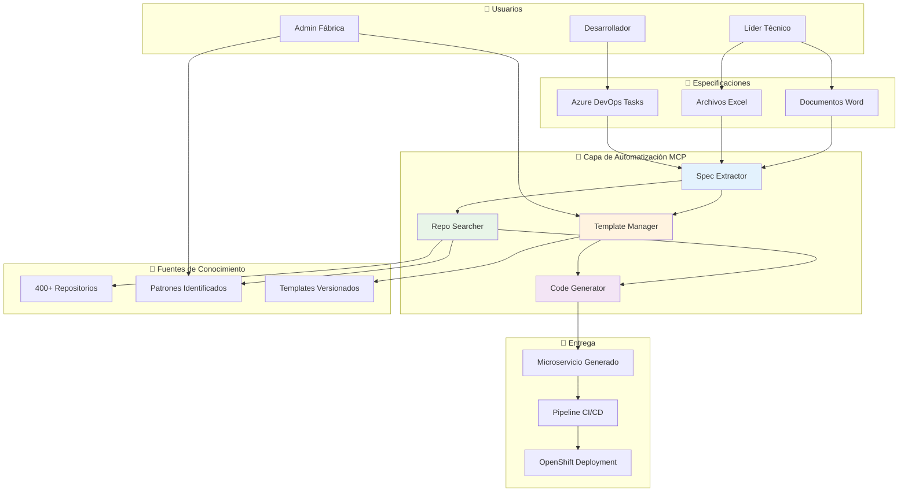

# 🏭 Estrategia Completa de Automatización de la Fábrica de Desarrollo

## 📋 Resumen Ejecutivo

La **Fábrica de Desarrollo Automatizada** transformará el proceso actual de desarrollo de microservicios, reduciendo el tiempo del líder técnico de **2-3 días a 30-60 minutos** mediante la automatización inteligente y reutilización de conocimiento de 400+ repositorios existentes.

### Beneficios Cuantificables
- **⏱️ Reducción de tiempo**: 80-90% en setup inicial de proyectos
- **🔄 Reutilización de código**: 70%+ mediante análisis automático de repositorios
- **📈 Incremento productividad**: 200%+ microservicios nuevos por mes
- **💰 ROI estimado**: 300% en primer año (€150k ahorro vs. €50k inversión)

## 🎯 Objetivos Estratégicos

### Objetivos Primarios
1. **Automatizar extracción de especificaciones** desde Word, Excel y Azure DevOps
2. **Reutilizar conocimiento existente** de 400+ repositorios de forma inteligente
3. **Generar código de alta calidad** con templates actualizados y mejores prácticas
4. **Integrar automáticamente** con OpenShift y pipelines CI/CD
5. **Reducir carga del líder técnico** a tareas de alto valor agregado

### Objetivos Secundarios
1. **Estandarizar arquitectura** de microservicios en la organización
2. **Mantener templates actualizados** automáticamente con nuevas versiones
3. **Capturar y aplicar mejores prácticas** emergentes de la comunidad de desarrollo
4. **Monitorear y optimizar** el proceso de desarrollo continuamente

## 🏗️ Arquitectura de la Solución

### Visión de Alto Nivel



### Componentes Clave de la Estrategia

#### 1. 🔍 Intelligent Spec Extractor
**Propósito**: Extraer automáticamente requerimientos de documentos heterogéneos

**Estrategia de Implementación**:
```yaml
Tecnologías:
  - NLP Engine: spaCy + transformers
  - Document Parsing: mammoth.js (Word) + xlsx (Excel)
  - API Integration: azure-devops-node-api
  - Validation: JSON Schema + custom rules

Capacidades:
  - Detección automática de entidades (APIs, bases de datos, dependencias)
  - Extracción de criterios de aceptación estructurados
  - Identificación de patrones arquitectónicos requeridos
  - Normalización a formato estándar JSON

Output:
  {
    "project": {
      "name": "string",
      "description": "string",
      "technology": "nodejs|springboot",
      "domain": "string"
    },
    "requirements": {
      "functional": ["string"],
      "nonFunctional": ["string"],
      "apis": [{"name": "string", "type": "REST|GraphQL"}],
      "databases": [{"type": "MongoDB|PostgreSQL", "purpose": "string"}]
    },
    "architecture": {
      "pattern": "microservice|api-gateway|event-driven",
      "dependencies": ["string"],
      "integrations": ["string"]
    }
  }
```

#### 2. 🔎 Smart Repo Searcher
**Propósito**: Encontrar y extraer patrones reutilizables de 400+ repositorios

**Estrategia de Implementación**:
```yaml
Indexación Inteligente:
  - Frecuencia: Semanal automática + manual on-demand
  - Contenido: AST parsing + README + configuraciones
  - Embeddings: Semantic similarity para búsqueda contextual
  - Filtros: Tecnología, dominio, antigüedad, popularidad

Búsqueda Semántica:
  - Query Enhancement: Expansión automática de términos
  - Ranking Algorithm: 
    * Similarity score (40%)
    * Usage frequency (30%)
    * Code quality metrics (20%)
    * Recency (10%)
  - Context Awareness: Consideración del dominio y tecnología

Extracción de Patrones:
  - Code Patterns: Functions, classes, interfaces comunes
  - Configuration Patterns: Docker, OpenShift, CI/CD
  - Architecture Patterns: Estructura de carpetas, dependencias
  - Best Practices: Linting rules, testing patterns
```

#### 3. 📋 Dynamic Template Manager
**Propósito**: Mantener templates actualizados con mejores prácticas en evolución

**Estrategia de Implementación**:
```yaml
Template Evolution:
  - Base Templates: Node.js (80%), Spring Boot (20%)
  - Version Control: Git con semantic versioning
  - Auto-Update: CI/CD que integra nuevos patrones semanalmente
  - Validation: Tests automáticos + security scanning

Customization Engine:
  - Variable Injection: Configuración específica de empresa
  - Module Composition: Composición dinámica según requerimientos
  - Dependency Management: Actualización automática de versiones
  - Security Compliance: Aplicación automática de políticas de seguridad

Quality Assurance:
  - Automated Testing: Unit + integration + E2E
  - Performance Testing: Load testing básico en templates
  - Security Scanning: SAST + dependency vulnerability check
  - Code Quality: SonarQube integration
```

#### 4. ⚡ Intelligent Code Generator
**Propósito**: Generar código funcional listo para desarrollo con mínima intervención

**Estrategia de Implementación**:
```yaml
Generation Engine:
  - Template Engine: Handlebars con helpers custom
  - Code Validation: AST parsing + compilation check
  - Best Practices: Automatic application de coding standards
  - Documentation: Auto-generation de README y API docs

Integration Orchestration:
  - Repository Creation: Azure DevOps API integration
  - Pipeline Generation: azure-pipelines.yml personalizado
  - OpenShift Integration: Deployment manifests automáticos
  - Secret Management: Azure Key Vault integration

Post-Generation:
  - Build Verification: Automatic build + test execution
  - Deployment Simulation: Dry-run en environment de testing
  - Quality Gates: SonarQube + security scans obligatorios
  - Notification: Teams/Email con status y next steps
```

## 🔐 Estrategia de Seguridad y Gobierno

### Modelo de Permisos
```yaml
Service Principal Strategy:
  - Principal: "mcp-factory-service"
  - Scope: "Organization-wide read, project-specific write"
  - Authentication: "Managed Identity + Azure Key Vault"
  - Rotation: "Automatic 90-day secret rotation"

Access Control:
  Repositories:
    - Read: "All 400+ repos (code analysis only)"
    - Write: "None (read-only access)"
    - Exclusions: "Private/confidential repos via tags"
  
  Azure DevOps:
    - Projects: "Read metadata, create new projects"
    - Work Items: "Read assigned tasks, create related tasks"
    - Pipelines: "Create and configure CI/CD"
    - Artifacts: "Read package feeds"

Data Privacy:
  - No Persistence: "Specifications processed in-memory only"
  - Anonymization: "Remove sensitive data before processing"
  - Audit Trail: "All actions logged for compliance"
  - Retention: "Logs kept 90 days, no code storage"
```

### Compliance y Auditoría
```yaml
Security Measures:
  - HTTPS Only: "All communications encrypted"
  - Network Isolation: "VNet integration for internal traffic"
  - Secret Management: "Azure Key Vault for all credentials"
  - Access Logging: "All repository access audited"

Quality Gates:
  - Security Scanning: "All generated code scanned for vulnerabilities"
  - License Compliance: "Dependency license verification"
  - Code Quality: "Minimum quality thresholds enforced"
  - Performance: "Basic performance testing mandatory"

Governance:
  - Template Approval: "Senior dev review for template changes"
  - Pattern Validation: "Architecture review for new patterns"
  - Exception Handling: "Manual override process for edge cases"
  - Feedback Loop: "User feedback integrated into improvements"
```

## 👥 Estrategia Organizacional

### Estructura de Equipos

#### Equipo de Implementación (6 semanas)
```yaml
Arquitecto de Software:
  - Responsabilidad: "Diseño técnico, decisiones arquitectónicas"
  - Perfil: "Senior, 5+ años, experiencia LLM/MCP, Azure DevOps"
  - Dedicación: "50% durante implementación"
  - Entregables: "Arquitectura detallada, guías técnicas"

Desarrollador Full-Stack:
  - Responsabilidad: "Implementación MCPs, integraciones"
  - Perfil: "Senior, Node.js/TypeScript, APIs, Git"
  - Dedicación: "100% durante implementación"
  - Entregables: "MCPs funcionales, tests, documentación"

DevOps Engineer:
  - Responsabilidad: "Infraestructura, permisos, CI/CD"
  - Perfil: "Expert Azure DevOps, OpenShift, networking"
  - Dedicación: "30% durante implementación"
  - Entregables: "Infraestructura, permisos, pipelines"

Líder Técnico Piloto:
  - Responsabilidad: "Testing, feedback, casos de uso"
  - Perfil: "Current team lead con conocimiento del proceso"
  - Dedicación: "20% durante implementación"
  - Entregables: "Casos de prueba, feedback, documentación"
```

#### Equipo de Operación (Continuo)
```yaml
Administrador de Fábrica:
  - Responsabilidad: "Mantenimiento, optimización, soporte L2"
  - Dedicación: "10% continuo (4h/semana)"
  - KPIs: "Uptime >99.5%, tiempo respuesta <24h"

Curador de Conocimiento:
  - Responsabilidad: "Análisis nuevos patrones, actualización templates"
  - Dedicación: "5% continuo (2h/semana)"
  - KPIs: "Templates actualizados semanalmente, nuevos patrones identificados"

Especialista en Soporte:
  - Responsabilidad: "Soporte L1, capacitación, documentación"
  - Dedicación: "15% continuo (6h/semana)"
  - KPIs: "Satisfacción usuario >4.5/5, tickets resueltos <48h"
```

### Estrategia de Adopción

#### Fase 1: Piloto Controlado (4 semanas)
```yaml
Scope: "2 equipos, 5 microservicios"
Objetivos:
  - Validar proceso end-to-end
  - Identificar casos edge
  - Refinar documentación
  - Capacitar early adopters

Success Criteria:
  - 80% de microservicios generados exitosamente
  - Reducción 60%+ en tiempo de setup
  - Feedback positivo de usuarios piloto
```

#### Fase 2: Expansión Gradual (8 semanas)
```yaml
Scope: "10 equipos, 25 microservicios"
Objetivos:
  - Escalar infraestructura
  - Automatizar más procesos
  - Desarrollar self-service capabilities
  - Crear contenido de capacitación

Success Criteria:
  - 95% uptime de la fábrica
  - 75% reducción en tiempo setup
  - 50% equipos adoptando la herramienta
```

#### Fase 3: Adopción Masiva (12 semanas)
```yaml
Scope: "Toda la organización"
Objetivos:
  - Rollout completo
  - Optimización continua
  - Métricas de impacto de negocio
  - Roadmap de evolución

Success Criteria:
  - 80% de nuevos microservicios usando la fábrica
  - ROI positivo documentado
  - Proceso integrado en workflows estándar
```

## 📊 Estrategia de Métricas y Optimización

### KPIs Técnicos
```yaml
Performance:
  - Tiempo Extracción: "< 30 segundos (target: 15s)"
  - Tiempo Generación: "< 5 minutos (target: 3m)"
  - Disponibilidad: "> 99.5% (target: 99.9%)"
  - Precisión Extracción: "> 95% (target: 98%)"

Quality:
  - Build Success Rate: "> 98% (target: 99%)"
  - Security Vulnerabilities: "0 critical, < 5 medium"
  - Code Coverage: "> 80% en código generado"
  - Performance Score: "> 90 (Lighthouse/similar)"

Adoption:
  - User Satisfaction: "> 4.5/5 (target: 4.8/5)"
  - Feature Usage: "> 80% de features utilizadas"
  - Support Tickets: "< 2 por semana"
  - Training Completion: "> 95% de usuarios entrenados"
```

### KPIs de Negocio
```yaml
Productivity:
  - Microservicios/mes: "+200% vs. baseline"
  - Tiempo Líder Técnico: "-80% en setup inicial"
  - Tiempo al Primer Deploy: "-70% vs. manual"
  - Reutilización Código: "> 70% LOC reutilizada"

Financial:
  - ROI: "> 300% primer año"
  - Costo por Microservicio: "-60% vs. desarrollo manual"
  - Ahorro Tiempo: "€150k anuales estimados"
  - Inversión Total: "€50k implementación + €20k/año operación"

Strategic:
  - Standardización: "> 90% proyectos siguiendo templates"
  - Knowledge Capture: "100% patrones documentados automáticamente"
  - Innovation Time: "+40% tiempo dedicado a innovación vs. setup"
  - Team Satisfaction: "> 4.5/5 en surveys trimestrales"
```

### Estrategia de Optimización Continua
```yaml
Weekly Reviews:
  - Performance metrics analysis
  - User feedback review
  - Template updates deployment
  - Repository pattern analysis

Monthly Optimizations:
  - Algorithm improvements
  - New pattern integration
  - Process refinements
  - Capacity planning

Quarterly Innovations:
  - Technology stack updates
  - New feature development
  - Architecture evolution
  - Strategic alignment review
```

## 🚀 Plan de Implementación Estratégico

### Cronograma de Ejecución

#### Preparación (Semana 0)
```yaml
Actividades:
  - Confirmación de equipo y recursos
  - Configuración inicial de permisos
  - Setup de infraestructura base
  - Kick-off con stakeholders

Entregables:
  - Equipo confirmado y disponible
  - Accesos configurados
  - Ambiente de desarrollo listo
  - Plan detallado aprobado
```

#### Sprint 1-2: Fundación (Semanas 1-2)
```yaml
Actividades:
  - Implementar MCP Spec Extractor MVP
  - Configurar service principal en Azure DevOps
  - Crear infrastructure as code
  - Setup monitoring y logging básico

Entregables:
  - Extractor funcional para documentos Word
  - Permisos de acceso configurados
  - Infraestructura desplegada en Azure
  - Dashboard básico de monitoreo
```

#### Sprint 3-4: Inteligencia (Semanas 3-4)
```yaml
Actividades:
  - Implementar indexación de repositorios
  - Desarrollar algoritmo de búsqueda semántica
  - Crear sistema de ranking de patrones
  - Integrar con Azure DevOps API

Entregables:
  - Buscador de patrones funcional
  - Base de conocimiento indexada
  - API de búsqueda documentada
  - Casos de prueba validados
```

#### Sprint 5-6: Generación (Semanas 5-6)
```yaml
Actividades:
  - Implementar motor de generación de código
  - Crear templates actualizados Node.js/Spring Boot
  - Integrar con OpenShift
  - Desarrollar pipeline de CI/CD automático

Entregables:
  - Generador de código funcional end-to-end
  - Templates validados y probados
  - Integración OpenShift operativa
  - Primer microservicio generado completamente
```

#### Piloto (Semanas 7-10)
```yaml
Actividades:
  - Ejecutar piloto con 2 equipos
  - Recopilar feedback detallado
  - Refinar procesos basado en uso real
  - Crear documentación de usuario final

Entregables:
  - 5 microservicios generados en piloto
  - Documentación de usuario completa
  - Proceso optimizado basado en feedback
  - Plan de expansión aprobado
```

### Factores Críticos de Éxito

#### Técnicos
```yaml
Infrastructure:
  - Azure subscription con suficientes límites
  - Service principal con permisos adecuados
  - Red connectivity a repositorios internos
  - OpenShift cluster con namespaces disponibles

Development:
  - Acceso a 400+ repositorios confirmado
  - Templates base validados y actualizados
  - Testing framework establecido
  - CI/CD pipeline funcional

Integration:
  - Azure DevOps API access confirmado
  - Service mesh/networking configurado
  - Secret management operativo
  - Monitoring y alerting funcional
```

#### Organizacionales
```yaml
Stakeholder Buy-in:
  - Sponsorship ejecutivo confirmado
  - Líderes técnicos comprometidos con piloto
  - DevOps team disponible para soporte
  - Change management plan aprobado

Resource Allocation:
  - Budget confirmado (€70k total)
  - Equipo dedicado identificado y disponible
  - Training time allocated para usuarios
  - Support structure definida

Process Integration:
  - Current workflows documentados
  - Migration strategy definida
  - Rollback plan establecido
  - Success criteria acordados
```

## 🎯 Conclusiones y Próximos Pasos

### Valor Estratégico
La Fábrica de Desarrollo Automatizada representa una **transformación fundamental** en la forma de crear microservicios, convirtiendo un proceso manual y repetitivo en un **proceso inteligente y automatizado** que capitaliza el conocimiento existente de la organización.

### Impacto Esperado
- **Desarrolladores**: Más tiempo en lógica de negocio, menos en boilerplate
- **Líderes Técnicos**: Foco en arquitectura y mentoring, no en setup manual
- **Organización**: Standardización, reutilización y velocidad de entrega
- **Clientes**: Faster time-to-market y mayor calidad de software

### Próximos Pasos Inmediatos
1. **Aprobación del plan** y confirmación de recursos
2. **Formación del equipo** de implementación
3. **Configuración inicial** de permisos y infraestructura
4. **Inicio del Sprint 1** con implementación del Spec Extractor

---

**Estado**: 📋 **Estrategia completa documentada y lista para ejecución**  
**Inversión**: €70k total (€50k implementación + €20k/año operación)  
**ROI**: 300%+ en primer año  
**Timeline**: 6 semanas implementación + 4 semanas piloto  
**Riesgo**: Bajo (tecnologías probadas, equipo experimentado, proceso incremental)
