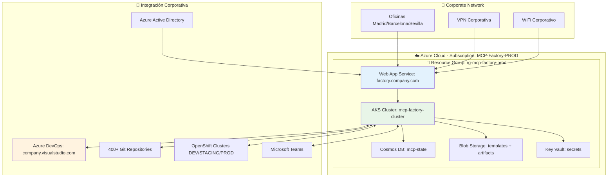
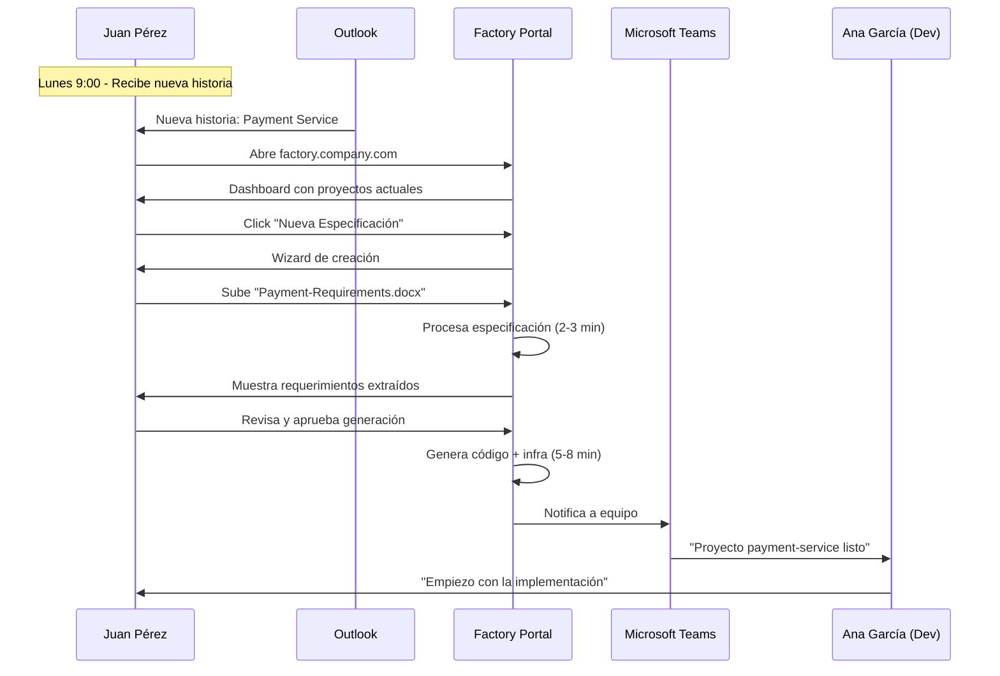
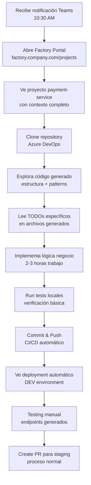
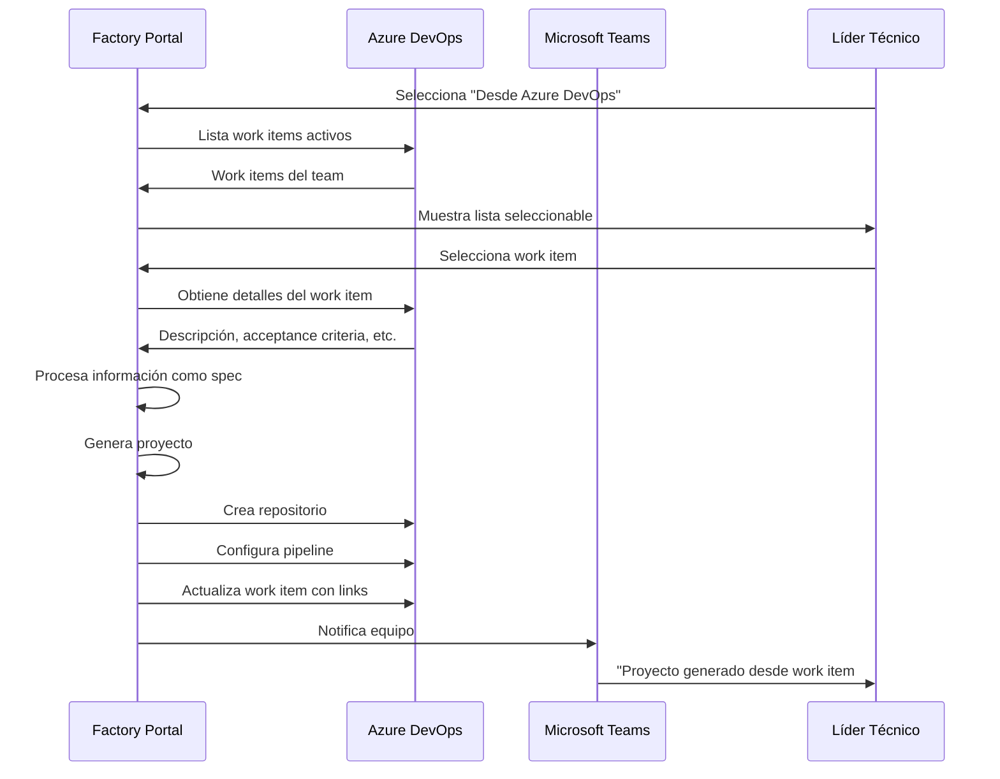

# 🏭 Guía Práctica: Dónde se Monta y Cómo se Usa la Fábrica

## 📍 Ubicación y Acceso de la Solución

### 🌐 Dónde Está Montada la Fábrica



### 🔗 URLs de Acceso

| Rol | URL Principal | Descripción |
|-----|---------------|-------------|
| **Líder Técnico** | `https://factory.company.com` | Portal principal para crear proyectos |
| **Desarrollador** | `https://factory.company.com/projects` | Vista de proyectos asignados |
| **Admin Fábrica** | `https://factory.company.com/admin` | Dashboard de administración |
| **QA/Testing** | `https://factory.company.com/quality` | Métricas de calidad y testing |
| **Management** | `https://factory.company.com/reports` | Reportes ejecutivos y ROI |

### 🔐 Autenticación y Permisos

```yaml
Autenticación:
  Provider: Azure Active Directory (SSO)
  Method: Automática desde red corporativa
  MFA: Requerido para admins
  
Grupos de Seguridad:
  - "MCP-Factory-Leaders": Líderes técnicos
  - "MCP-Factory-Developers": Desarrolladores
  - "MCP-Factory-Admins": Administradores
  - "MCP-Factory-ReadOnly": QA y Management
  
Permisos por Rol:
  Leaders:
    - Crear nuevos proyectos
    - Subir especificaciones
    - Aprobar generaciones
    - Ver métricas de equipo
    
  Developers:
    - Ver proyectos asignados
    - Acceder a repos generados
    - Reportar issues
    - Ver documentación
    
  Admins:
    - Gestionar templates
    - Configurar integraciones
    - Monitorear sistema
    - Gestionar usuarios
```

## 👥 Cómo Usa Cada Rol la Fábrica

### 1. 👨‍💼 Líder Técnico: Juan Pérez (Team Payments)

#### 📅 Uso Típico Diario (Lunes 9:00 AM)

**Contexto**: Juan recibe una nueva historia de usuario para un servicio de pagos



#### 🖥️ Vista en Pantalla de Juan

```html
┌─────────────────────────────────────────────────────────────┐
│ 🏭 Factory Portal - Juan Pérez (Team Payments)              │
├─────────────────────────────────────────────────────────────┤
│                                                             │
│ 🚀 Crear Nuevo Proyecto                                    │
│ [📄 Subir Documento] [📋 Azure DevOps] [✏️ Manual]        │
│                                                             │
│ 📊 Mis Proyectos Activos                                   │
│ ┌─────────────────┐ ┌─────────────────┐ ┌─────────────────┐ │
│ │ payment-service │ │ refund-api      │ │ wallet-service  │ │
│ │ ⏱️ Generando... │ │ ✅ En desarrollo│ │ 🚀 Desplegado   │ │
│ │ 70% - 3min left │ │ Ana García      │ │ Luis Martín     │ │
│ │                 │ │ ETA: 2 días     │ │ PROD desde ayer │ │
│ └─────────────────┘ └─────────────────┘ └─────────────────┘ │
│                                                             │
│ 📈 Productividad del Equipo (Esta semana)                  │
│ • Proyectos completados: 3                                 │
│ • Tiempo ahorro vs manual: 23 horas                        │
│ • Reutilización de código: 78%                             │
│ • Satisfaction score: 9.2/10                               │
│                                                             │
│ 🎯 Próximas Tareas                                         │
│ • Review payment-service code (Ana, mañana)                │
│ • Sprint planning (miércoles 10:00)                        │
│ • Demo stakeholders (viernes 15:00)                        │
│                                                             │
└─────────────────────────────────────────────────────────────┘
```

#### 📱 Workflow Real de Juan

```yaml
9:00 AM - Apertura del día:
  Action: Abre factory.company.com desde laptop
  Browser: Chrome corporativo con SSO automático
  Dashboard: Ve 2 proyectos en progreso, 1 completado ayer
  
9:05 AM - Nueva historia recibida:
  Email: Product Owner envía "Payment-Service-Requirements.docx"
  Decision: Usar la fábrica en lugar de asignación manual
  
9:07 AM - Inicio de creación:
  Click: "📄 Subir Documento"
  Upload: Arrastra el archivo Word de 2.3MB
  Form: Nombre "payment-service", Team "Payments", Prioridad "Alta"
  
9:10 AM - Procesamiento automático:
  Status: Ve progreso en tiempo real
  - "Extrayendo requerimientos... ✅"
  - "Buscando patrones similares... ✅" 
  - "Generando estructura base... ⏱️"
  
9:13 AM - Review de resultados:
  Screen: Ve 18 requerimientos extraídos automáticamente
  Patterns: 3 patrones de código encontrados (73% reutilización)
  Decision: Aprueba la generación con pequeño ajuste
  
9:15 AM - Generación en progreso:
  Status: "Generando código... 45%"
  Parallel: Juan revisa otros proyectos mientras espera
  
9:22 AM - Proyecto completado:
  Notification: Teams "✅ payment-service generado exitosamente"
  Actions: 
    - Ve links a repositorio en Azure DevOps
    - Confirma deployment en OpenShift DEV
    - Asigna a Ana García (desarrollador senior)
  
9:25 AM - Handoff:
  Teams: "@Ana García nuevo proyecto payment-service listo"
  Context: Adjunta especificación original y links relevantes
  ETA: "Estimo 2-3 días para lógica de negocio específica"
```

### 2. 👨‍💻 Desarrollador: Ana García (Senior Developer)

#### 🔧 Workflow de Desarrollo (Recibe Asignación)



#### 🖥️ Vista en Pantalla de Ana

```html
┌─────────────────────────────────────────────────────────────┐
│ 📁 payment-service - Asignado hace 30 minutos               │
├─────────────────────────────────────────────────────────────┤
│                                                             │
│ 📋 Contexto del Proyecto                                   │
│ Líder: Juan Pérez | Prioridad: Alta | ETA: 2-3 días        │
│                                                             │
│ ✅ Estado Actual                                            │
│ • Código base: Generado ✅                                 │
│ • Tests básicos: Creados ✅                                │
│ • Pipeline CI/CD: Activo ✅                                │
│ • DEV deployment: Funcionando ✅                           │
│ • Pendiente: Lógica de negocio específica ⏱️              │
│                                                             │
│ 🔗 Enlaces de Trabajo                                      │
│ [💻 Repository] [🔧 Pipeline] [🌐 DEV Environment]         │
│ [📚 API Docs] [🧪 Test Report] [📊 Monitoring]             │
│                                                             │
│ 🎯 TODOs Específicos (Auto-generados)                      │
│ 1. PaymentService.processPayment() - Integrar Stripe API   │
│ 2. PaymentValidator.validateCard() - Reglas PCI            │
│ 3. PaymentController.handleRefund() - Lógica reembolsos    │
│ 4. Error handling específico de payments                   │
│                                                             │
│ 📈 Código Pre-construido (68% reutilizado)                 │
│ • REST controllers estructura ✅                           │
│ • Database models y migrations ✅                          │
│ • Authentication middleware ✅                             │
│ • Error handling genérico ✅                               │
│ • Unit tests básicos ✅                                    │
│                                                             │
└─────────────────────────────────────────────────────────────┘
```

#### 💻 Trabajo Real de Ana

```bash
# 10:35 AM - Ana abre su workstation
cd /workspace
git clone https://dev.azure.com/company/payment-service.git
cd payment-service

# Explora estructura generada
tree -L 3
```

```
payment-service/
├── src/
│   ├── controllers/
│   │   ├── PaymentController.ts    # ✅ Estructura base
│   │   └── HealthController.ts     # ✅ Auto-generado
│   ├── services/
│   │   ├── PaymentService.ts       # 🔧 TODOs específicos
│   │   └── ValidationService.ts    # ✅ Patrón reutilizado
│   ├── models/
│   │   ├── Payment.ts             # ✅ Schema completo
│   │   └── PaymentResult.ts       # ✅ Response types
│   ├── middleware/
│   │   ├── auth.ts                # ✅ Reutilizado
│   │   ├── validation.ts          # ✅ Reutilizado  
│   │   └── error.ts               # ✅ Reutilizado
│   └── routes/
│       └── payments.ts            # ✅ Rutas definidas
├── tests/
│   ├── unit/                      # ✅ Tests básicos
│   ├── integration/               # ✅ Tests API
│   └── fixtures/                  # ✅ Data de prueba
├── docs/
│   ├── API.md                     # ✅ Documentación auto
│   ├── DEPLOYMENT.md              # ✅ Guía despliegue
│   └── DEVELOPMENT.md             # ✅ Guía desarrollo
└── k8s/
    ├── deployment.yaml            # ✅ OpenShift manifests
    ├── service.yaml              # ✅ Service config
    └── configmap.yaml            # ✅ Configuration
```

```typescript
// Ana abre src/services/PaymentService.ts
// Encuentra código generado con TODOs específicos

export class PaymentService {
  constructor(
    private stripeClient: StripeClient,  // ✅ Ya inyectado
    private paymentRepo: PaymentRepository,  // ✅ Ya configurado
    private validator: PaymentValidator      // ✅ Ya implementado
  ) {}

  async processPayment(request: PaymentRequest): Promise<PaymentResult> {
    // ✅ Validación básica ya implementada (patrón reutilizado)
    const validation = await this.validator.validate(request);
    if (!validation.isValid) {
      throw new PaymentValidationError(validation.errors);
    }

    // 🔧 TODO: Ana implementa la lógica específica aquí
    // Patrones sugeridos basados en order-service:
    try {
      // TODO: Crear cargo en Stripe
      const charge = await this.stripeClient.charges.create({
        amount: request.amount,
        currency: request.currency,
        source: request.cardToken,
        description: `Payment for order ${request.orderId}`
      });

      // TODO: Guardar transacción en BD
      const payment = await this.paymentRepo.create({
        orderId: request.orderId,
        amount: request.amount,
        stripeChargeId: charge.id,
        status: charge.status === 'succeeded' ? 'completed' : 'failed'
      });

      // ✅ Response ya tipado
      return {
        paymentId: payment.id,
        status: payment.status,
        transactionId: charge.id
      };

    } catch (error) {
      // ✅ Error handling ya implementado (patrón reutilizado)
      throw this.handlePaymentError(error);
    }
  }

  // ✅ Método helper ya generado con patrón reutilizado
  private handlePaymentError(error: any): PaymentError {
    // Lógica de error handling específica ya implementada
  }
}
```

```bash
# 12:30 PM - Ana termina implementación y testing
npm test                    # ✅ All tests pass
npm run test:integration   # ✅ API tests pass
git add .
git commit -m "Implement payment processing logic with Stripe integration"
git push origin develop

# CI/CD automático se ejecuta
# Deployment a DEV environment automático
# Ana ve en Factory Portal: "✅ Deployed to DEV successfully"
```

### 3. 🔧 Administrador: María Rodríguez (DevOps/Admin)

#### 🛠️ Trabajo Diario de Administración

**Contexto**: María gestiona la fábrica, mantiene templates actualizados y monitorea la operación

```yaml
8:00 AM - Review diario:
  URL: https://factory.company.com/admin
  Tasks:
    - Revisar métricas overnight
    - Verificar alertas activas
    - Planificar actualizaciones pendientes

Dashboard Vista:
  - 47 generaciones completadas ayer
  - 3 alertas menores (template updates disponibles)
  - 0 errores críticos
  - Usage trend: +15% vs semana anterior
```

#### 🖥️ Admin Dashboard de María

```html
┌─────────────────────────────────────────────────────────────┐
│ ⚙️ Factory Admin Console - María Rodríguez                  │
├─────────────────────────────────────────────────────────────┤
│                                                             │
│ 🚨 Alertas y Notificaciones                                │
│ ⚠️ nodejs-template: Nueva versión 18.2.1 disponible       │
│ ℹ️ Repository scan: 12 nuevos patrones detectados          │
│ ✅ Backup templates: Completado a las 02:00                │
│                                                             │
│ 📊 Métricas Operacionales (24h)                            │
│ • Generaciones: 47 ✅ (3 fallidas ⚠️)                     │
│ • Tiempo promedio: 6.8 min                                 │
│ • Templates utilizados:                                     │
│   - nodejs-microservice: 32 usos                          │
│   - springboot-api: 12 usos                                │
│   - python-worker: 3 usos                                  │
│                                                             │
│ 🔄 Tareas Programadas                                      │
│ [🔍 Scan Repositories] [📋 Update Templates]               │
│ [🧹 Cleanup Jobs] [📊 Generate Weekly Report]              │
│                                                             │
│ 🎯 Templates Management                                     │
│ ┌─────────────────────────────────────────────────────────┐ │
│ │ Template                Version    Status    Last Update │ │
│ │ nodejs-microservice    v2.1.4     ✅ Current  2 días    │ │
│ │ springboot-api         v1.8.2     ⚠️ Update   5 días   │ │
│ │ python-worker          v1.5.1     ✅ Current  1 semana  │ │
│ │ react-frontend         v3.2.0     ✅ Current  3 días    │ │
│ └─────────────────────────────────────────────────────────┘ │
│                                                             │
│ 📈 Analytics & Reports                                      │
│ [📊 Usage Dashboard] [👥 User Analytics] [💰 ROI Report]   │
│                                                             │
└─────────────────────────────────────────────────────────────┘
```

#### 🔧 Tareas Semanales de María

```yaml
Lunes - Review y Planning:
  - Analizar métricas de la semana anterior
  - Planificar actualizaciones de templates
  - Review de nuevos patrones detectados
  - Coordinar con equipos de desarrollo

Martes - Template Maintenance:
  - Actualizar templates con últimas versiones
  - Testing de templates actualizados
  - Deploy de nuevas versiones a staging
  - Documentación de cambios

Miércoles - Repository Analysis:
  - Ejecutar scan de 400+ repositorios
  - Analizar nuevos patrones encontrados
  - Curar y validar patrones relevantes
  - Actualizar base de conocimiento

Jueves - Monitoring & Optimization:
  - Revisar performance de la plataforma
  - Optimizar queries y procesos
  - Gestionar storage y cleanup
  - Planificar escalado si necesario

Viernes - Reporting & Communication:
  - Generar reportes semanales
  - Comunicar métricas a stakeholders
  - Planificar mejoras para próxima semana
  - Training y soporte a usuarios
```

### 4. 🧪 QA/Testing: Luis Martín (Quality Assurance)

#### 🔍 Workflow de Validación

```yaml
Acceso: https://factory.company.com/quality
Responsabilidades:
  - Validar calidad del código generado
  - Verificar cumplimiento de estándares
  - Testing de templates nuevos
  - Reportar issues y mejoras

Vista Típica:
  - 15 proyectos generados esta semana
  - 3 pendientes de quality review
  - 2 templates en testing
  - 0 issues críticos reportados
```

#### 📊 Dashboard de Calidad

```html
┌─────────────────────────────────────────────────────────────┐
│ 🧪 Quality Dashboard - Luis Martín                          │
├─────────────────────────────────────────────────────────────┤
│                                                             │
│ 📋 Proyectos Pendientes Review (3)                         │
│ ┌─────────────────────────────────────────────────────────┐ │
│ │ payment-service    | Ana García    | Generado hace 2h   │ │
│ │ user-profile-api   | Carlos López  | Generado hace 4h   │ │
│ │ notification-srv   | Sara Jiménez  | Generado hace 1d   │ │
│ └─────────────────────────────────────────────────────────┘ │
│                                                             │
│ 📈 Métricas de Calidad (Esta semana)                       │
│ • Code coverage promedio: 87%                              │
│ • Security issues: 0 critical, 2 minor                     │
│ • Performance score: 94/100                                │
│ • Best practices compliance: 96%                           │
│                                                             │
│ 🔍 Templates en Testing                                     │
│ • nodejs-microservice v2.2.0 (Beta)                       │
│ • springboot-api v1.9.0 (Release Candidate)               │
│                                                             │
│ 🚨 Issues Reportados                                       │
│ • Template springboot: Missing error handling (MINOR)      │
│ • Code generator: Inconsistent naming (LOW)                │
│                                                             │
└─────────────────────────────────────────────────────────────┘
```

### 5. 📊 Management: Carmen López (Engineering Manager)

#### 📈 Vista Ejecutiva y ROI

```yaml
Acceso: https://factory.company.com/reports
Enfoque:
  - ROI y métricas de productividad
  - Adoption rate por equipos
  - Identificar bottlenecks organizacionales
  - Planning de inversión en herramientas
```

#### 💼 Executive Dashboard

```html
┌─────────────────────────────────────────────────────────────┐
│ 📊 Factory Executive Dashboard - Carmen López               │
├─────────────────────────────────────────────────────────────┤
│                                                             │
│ 💰 ROI y Beneficios (Último mes)                           │
│ • Horas ahorradas: 342 hours                               │
│ • Costo evitado: €25,650 (@ €75/hour)                     │
│ • Proyectos acelerados: 23                                 │
│ • Time-to-market reducido: 68% average                     │
│                                                             │
│ 📈 Adopción por Equipo                                     │
│ ┌─────────────────────────────────────────────────────────┐ │
│ │ Team Payments:     95% adoption | 12 proyectos         │ │
│ │ Team Commerce:     87% adoption | 8 proyectos          │ │
│ │ Team Identity:     76% adoption | 6 proyectos          │ │
│ │ Team Operations:   45% adoption | 3 proyectos          │ │
│ └─────────────────────────────────────────────────────────┘ │
│                                                             │
│ 🎯 KPIs Clave                                              │
│ • Developer satisfaction: 9.1/10                           │
│ • Code reuse rate: 73%                                     │
│ • Defect rate: -45% vs manual                             │
│ • Deployment frequency: +120%                              │
│                                                             │
│ 🔮 Proyección Trimestral                                   │
│ • Proyectos estimados: 67                                  │
│ • Ahorro proyectado: €89,000                              │
│ • Teams pendientes adopción: 2                             │
│                                                             │
└─────────────────────────────────────────────────────────────┘
```

## 🔄 Flujos de Integración Corporativa

### Integración con Azure DevOps



### Integración con OpenShift

```yaml
Automatic Deployment Flow:
  1. Factory genera código + manifiestos K8s
  2. CI/CD pipeline ejecuta deployment
  3. OpenShift crea namespace específico
  4. Deployment automático a DEV environment
  5. Health checks y smoke tests
  6. Notificación de éxito/error

Environments Configuration:
  DEV:
    cluster: "openshift-dev.company.com"
    namespace: "{project-name}-dev"
    resources: "Limited (0.5 CPU, 1GB RAM)"
    
  STAGING:
    cluster: "openshift-staging.company.com"  
    namespace: "{project-name}-staging"
    resources: "Production-like (2 CPU, 4GB RAM)"
    
  PROD:
    cluster: "openshift-prod.company.com"
    namespace: "{project-name}-prod"
    resources: "Auto-scaling (1-8 replicas)"
```

## 📱 Acceso Móvil y Remoto

### Teams Integration

```yaml
Bot Commands:
  @FactoryBot new project [description]
  @FactoryBot status [project-name]
  @FactoryBot help

Notifications:
  - Proyecto generado exitosamente
  - Error en generación (requiere atención)
  - Template actualizado (afecta proyectos activos)
  - Métricas semanales de equipo
```

### Mobile Web Access

```html
<!-- Responsive design para tablets/móviles -->
┌─────────────────────────────┐
│ 🏭 Factory Mobile           │
├─────────────────────────────┤
│                             │
│ 📱 Quick Actions            │
│ [📄 Nueva Spec]             │
│ [📊 Ver Proyectos]          │
│ [📈 Métricas]               │
│                             │
│ 🚀 Proyectos Activos        │
│ ┌─────────────────────────┐ │
│ │ payment-service         │ │
│ │ ⏱️ Generando... 60%     │ │
│ └─────────────────────────┘ │
│                             │
│ 📨 Notificaciones (2)       │
│ • user-api completed ✅     │
│ • template update ⚠️       │
│                             │
└─────────────────────────────┘
```

## 🎯 Resumen de Ubicación y Uso

| Aspecto | Detalle |
|---------|---------|
| **Dónde está** | Azure Cloud (AKS) en subscription corporativo |
| **Cómo acceden** | URL factory.company.com con SSO Azure AD |
| **Cuándo usan** | Líderes: al recibir historias. Devs: al ser asignados |
| **Integración** | Nativa con Azure DevOps, OpenShift, Teams |
| **Disponibilidad** | 24/7 con SLA 99.9% |
| **Soporte** | María (Admin) + escalación a vendor |

La fábrica está completamente integrada en el flujo de trabajo diario, eliminando fricción y maximizando la adopción natural por parte de los equipos.
