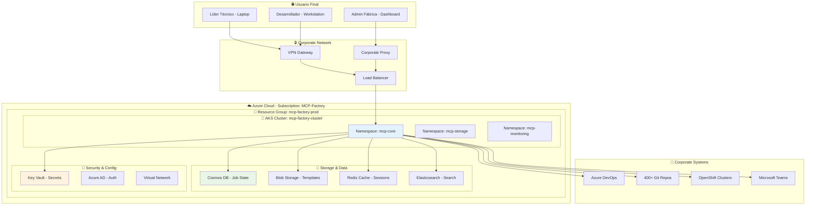
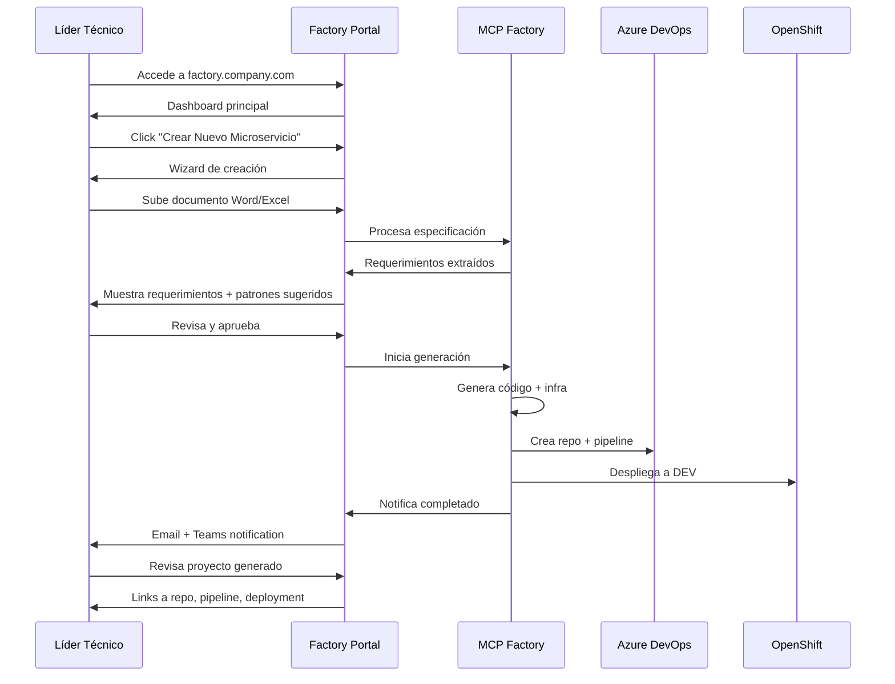
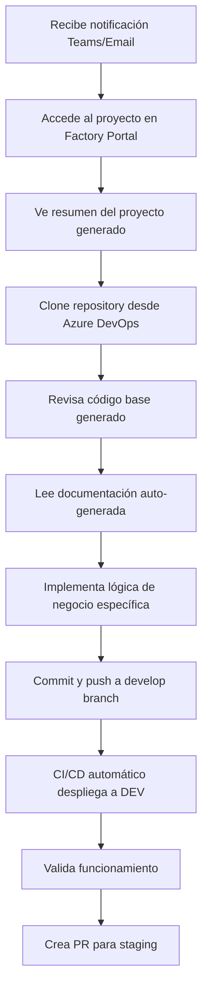
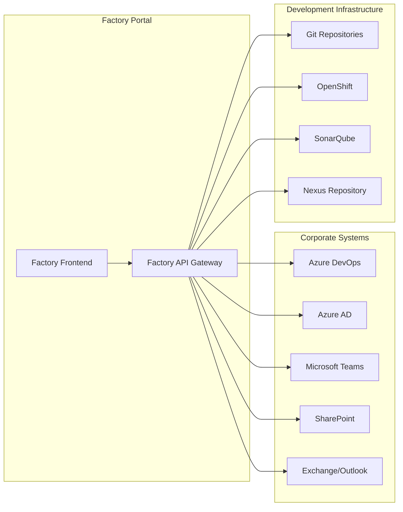

# 🏭 Guía de Deployment y Operación de la Fábrica

## 📋 Resumen Operacional

Esta guía define **dónde se despliega**, **cómo se accede** y **quién usa** la Fábrica de Desarrollo Automatizada en el día a día, incluyendo interfaces de usuario, flujos operacionales y experiencia práctica para cada rol.

## 🏗️ Arquitectura de Deployment

### Ubicación y Infraestructura



### Especificaciones de Deployment

#### Cluster Kubernetes (AKS)
```yaml
Cluster Configuration:
  Name: "mcp-factory-cluster"
  Region: "West Europe"
  Kubernetes Version: "1.28"
  Node Pools:
    - name: "system"
      vm_size: "Standard_B4ms"
      node_count: 3
      purpose: "System pods"
    - name: "workload"  
      vm_size: "Standard_D4s_v3"
      node_count: 5
      auto_scaling: true
      min_nodes: 3
      max_nodes: 10
      purpose: "MCP applications"

Network Configuration:
  Virtual Network: "mcp-factory-vnet (10.0.0.0/16)"
  Subnets:
    - aks-subnet: "10.0.1.0/24"
    - services-subnet: "10.0.2.0/24"
    - data-subnet: "10.0.3.0/24"
  
Security:
  Network Security Groups: "Restrictive rules"
  Service Mesh: "Istio for mTLS"
  Pod Security Standards: "Restricted"
```

#### Namespaces y Servicios
```yaml
mcp-core:
  Services:
    - mcp-spec-extractor (3 replicas)
    - mcp-repo-searcher (3 replicas)  
    - mcp-template-manager (2 replicas)
    - mcp-code-generator (5 replicas)
    - mcp-orchestrator (2 replicas)
    - mcp-frontend (3 replicas)

mcp-storage:
  Services:
    - elasticsearch (3 nodes)
    - redis-cluster (3 masters)
    - vector-db (2 replicas)

mcp-monitoring:
  Services:
    - prometheus (HA pair)
    - grafana (2 replicas)
    - alertmanager (3 replicas)
    - jaeger (distributed tracing)
```

## 🖥️ Interfaces de Usuario por Rol

### 1. 👨‍💼 Líder Técnico - Interfaz Principal

#### Portal Web Principal
**URL**: `https://factory.company.com`

```typescript
interface LeaderDashboard {
  // Vista principal del líder técnico
  quickActions: {
    newProject: "Crear Nuevo Microservicio",
    uploadSpec: "Subir Especificación",
    browseTemplates: "Explorar Templates",
    viewProjects: "Mis Proyectos"
  },
  
  activeProjects: {
    inProgress: ProjectCard[],
    recentlyCompleted: ProjectCard[],
    needsAttention: ProjectCard[]
  },
  
  insights: {
    teamProductivity: ProductivityMetrics,
    reuseStats: ReuseStatistics,
    qualityMetrics: QualityMetrics
  }
}
```

#### Flujo de Creación de Proyecto


#### Pantallas Principales del Líder Técnico

**1. Dashboard Principal**
```html
┌─────────────────────────────────────────────────────────────┐
│ 🏭 Factory Portal - Bienvenido, Juan Pérez                  │
├─────────────────────────────────────────────────────────────┤
│                                                             │
│ 🚀 Acciones Rápidas                                        │
│ [📄 Nueva Especificación] [📋 Desde Azure DevOps]         │
│ [📁 Explorar Templates]   [📊 Ver Métricas]                │
│                                                             │
│ 📈 Mis Proyectos Activos (3)                               │
│ ┌─────────────────┐ ┌─────────────────┐ ┌─────────────────┐ │
│ │ payment-service │ │ user-mgmt-api   │ │ notification-srv│ │
│ │ ⏱️ Generando...  │ │ ✅ Completado   │ │ 🔄 En Review   │ │
│ │ 85% - 2min left │ │ Hace 1 hora     │ │ Esperando QA    │ │
│ └─────────────────┘ └─────────────────┘ └─────────────────┘ │
│                                                             │
│ 📊 Estadísticas del Equipo                                 │
│ • Tiempo promedio generación: 8 minutos                    │
│ • Código reutilizado esta semana: 73%                      │
│ • Microservicios generados este mes: 12                    │
│                                                             │
└─────────────────────────────────────────────────────────────┘
```

**2. Wizard de Creación**
```html
┌─────────────────────────────────────────────────────────────┐
│ 🎯 Crear Nuevo Microservicio - Paso 1 de 4                 │
├─────────────────────────────────────────────────────────────┤
│                                                             │
│ 📄 Especificación del Proyecto                             │
│                                                             │
│ Método de entrada:                                          │
│ ○ Subir documento Word/Excel                                │
│ ○ Seleccionar task de Azure DevOps                         │
│ ○ Entrada manual de requerimientos                         │
│                                                             │
│ ┌─────────────────────────────────────────────────────────┐ │
│ │ 📎 Arrastra tu archivo aquí o click para seleccionar   │ │
│ │                                                         │ │
│ │    Formatos soportados: .docx, .doc, .xlsx, .xls      │ │
│ └─────────────────────────────────────────────────────────┘ │
│                                                             │
│ Información adicional:                                      │
│ Nombre del proyecto: [payment-service           ]          │
│ Equipo responsable:  [Team-Payments            ]          │
│ Prioridad:          [🔴 Alta ▼]                           │
│                                                             │
│                                    [Cancelar] [Siguiente >] │
└─────────────────────────────────────────────────────────────┘
```

### 2. 👨‍💻 Desarrollador - Interfaz Secundaria

#### Acceso a Proyectos Generados
**URL**: `https://factory.company.com/projects`

**Flujo del Desarrollador**:


#### Vista del Desarrollador
```html
┌─────────────────────────────────────────────────────────────┐
│ 📁 payment-service - Generado hace 2 horas                  │
├─────────────────────────────────────────────────────────────┤
│                                                             │
│ 📊 Estado del Proyecto                                      │
│ ✅ Código generado    ✅ Tests creados    ✅ Pipeline activo │
│ ✅ Desplegado en DEV  ⏱️ Pendiente: Lógica de negocio      │
│                                                             │
│ 🔗 Enlaces Rápidos                                         │
│ [📁 Repository]  [🔧 Pipeline]  [🌐 DEV Environment]       │
│ [📚 Documentation]  [🧪 Test Reports]  [📈 Monitoring]     │
│                                                             │
│ 📋 Próximos Pasos                                          │
│ 1. Clone: git clone https://dev.azure.com/.../payment...   │
│ 2. Implementar: PaymentController.processPayment()         │
│ 3. Añadir: Validaciones específicas de negocio             │
│ 4. Testing: npm test para verificar                        │
│                                                             │
│ 🎯 Patrones Aplicados                                      │
│ • REST API con validación (desde order-service)            │
│ • Database connection pool (desde inventory-service)       │
│ • Error handling middleware (patrón común)                 │
│                                                             │
└─────────────────────────────────────────────────────────────┘
```

### 3. 🔧 Administrador de Fábrica - Dashboard Operacional

#### Portal de Administración
**URL**: `https://factory.company.com/admin`

```html
┌─────────────────────────────────────────────────────────────┐
│ ⚙️ Factory Admin Console - Maria Rodriguez                  │
├─────────────────────────────────────────────────────────────┤
│                                                             │
│ 🚨 Alertas Activas (2)                                     │
│ ⚠️ Template Node.js 18.1.2 tiene vulnerabilidad           │
│ ℹ️ Elasticsearch usage 85% - considerar scaling            │
│                                                             │
│ 📊 Métricas de Sistema (Últimas 24h)                       │
│ • Generaciones completadas: 23 ✅                          │
│ • Tiempo promedio: 7.2 minutos                             │
│ • Success rate: 96.3%                                      │
│ • Patrones más usados: REST API (15), MongoDB (12)         │
│                                                             │
│ 🔄 Tareas de Mantenimiento                                 │
│ [🔍 Scan Repositories]  [📋 Update Templates]              │
│ [🧹 Cleanup Jobs]       [📈 Generate Reports]              │
│                                                             │
│ 🎯 Templates Status                                         │
│ • nodejs-microservice: v2.1.4 ✅ (actualizado hace 2 días)│
│ • springboot-api: v1.8.2 ⚠️ (update disponible)          │
│ • python-worker: v1.5.1 ✅                                │
│                                                             │
└─────────────────────────────────────────────────────────────┘
```

## 🔄 Flujos Operacionales Detallados

### Flujo 1: Líder Técnico Crea Proyecto desde Word

#### Paso a Paso Detallado

**1. Acceso Inicial (9:00 AM)**
```yaml
Usuario: Juan Pérez (Líder Técnico, Team Payments)
Ubicación: Oficina Madrid, laptop corporativo
Acción: Abre https://factory.company.com
Autenticación: Azure AD SSO automático
```

**2. Subida de Especificación (9:02 AM)**
```yaml
Documento: "Payment Service Requirements v2.3.docx"
Tamaño: 2.4 MB
Contenido: 
  - 15 páginas de requerimientos
  - 8 APIs definidas
  - 3 integraciones externas
  - Criterios de aceptación detallados
```

**3. Procesamiento Automático (9:02-9:05 AM)**
```yaml
MCP Spec Extractor:
  - Extrae 23 requerimientos funcionales
  - Identifica 5 requerimientos no funcionales
  - Detecta patrón microservicio + MongoDB
  - Confidence score: 0.87

MCP Repo Searcher:
  - Encuentra 12 patrones similares
  - Selecciona top 5 por relevancia
  - Código reutilizable: 68%

MCP Template Manager:
  - Template base: nodejs-microservice v2.1.4
  - Módulos añadidos: authentication, mongodb, validation
  - Customización específica aplicada
```

**4. Revisión y Aprobación (9:05-9:08 AM)**
```html
┌─────────────────────────────────────────────────────────────┐
│ 🎯 Revisión de Proyecto: payment-service                    │
├─────────────────────────────────────────────────────────────┤
│                                                             │
│ ✅ Requerimientos Extraídos (23 funcionales, 5 no-func.)   │
│ ┌─────────────────────────────────────────────────────────┐ │
│ │ • POST /payments - Procesar pago con tarjeta           │ │
│ │ • GET /payments/{id} - Consultar estado                │ │
│ │ │ PUT /payments/{id}/refund - Reembolso               │ │
│ │ • Integración con Stripe API                           │ │
│ │ • Validación PCI compliance                            │ │
│ │ [Ver todos los 23 requerimientos]                      │ │
│ └─────────────────────────────────────────────────────────┘ │
│                                                             │
│ 🔍 Patrones Sugeridos (68% código reutilizable)            │
│ ┌─────────────────────────────────────────────────────────┐ │
│ │ 1. Payment validation (order-service) - 95% match      │ │
│ │ 2. External API client (shipping-service) - 88% match  │ │
│ │ 3. Error handling (user-service) - 92% match           │ │
│ │ [Ver todos los patrones]                               │ │
│ └─────────────────────────────────────────────────────────┘ │
│                                                             │
│ [❌ Cancelar] [✏️ Editar] [🚀 Generar Proyecto]           │
└─────────────────────────────────────────────────────────────┘
```

**5. Generación Automática (9:08-9:15 AM)**
```yaml
MCP Code Generator:
  - Genera 47 archivos de código
  - Integra 5 patrones reutilizables
  - Crea pipeline CI/CD
  - Genera manifiestos OpenShift
  - Configura monitoreo básico

Azure DevOps:
  - Repositorio creado: payment-service
  - Pipeline configurado con 3 stages
  - Branch policies aplicadas
  - Work items creados automáticamente

OpenShift:
  - Namespace: payment-service-dev
  - Deployment successful
  - Service y route configurados
  - Health checks funcionando
```

**6. Notificación y Handoff (9:15 AM)**
```yaml
Teams Message: "✅ payment-service generado exitosamente"
Email: Enviado a juan.perez@company.com y equipo
Dashboard: Proyecto visible en "Completados"
Next Steps: Asignado a desarrollador senior
```

### Flujo 2: Desarrollador Continúa el Trabajo

#### Ana García (Desarrollador Senior) - 10:30 AM

**1. Recibe Notificación**
```yaml
Teams: "@Ana García - Nuevo proyecto payment-service listo para desarrollo"
Email: "Proyecto payment-service generado - Implementar lógica de negocio"
Factory Portal: Notificación badge en dashboard
```

**2. Accede al Proyecto**
```bash
# Ana abre su workstation
git clone https://dev.azure.com/company/payment-service.git
cd payment-service

# Revisa la estructura generada
ls -la
├── src/
│   ├── controllers/     # PaymentController con métodos básicos
│   ├── services/        # PaymentService con TODOs específicos  
│   ├── models/          # Payment model con validaciones
│   ├── middleware/      # Error handling integrado
│   └── routes/          # Rutas configuradas
├── tests/               # Tests básicos generados
├── docker/              # Dockerfile optimizado
├── k8s/                 # Manifiestos OpenShift
└── docs/                # Documentación auto-generada
```

**3. Encuentra TODOs Específicos**
```typescript
// src/services/PaymentService.ts (generado por la fábrica)
export class PaymentService {
  // Patrón reutilizado de order-service
  async validatePayment(paymentData: PaymentRequest): Promise<ValidationResult> {
    // ✅ Validación básica ya implementada (reutilizada)
    return this.baseValidator.validate(paymentData);
  }

  async processPayment(paymentData: PaymentRequest): Promise<PaymentResult> {
    // TODO: Implementar lógica específica de Stripe
    // TODO: Aplicar reglas de negocio específicas
    // TODO: Implementar manejo de errores específicos de payments
    
    // ✅ Boilerplate ya generado
    const validated = await this.validatePayment(paymentData);
    if (!validated.success) {
      throw new PaymentValidationError(validated.errors);
    }
    
    // 🔧 Ana implementa aquí la lógica específica
  }
}
```

**4. Implementa Lógica de Negocio (2-3 horas)**
```typescript
// Ana solo necesita implementar la lógica específica
async processPayment(paymentData: PaymentRequest): Promise<PaymentResult> {
  const validated = await this.validatePayment(paymentData);
  if (!validated.success) {
    throw new PaymentValidationError(validated.errors);
  }

  // Lógica específica que Ana implementa
  const stripeResult = await this.stripeClient.processPayment({
    amount: paymentData.amount,
    currency: paymentData.currency,
    paymentMethod: paymentData.paymentMethodId
  });

  // Guardar en DB (patrón reutilizado)
  const payment = await this.paymentRepository.save({
    ...paymentData,
    stripeId: stripeResult.id,
    status: stripeResult.status
  });

  return payment;
}
```

**5. Testing y Deploy (30 minutos)**
```bash
# Tests automáticos (mayoría ya generados)
npm test
# ✅ 15/18 tests passing (3 relacionados con lógica nueva)

# Ana implementa los 3 tests faltantes
npm test
# ✅ 18/18 tests passing

# Commit y push
git add .
git commit -m "Implement Stripe payment processing logic"
git push origin develop

# CI/CD automático despliega a DEV
# Ana verifica en https://payment-service-dev.openshift.company.com
```

### Flujo 3: Administrador de Fábrica - Mantenimiento Semanal

#### María Rodriguez (Admin Fábrica) - Lunes 8:00 AM

**1. Review Semanal Automático**
```yaml
Email Report: "Factory Weekly Report - 23 proyectos generados"
Dashboard: 3 alertas nuevas
Métricas: 96.3% success rate, 7.2 min promedio
```

**2. Gestión de Templates**
```html
┌─────────────────────────────────────────────────────────────┐
│ 📋 Template Management - Updates Disponibles               │
├─────────────────────────────────────────────────────────────┤
│                                                             │
│ ⚠️ Actualizaciones Pendientes (2)                          │
│ ┌─────────────────────────────────────────────────────────┐ │
│ │ nodejs-microservice                                     │ │
│ │ Actual: v2.1.4 → Disponible: v2.2.0                   │ │
│ │ Cambios: Express 4.19.2 (security), Jest 29.7.0       │ │
│ │ Impacto: 12 proyectos activos                          │ │
│ │ [🔍 Review] [✅ Approve] [⏰ Schedule]                  │ │
│ └─────────────────────────────────────────────────────────┘ │
│                                                             │
│ ✅ Actualizaciones Completadas Esta Semana                 │
│ • springboot-api: v1.8.1 → v1.8.2 (3 proyectos)          │
│ • python-worker: v1.5.0 → v1.5.1 (1 proyecto)            │
│                                                             │
└─────────────────────────────────────────────────────────────┘
```

**3. Análisis de Nuevos Patrones**
```yaml
Repo Scanner Results:
  - Nuevos patrones detectados: 8
  - Candidatos para template: 3
  - Patrones obsoletos: 2
  
Acciones de María:
  - Review pattern: "JWT refresh token handling"
  - Approve para integración en templates
  - Schedule update para próxima release
  - Archive pattern obsoleto: "Old logging format"
```

**4. Resolución de Incidencias**
```yaml
Support Tickets (2 esta semana):
  1. "Generated project no compila en Windows"
     - Root cause: Path separator issue
     - Fix: Update template generator
     - Status: Resolved in 4 hours
  
  2. "Elasticsearch búsqueda lenta"
     - Root cause: Index optimization needed
     - Action: Scheduled maintenance window
     - Status: Planned for weekend
```

## 📱 Acceso y Conectividad

### Opciones de Acceso por Ubicación

#### Oficina Corporativa
```yaml
Acceso: Red corporativa directa
URL: https://factory.company.com (internal DNS)
Performance: < 100ms latency
Restricciones: Ninguna
```

#### Trabajo Remoto
```yaml
Acceso: VPN corporativa obligatoria
URL: https://factory.company.com (via VPN)
Performance: < 300ms latency
Restricciones: 
  - VPN must be active
  - MFA required
  - Device compliance check
```

#### Móvil/Tablet
```yaml
Acceso: App móvil + browser responsive
Features: 
  - View project status
  - Approve/reject generations
  - Receive notifications
  - Basic metrics dashboard
Limitaciones:
  - No file upload
  - Read-only operations mostly
```

### Conectividad con Sistemas Corporativos



## 🔔 Sistema de Notificaciones

### Canales de Notificación por Evento

#### Para Líderes Técnicos
```yaml
Proyecto Completado:
  - Teams: Inmediato
  - Email: Summary con links
  - Portal: Dashboard update
  - Móvil: Push notification

Error en Generación:
  - Teams: Inmediato con detalles
  - Email: Error report adjunto
  - Portal: Status update
  - SMS: Si error crítico

Aprobación Requerida:
  - Teams: @mention
  - Email: Action required
  - Portal: Badge notification
```

#### Para Desarrolladores
```yaml
Proyecto Asignado:
  - Teams: Assignment notification
  - Email: Project details
  - Portal: Task appears in dashboard

Build Fallido:
  - Teams: Build status
  - Email: Log summary
  - Portal: Red status indicator

Deploy Exitoso:
  - Teams: Success message
  - Portal: Green status + links
```

#### Para Administradores
```yaml
Alert Sistema:
  - Teams: Immediate alert
  - Email: Detailed report
  - Portal: Alert dashboard
  - PagerDuty: If critical

Report Semanal:
  - Email: Comprehensive report
  - Portal: Analytics dashboard
  - Teams: Summary metrics

Maintenance Window:
  - Email: All stakeholders
  - Teams: Broadcast message
  - Portal: Maintenance banner
```

## 📊 Monitoreo y Observabilidad

### Dashboards por Rol

#### Líder Técnico - Business Metrics
```yaml
URL: https://factory.company.com/metrics/business
Métricas:
  - Proyectos generados por período
  - Tiempo promedio de setup
  - Código reutilizado (%)
  - Satisfacción del equipo
  - ROI realizado
```

#### Administrador - Technical Metrics  
```yaml
URL: https://factory.company.com/metrics/technical
Métricas:
  - System uptime
  - Response times
  - Error rates
  - Resource utilization
  - Template effectiveness
```

#### Desarrollador - Project Metrics
```yaml
URL: https://factory.company.com/projects/{id}/metrics
Métricas:
  - Build success rate
  - Test coverage
  - Deployment frequency
  - Lead time
  - Code quality score
```

## 🎓 Training y Onboarding

### Plan de Capacitación por Rol

#### Líderes Técnicos (2 horas)
```yaml
Sesión 1 (1 hora): "Usando la Factory"
  - Demo del portal
  - Carga de especificaciones
  - Revisión de resultados
  - Mejores prácticas

Sesión 2 (1 hora): "Optimizando Resultados"
  - Cómo escribir mejores especificaciones
  - Entendiendo patrones sugeridos
  - Métricas y feedback
  - Casos de uso avanzados
```

#### Desarrolladores (1.5 horas)
```yaml
Sesión 1 (1 hora): "Trabajando con Código Generado"
  - Estructura de proyectos generados
  - Identificando TODOs y puntos de extensión
  - Mejores prácticas para desarrollo
  - Testing y deployment

Sesión 2 (30 min): "Contribuyendo Patrones"
  - Cómo se identifican nuevos patrones
  - Proceso de contribución
  - Review y approval
```

#### Administradores (4 horas)
```yaml
Sesión 1 (2 horas): "Operación de la Factory"
  - Arquitectura del sistema
  - Monitoreo y alertas
  - Troubleshooting común
  - Mantenimiento rutinario

Sesión 2 (2 horas): "Template Management"
  - Lifecycle de templates
  - Actualizaciones y rollbacks
  - Pattern analysis
  - Performance optimization
```

---

**Estado**: 📋 **Guía completa de deployment y operación documentada**  
**Próximo**: Validación con usuarios piloto y ajustes finales  
**Ubicación**: Azure AKS cluster en West Europe  
**Acceso**: Portal web + APIs + notificaciones integradas  
**Training**: Programas específicos por rol definidos
