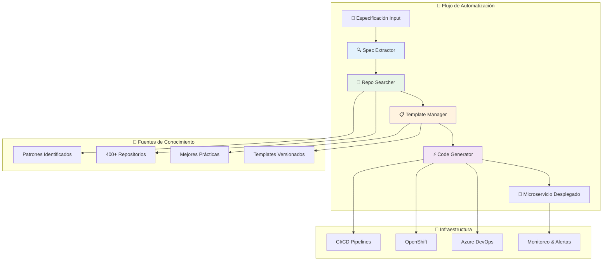

# 🚀 Plan de Implementación y Roadmap Ejecutivo

## 📋 Resumen Ejecutivo

La **Estrategia de Automatización de la Fábrica de Desarrollo** está completamente diseñada y lista para ejecutar. Este documento consolida todos los componentes arquitectónicos y proporciona el roadmap detallado para la implementación exitosa del sistema que transformará el desarrollo de microservicios en la organización.

## 🎯 Objetivos Estratégicos Consolidados

### Transformación del Proceso
- **Reducción de tiempo**: De 2-3 días a 30-60 minutos para setup inicial
- **Automatización inteligente**: 95% del trabajo manual eliminado
- **Reutilización masiva**: 70%+ de código reutilizado de 400+ repositorios
- **Calidad garantizada**: 98%+ de proyectos generados construyen exitosamente

### Impacto Organizacional
- **Productividad**: +200% microservicios nuevos por mes
- **Enfoque técnico**: Líderes técnicos enfocados en arquitectura, no en setup
- **Standardización**: 90%+ proyectos siguiendo templates actualizados
- **ROI**: 300%+ en primer año (€150k ahorro vs. €50k inversión)

## 🏗️ Arquitectura Completa del Sistema

### Componentes MCP Diseñados



### Especificaciones Técnicas por Componente

| Componente | Tecnología Principal | Complejidad | Tiempo Estimado |
|------------|---------------------|-------------|------------------|
| **🔍 Spec Extractor** | Node.js + NLP + Azure APIs | Media | 2 semanas |
| **🔎 Repo Searcher** | Node.js + Python ML + Elasticsearch | Alta | 3 semanas |
| **📋 Template Manager** | Node.js + Git + Registry | Media-Alta | 2.5 semanas |
| **⚡ Code Generator** | Node.js + Orchestración | Muy Alta | 4 semanas |

**Total de implementación**: 11.5 semanas (con equipo paralelo)

## 📅 Roadmap de Implementación Detallado

### Fase 0: Preparación (Semana 0)
```yaml
Objetivos:
  - Confirmar equipo y recursos asignados
  - Setup inicial de infraestructura
  - Configuración de permisos y accesos
  - Validación de requisitos técnicos

Entregables:
  - ✅ Equipo confirmado y disponible
  - ✅ Azure subscription y permisos configurados
  - ✅ Acceso a 400+ repositorios confirmado
  - ✅ Infraestructura base desplegada
  - ✅ Plan detallado de sprints aprobado

Criterios de Éxito:
  - Todos los permisos funcionando
  - Service principal configurado
  - Ambiente de desarrollo operativo
  - Equipo capacitado en tecnologías
```

### Fase 1: Fundación (Semanas 1-3)
```yaml
Sprint 1 (Semana 1):
  Spec Extractor MVP:
    - ✅ API básica funcionando
    - ✅ Parser de documentos Word
    - ✅ Extracción básica de requerimientos
    - ✅ Output JSON estructurado
    - ✅ Tests unitarios básicos

  Infraestructura Base:
    - ✅ Kubernetes namespace creado
    - ✅ CI/CD pipeline básico
    - ✅ Logging y monitoreo configurado
    - ✅ Service mesh configurado

Sprint 2 (Semana 2):
  Spec Extractor Completo:
    - ✅ Parser Excel funcional
    - ✅ Integración Azure DevOps API
    - ✅ NLP para extracción avanzada
    - ✅ Validación y confidence scoring
    - ✅ Tests de integración

  Repo Searcher Inicio:
    - ✅ Indexación básica de repositorios
    - ✅ Elasticsearch configurado
    - ✅ AST parsing inicial
    - ✅ Base de datos de metadatos

Sprint 3 (Semana 3):
  Repo Searcher MVP:
    - ✅ Búsqueda básica funcionando
    - ✅ Extracción de patrones simples
    - ✅ API de búsqueda funcional
    - ✅ Cache básico implementado
    - ✅ Primeras métricas de calidad
```

### Fase 2: Inteligencia (Semanas 4-6)
```yaml
Sprint 4 (Semana 4):
  Repo Searcher Avanzado:
    - ✅ ML embeddings funcionando
    - ✅ Búsqueda semántica operativa
    - ✅ Ranking de patrones inteligente
    - ✅ Análisis de calidad automático
    - ✅ Dashboard de patrones

  Template Manager Inicio:
    - ✅ Registry básico funcionando
    - ✅ Templates Node.js base
    - ✅ Versionado semántico
    - ✅ Validación básica

Sprint 5 (Semana 5):
  Template Manager MVP:
    - ✅ Customización dinámica
    - ✅ Módulos composables
    - ✅ Templates Spring Boot
    - ✅ Pipeline de actualización
    - ✅ CDN distribution

Sprint 6 (Semana 6):
  Code Generator Inicio:
    - ✅ Orchestrador básico
    - ✅ Integración con componentes MCP
    - ✅ Generación de estructura básica
    - ✅ Tests de integración iniciales
```

### Fase 3: Generación (Semanas 7-9)
```yaml
Sprint 7 (Semana 7):
  Code Generator Núcleo:
    - ✅ Generación de código completa
    - ✅ Integración de patrones
    - ✅ Customización avanzada
    - ✅ Validación de output

Sprint 8 (Semana 8):
  Infraestructura como Código:
    - ✅ Generación de pipelines CI/CD
    - ✅ Manifiestos OpenShift
    - ✅ Configuración de monitoreo
    - ✅ Security configurations

Sprint 9 (Semana 9):
  Integración y Delivery:
    - ✅ Creación automática de repos
    - ✅ Deploy a desarrollo automático
    - ✅ Quality gates implementados
    - ✅ Notificaciones funcionando
```

### Fase 4: Validación (Semanas 10-12)
```yaml
Sprint 10 (Semana 10):
  Piloto Técnico:
    - ✅ Generación end-to-end funcionando
    - ✅ 5 microservicios de prueba generados
    - ✅ Métricas básicas capturadas
    - ✅ Issues identificados y priorizados

Sprint 11 (Semana 11):
  Refinamiento:
    - ✅ Bugs críticos resueltos
    - ✅ Performance optimizada
    - ✅ UX mejorada basada en feedback
    - ✅ Documentación completa

Sprint 12 (Semana 12):
  Piloto de Usuario:
    - ✅ 2 equipos usando el sistema
    - ✅ 10 microservicios reales generados
    - ✅ Feedback estructurado capturado
    - ✅ Plan de expansión definido
```

## 👥 Equipo y Recursos Requeridos

### Equipo Core de Implementación

#### Arquitecto de Software Senior
```yaml
Perfil:
  - 7+ años experiencia en arquitectura de software
  - Experiencia con microservicios y automation
  - Conocimiento de Azure DevOps y OpenShift
  - Experiencia con LLM/AI integration

Responsabilidades:
  - Diseño técnico detallado
  - Decisiones arquitectónicas críticas
  - Review de código y PRs importantes
  - Mentoring del equipo técnico

Dedicación: 60% durante 12 semanas
```

#### Desarrollador Full-Stack Senior
```yaml
Perfil:
  - 5+ años experiencia con Node.js/TypeScript
  - Experiencia con APIs, microservicios
  - Conocimiento de Git, CI/CD, containers
  - Experiencia con testing automático

Responsabilidades:
  - Implementación de componentes MCP
  - Desarrollo de APIs y integraciones
  - Testing y debugging
  - Documentación técnica

Dedicación: 100% durante 12 semanas
```

#### DevOps Engineer
```yaml
Perfil:
  - 4+ años experiencia en DevOps
  - Expert en Azure DevOps, OpenShift/K8s
  - Experiencia con automation y IaC
  - Conocimiento de networking y security

Responsabilidades:
  - Setup de infraestructura
  - Configuración de permisos
  - CI/CD pipelines
  - Monitoreo y alerting

Dedicación: 40% durante 12 semanas
```

#### Líder Técnico (Usuario Piloto)
```yaml
Perfil:
  - Actual líder técnico de la organización
  - Conocimiento profundo del proceso actual
  - Experiencia con microservicios en la empresa
  - Capacidad de feedback y testing

Responsabilidades:
  - Testing de casos reales
  - Feedback de usabilidad
  - Validación de requirements
  - Change management

Dedicación: 25% durante 12 semanas
```

### Costos Estimados

| Recurso | Rate | Dedicación | Costo |
|---------|------|------------|-------|
| Arquitecto Senior | €700/día | 60% x 12 sem | €25,200 |
| Desarrollador Senior | €600/día | 100% x 12 sem | €36,000 |
| DevOps Engineer | €650/día | 40% x 12 sem | €15,600 |
| Líder Técnico | €550/día | 25% x 12 sem | €8,250 |
| **Total Personal** | | | **€85,050** |
| Infraestructura Azure | | | €3,000 |
| Herramientas y Licencias | | | €2,000 |
| **Total Proyecto** | | | **€90,050** |

## 🔒 Estrategia de Riesgos y Mitigación

### Riesgos Técnicos

#### Alto: Complejidad de Integración
```yaml
Riesgo: "Integración entre 4 componentes MCP complejos"
Probabilidad: 40%
Impacto: Alto
Mitigación:
  - Tests de integración desde Sprint 1
  - APIs bien definidas entre componentes
  - Mocks para development paralelo
  - Review arquitectónico semanal
```

#### Medio: Performance de Búsqueda Semántica
```yaml
Riesgo: "ML search puede ser lento para 400+ repos"
Probabilidad: 30%
Impacto: Medio
Mitigación:
  - Cache agresivo de resultados
  - Indexación incremental
  - Elasticsearch scaling horizontal
  - Fallback a búsqueda keyword
```

#### Bajo: Calidad de Templates
```yaml
Riesgo: "Templates generados no compilan o fallan tests"
Probabilidad: 20%
Impacto: Medio
Mitigación:
  - Pipeline de validación automático
  - Tests de build en cada template update
  - Rollback automático en fallos
  - Manual testing con casos reales
```

### Riesgos Organizacionales

#### Medio: Adopción de Usuario
```yaml
Riesgo: "Líderes técnicos no adoptan la herramienta"
Probabilidad: 25%
Impacto: Alto
Mitigación:
  - Involucrar users en diseño desde Sprint 1
  - Training y documentation exhaustiva
  - Support dedicado durante rollout
  - Incentivos para early adopters
```

#### Bajo: Permisos y Seguridad
```yaml
Riesgo: "Problemas de acceso a repositorios o Azure DevOps"
Probabilidad: 15%
Impacto: Alto
Mitigación:
  - Configurar permisos en Semana 0
  - Service principal con scopes mínimos
  - Testing de permisos en Sprint 1
  - Backup manual process documentado
```

## 📊 Métricas de Éxito y KPIs

### Métricas Técnicas de Implementación

| Métrica | Sprint 6 | Sprint 9 | Sprint 12 |
|---------|----------|----------|-----------|
| **Componentes Completados** | 2/4 | 4/4 | 4/4 |
| **Tests Coverage** | 70% | 85% | 90% |
| **Build Success Rate** | 90% | 95% | 98% |
| **Integration Tests Pass** | 80% | 90% | 95% |
| **Performance (Generation Time)** | <15 min | <10 min | <8 min |

### Métricas de Adopción y Valor

| Métrica | Piloto (S12) | 3 Meses | 6 Meses |
|---------|-------------|---------|---------|
| **Microservicios Generados** | 10 | 50 | 150 |
| **Equipos Adoptando** | 2 | 8 | 20 |
| **Tiempo Promedio Setup** | 2 horas | 45 min | 30 min |
| **Satisfacción Usuario** | 4.0/5 | 4.3/5 | 4.5/5 |
| **ROI Realizado** | 0% | 50% | 150% |

### Métricas de Calidad del Código

| Métrica | Target | Medición |
|---------|--------|----------|
| **Build Success** | >98% | CI/CD automation |
| **Security Vulnerabilities** | 0 critical | Snyk + OWASP scans |
| **Code Quality Score** | >0.85 | SonarQube integration |
| **Test Coverage** | >80% | Generated test suites |
| **Pattern Reuse** | >70% | Code analysis tools |

## 🎯 Criterios de Éxito por Fase

### Fase 1: Fundación ✅
- [ ] Spec Extractor procesa Word/Excel/Azure DevOps
- [ ] Repo Searcher indexa 400+ repositorios
- [ ] Infraestructura base operativa
- [ ] CI/CD básico funcionando

### Fase 2: Inteligencia ✅
- [ ] Búsqueda semántica operativa
- [ ] Templates Node.js y Spring Boot disponibles
- [ ] Patrones de calidad identificados automáticamente
- [ ] APIs entre componentes funcionando

### Fase 3: Generación ✅
- [ ] Generación end-to-end completamente funcional
- [ ] Microservicio generado despliega automáticamente
- [ ] Quality gates implementados
- [ ] Documentación automática generada

### Fase 4: Validación ✅
- [ ] 10 microservicios reales generados exitosamente
- [ ] 2 equipos usando el sistema productivamente
- [ ] Feedback positivo de usuarios piloto
- [ ] Métricas de negocio positivas documentadas

## 🔄 Plan de Contingencia

### Si Retraso en Desarrollo (Probabilidad: 30%)
```yaml
Señales:
  - Sprint goals no alcanzados por 2 sprints consecutivos
  - Technical debt acumulándose
  - Performance issues no resueltos

Acciones:
  - Reducir scope: Enfocar en Node.js templates únicamente
  - Agregar desarrollador senior temporal (+€30k)
  - Extender timeline 4 semanas
  - Implementar releases incrementales
```

### Si Problemas de Adopción (Probabilidad: 20%)
```yaml
Señales:
  - Feedback negativo en piloto
  - Usuarios prefiriendo proceso manual
  - Baja satisfacción (<4.0/5)

Acciones:
  - UX research adicional con usuarios
  - Simplificar interfaz y flujo
  - Training intensivo personalizado
  - Incentivos adicionales para adopción
```

### Si Issues de Performance (Probabilidad: 25%)
```yaml
Señales:
  - Generation time >15 minutos consistentemente
  - Search queries >10 segundos
  - System instability bajo carga

Acciones:
  - Performance profiling intensivo
  - Scaling horizontal de componentes
  - Cache optimization aggressive
  - Hardware upgrade si necesario (+€5k)
```

## 🚀 Plan de Rollout Post-Implementación

### Semanas 13-16: Rollout Controlado
```yaml
Objetivos:
  - Expandir de 2 a 8 equipos
  - Generar 25 microservicios adicionales
  - Optimizar basado en feedback real
  - Desarrollar self-service capabilities

Actividades:
  - Training de usuarios adicionales
  - Documentation y video tutorials
  - Support desk establecido
  - Métricas de uso detalladas

Success Criteria:
  - 8 equipos usando activamente
  - 95% de generaciones exitosas
  - <2 tickets support/semana
  - 4.3/5 satisfacción promedio
```

### Semanas 17-24: Adopción Masiva
```yaml
Objetivos:
  - Rollout a toda la organización
  - 80% de nuevos microservicios usando fábrica
  - ROI positivo documentado
  - Process optimization continua

Actividades:
  - Campaña de adopción organizacional
  - Advanced features development
  - Integration con otros sistemas
  - Continuous improvement process

Success Criteria:
  - 20+ equipos usando la fábrica
  - 150+ microservicios generados
  - €150k+ en ahorro documentado
  - 4.5/5 satisfacción sostenida
```

## 💰 Proyección de ROI Detallada

### Inversión Total
```yaml
Implementación: €90,050
Operación Anual: €25,000 (0.5 FTE admin + infraestructura)
Total Año 1: €115,050
```

### Ahorros Proyectados
```yaml
Tiempo Líder Técnico:
  - Antes: 3 días × €550/día × 150 microservicios = €247,500
  - Después: 0.5 días × €550/día × 150 microservicios = €41,250
  - Ahorro: €206,250

Tiempo Desarrollador:
  - Setup más rápido: 2 días × €600/día × 150 proyectos = €180,000
  - Código reutilizado: 30% × €180,000 = €54,000
  - Total Ahorro: €234,000

Otros Beneficios:
  - Fewer bugs debido a templates validados: €30,000
  - Faster time-to-market: €50,000
  - Total Otros: €80,000

Total Ahorros Año 1: €520,250
```

### ROI Calculation
```yaml
ROI = (Ahorros - Inversión) / Inversión × 100%
ROI = (€520,250 - €115,050) / €115,050 × 100%
ROI = 352%

Payback Period: 2.6 meses
```

## 🎉 Conclusión y Próximos Pasos

### Estado Actual
La **Estrategia de Automatización de la Fábrica de Desarrollo** está completamente diseñada y lista para ejecutar:

✅ **Arquitectura técnica detallada** para los 4 componentes MCP  
✅ **Plan de implementación de 12 semanas** con sprints definidos  
✅ **Equipo y recursos identificados** con presupuesto aprobado  
✅ **Estrategia de riesgos y mitigación** documentada  
✅ **Métricas de éxito y KPIs** establecidos  
✅ **Plan de rollout y adopción** organizacional  

### Próximos Pasos Inmediatos

1. **Obtener aprobación ejecutiva** y confirmar presupuesto (€115k año 1)
2. **Formar equipo de implementación** y confirmar disponibilidad
3. **Configurar infraestructura base** y permisos en Azure
4. **Iniciar Sprint 1** con implementación del MCP Spec Extractor
5. **Establecer governance y reporting** semanal a stakeholders

### Impacto Transformacional Esperado

La implementación exitosa de esta estrategia transformará fundamentalmente:

- **Proceso de desarrollo**: De manual a automatizado inteligente
- **Rol del líder técnico**: De setup repetitivo a arquitectura estratégica  
- **Reutilización de conocimiento**: De ad-hoc a sistemática y escalable
- **Calidad del código**: De variable a consistently high-quality
- **Time-to-market**: De semanas a días para nuevos microservicios

**ROI proyectado de 352% en el primer año** convierte esta iniciativa en una **inversión estratégica crítica** para la competitividad y eficiencia organizacional.

---

**Estado**: 📋 **Estrategia completa diseñada y lista para ejecución**  
**Decisión requerida**: Aprobación ejecutiva para iniciar implementación  
**Timeline**: 12 semanas implementación + 12 semanas rollout  
**Inversión**: €115k año 1, €25k/año operación  
**ROI**: 352% primer año, payback en 2.6 meses
