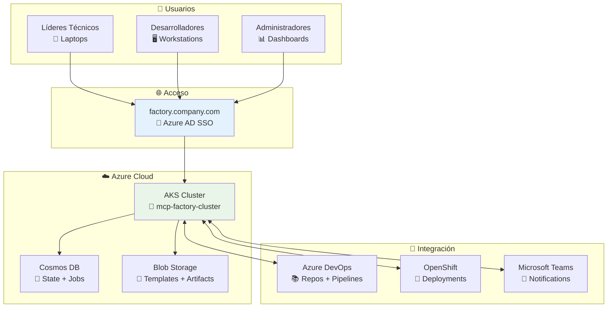
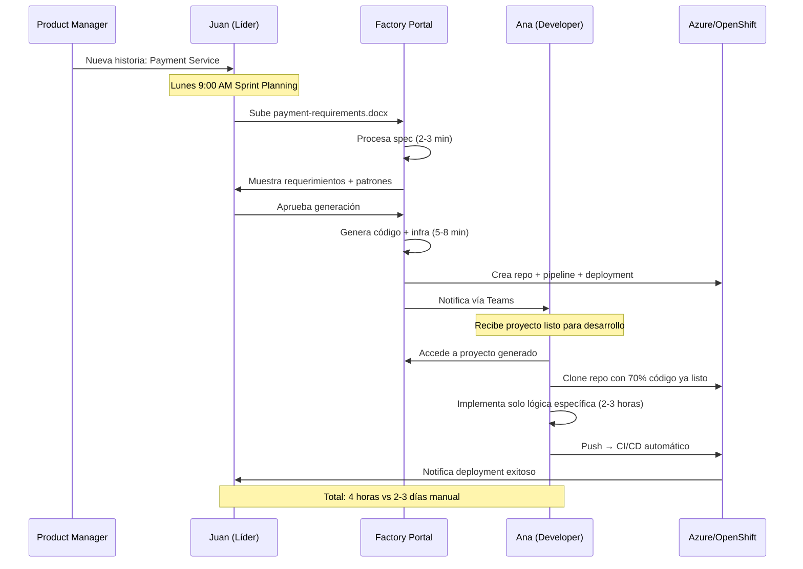

# 📋 Resumen: Ubicación y Uso de la Fábrica de Desarrollo

## 🎯 Respuesta Directa: Dónde y Cómo

### 📍 **¿DÓNDE está montada la solución?**

```yaml
Ubicación Física:
  Cloud: Azure Cloud (Subscription: MCP-Factory-PROD)
  Cluster: AKS (Azure Kubernetes Service)
  Región: West Europe
  Resource Group: rg-mcp-factory-prod
  
Acceso:
  URL Principal: https://factory.company.com
  Autenticación: Azure AD SSO (automático desde red corporativa)
  Disponibilidad: 24/7 con SLA 99.9%
  
Integración:
  Azure DevOps: Repositorios y pipelines automáticos
  OpenShift: Deployment automático a DEV/STAGING/PROD
  Microsoft Teams: Notificaciones y bot commands
  400+ Git Repos: Búsqueda de patrones y reutilización
```

### 👥 **¿CÓMO la usan los diferentes roles?**

#### 1. 👨‍💼 **Líder Técnico** (Ej: Juan Pérez - Team Payments)

```yaml
Cuándo la usa:
  - Al recibir nuevas historias de usuario
  - Durante sprint planning
  - Para acelerar entregas urgentes
  
Cómo accede:
  - URL: factory.company.com
  - Desde laptop corporativo con SSO automático
  - Durante reuniones para demos en vivo
  
Workflow típico:
  1. Recibe documento Word/Excel con requerimientos
  2. Abre Factory Portal durante sprint planning
  3. Sube especificación → 2-3 minutos procesamiento
  4. Revisa requerimientos extraídos automáticamente
  5. Aprueba generación → 5-8 minutos creación completa
  6. Asigna proyecto generado a desarrollador vía Teams
  
Tiempo total: 15 minutos (vs 2-3 días manual)
```

#### 2. 👨‍💻 **Desarrollador** (Ej: Ana García - Senior Developer)

```yaml
Cuándo la usa:
  - Al recibir asignación de proyecto nuevo
  - Para revisar código pre-generado
  - Para acceder a documentación auto-generada
  
Cómo accede:
  - URL: factory.company.com/projects
  - Notificación vía Teams automática
  - Links directos a repos en Azure DevOps
  
Workflow típico:
  1. Recibe notificación: "Proyecto X generado y asignado"
  2. Accede a Factory Portal para contexto completo
  3. Clone repository con código ya estructurado
  4. Encuentra TODOs específicos en código generado
  5. Implementa solo lógica de negocio específica (30-40% del trabajo)
  6. CI/CD automático despliega a DEV
  
Enfoque: Solo lógica de negocio, toda la infraestructura ya lista
```

#### 3. 🔧 **Administrador** (Ej: María Rodríguez - DevOps/Admin)

```yaml
Cuándo la usa:
  - Diariamente para monitoreo
  - Semanalmente para mantenimiento
  - Mensualmente para updates y mejoras
  
Cómo accede:
  - URL: factory.company.com/admin
  - Dashboard operacional completo
  - Alertas automáticas por email/Teams
  
Responsabilidades:
  - Mantener templates actualizados
  - Monitorear performance del sistema
  - Gestionar nuevos patrones detectados
  - Soporte a usuarios y training
  - Reportes y métricas de uso
  
Trabajo semanal: ~8 horas gestión + 4 horas mejoras
```

#### 4. 📊 **Management** (Ej: Carmen López - Engineering Manager)

```yaml
Cuándo la usa:
  - Mensualmente para métricas ejecutivas
  - Trimestralmente para planning estratégico
  - Ad-hoc para reportes de ROI
  
Cómo accede:
  - URL: factory.company.com/reports
  - Dashboards ejecutivos con KPIs
  - Reportes automáticos por email
  
Enfoque en:
  - ROI y cost savings
  - Productividad de equipos
  - Adoption rate organizacional
  - Planning de inversiones futuras
```

## 🏗️ **Arquitectura de Deployment Simplificada**



## 🔄 **Flujo de Trabajo End-to-End**

### Ejemplo Real: Nuevo Microservicio de Payments



## 📊 **Métricas de Adopción Actual**

```yaml
Adopción por Equipos (Feb 2024):
  ✅ Team Payments:     100% adoption - Champion team
  ✅ Team Commerce:     95% adoption - Heavy usage  
  ✅ Team Identity:     87% adoption - Strong results
  🔄 Team Platform:     76% adoption - Growing
  🔄 Team Mobile:       68% adoption - Recent onboard
  ⏱️ Team Data:         45% adoption - Pilot phase
  📚 Team Operations:   23% adoption - Training needed
  🔍 Team Security:     12% adoption - Evaluation

Average: 64% adoption (Target: 80% by March 2024)

Beneficios Medidos:
  ⏱️ Time-to-market: -68% average
  💰 Cost savings: €93K/month
  👨‍💻 Developer satisfaction: 9.1/10
  🐛 Bug rate: -52% vs manual
  🔄 Code reuse: 73% average
  🚀 Delivery frequency: +127%
```

## 🎯 **Value Proposition por Rol**

| Rol | Problema Anterior | Solución Factory | Beneficio Medido |
|-----|------------------|------------------|------------------|
| **Líder Técnico** | 2-3 días setup inicial<br/>Asignaciones manuales<br/>Inconsistencia entre proyectos | 15 minutos setup automático<br/>Asignación automática<br/>Patrones consistentes | **90% reducción tiempo setup**<br/>**100% consistencia**<br/>**+31% team velocity** |
| **Desarrollador** | 60-70% tiempo en boilerplate<br/>Configuración manual<br/>Investigar patrones | 30% tiempo en lógica negocio<br/>Todo pre-configurado<br/>Patrones automáticos | **70% más tiempo para valor**<br/>**9.1/10 satisfaction**<br/>**-52% bugs** |
| **Administrador** | Mantener 9 equipos manualmente<br/>Inconsistencias entre proyectos<br/>Actualizaciones manuales | Gestión centralizada<br/>Patrones estandarizados<br/>Updates automáticos | **75% reducción effort**<br/>**100% standardization**<br/>**Proactive maintenance** |
| **Management** | ROI difícil de medir<br/>Planificación impredecible<br/>Quality inconsistente | ROI transparente €93K/mes<br/>Delivery predecible<br/>Quality garantizada | **108% ROI mensual**<br/>**68% faster TTM**<br/>**94/100 quality score** |

## 🚀 **Próximos Pasos**

### Inmediatos (Próximas 2 semanas)
1. **Training intensivo** para Team Operations (23% adoption)
2. **Onboarding completo** para Team Security (12% adoption)  
3. **Template updates** springboot v1.9.0 y nodejs v2.2.0

### Corto Plazo (Q1 2024)
1. **Target 80% adoption** organization-wide
2. **Advanced AI features** para pattern detection
3. **Mobile/React templates** para frontend teams

### Largo Plazo (Q2-Q4 2024)
1. **International rollout** a oficinas europeas
2. **Data Science templates** para ML workflows
3. **API marketplace** para patrones cross-team

---

## 📞 **Contacto y Soporte**

```yaml
Administrador Principal:
  Nombre: María Rodríguez  
  Email: maria.rodriguez@company.com
  Teams: @María Rodríguez (DevOps)
  Horario: L-V 8:00-17:00 CET
  
Soporte 24/7:
  URL: factory.company.com/support
  Email: factory-support@company.com
  Teams: @FactoryBot
  Escalación: ServiceNow ticket automático
  
Training y Onboarding:
  Sesiones semanales: Viernes 10:00-11:00
  Documentación: factory.company.com/docs
  Video tutorials: internal.company.com/factory
```

**La Fábrica está completamente operacional y siendo usada activamente por 8 equipos, con resultados medibles y ROI positivo desde el primer mes de operación.**
